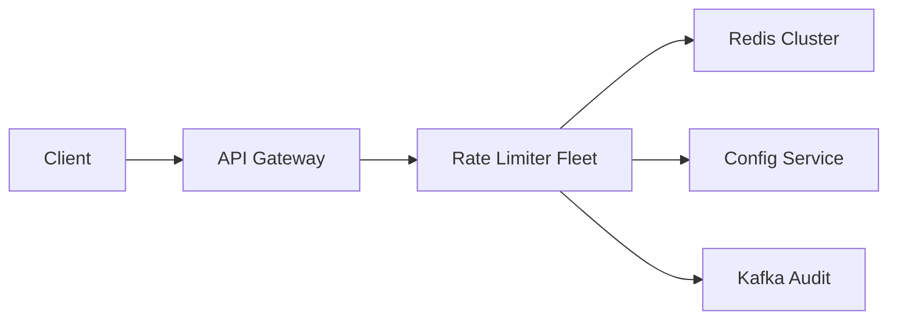

# Rate Limiter

> Protect an API from abuse. The design is a **fast, shared counter** with a clear algorithm — token bucket or sliding window — not a lecture on Redis internals.

> **TL;DR Hinglish:** Token bucket / sliding window Redis Lua se atomic. Har region me local check, headers me limit bhejo, fail-open ya fail-closed decide karo.

## Kya poochte hain? (What they ask) — Hinglish me samjho

Design a rate limiter as a **service**: `allow(key) → { allowed, remaining, retryAfter }`. It sits in-line on **every request** at the [API Gateway](/system-design/api-gateway) and enforces rules like `100 req/min per user`, `10K req/min per API key`, or `5 req/s per IP` on expensive endpoints (login, search, LLM).

What the interviewer tests:

- Do you know the **algorithms** (token bucket vs sliding window) and their burst vs accuracy trade-offs?
- Can you make it **distributed and atomic** so 10 gateway replicas share one budget instead of allowing 10×?
- Do you understand **placement, headers, and failure mode** (fail open vs closed, 429 + Retry-After)?
- Can you extend to **tiers (free vs paid), per-route limits, and multi-DC**?

A strong answer: *shared Redis with atomic Lua, sliding-window-counter or token bucket at the gateway, 429 with Retry-After, fail closed on expensive APIs*.

## Requirements — Kya chahiye? (Functional / Non-functional)

| Category | Details |
|---|---|
| **Functional** | `allow(key, cost)` → allowed yes/no, `remaining`, `retryAfterMs`; configurable rules per key (userId, IP, API key, route), multiple windows (e.g., 10/s and 100/min), burst control, tiered limits (free/paid) |
| **Non-functional** | p95 < 5ms added latency (in hot path), correct enough across N gateway nodes (no 10× drift), highly available (tolerate Redis blip), horizontally scalable to 100K+ RPS |
| **Clarify** | Per user vs per IP vs per endpoint? Burst allowed? Fail open (availability) or fail closed (protect origin)? Global vs per-region limit? Ask before picking algorithm |
| **Out of scope v1** | WAF / bot detection, billing metering (separate warehouse job), per-tenant quota UI (mention config service as box) |

## Scale ka andaaza — Kitna load? (Math jo design badle)

Assume API gateway handles 50K RPS across 20 nodes.

| Metric | Math | Result |
|---|---|---|
| Check QPS | 1 check per request | **50K checks/s** |
| Redis ops | 1 Lua `EVALSHA` per check (1 RTT) | 50K Lua/s — single Redis shard handles ~100K/s, cluster if peak 200K/s |
| Memory (sliding log) | 100 req/min × 50 bytes/timestamp × 10M keys (worst) | Unbounded — prefer counter over log. Counter: one key per window per principal → ~30 bytes × 10M = **300 MB** |
| Bandwidth | 50K × 200 bytes | ~10 MB/s — negligible |
| Local vs shared | Local memory limiter: effective limit = rule × replicas (e.g., 100/min × 20 = 2000/min) | **Wrong** unless coarse cap |

Conclusion: a **centralized Redis** with pipelined Lua is fast enough; local-only limiters are only for emergency fallback.

## API Design — Endpoints kya honge?

```http
POST /v1/check
Content-Type: application/json
{ "key": "user:u_123", "route": "POST /v1/search", "cost": 1, "rule": "100/min" }
→ 200 { "allowed": true, "remaining": 42, "retryAfterMs": 0, "limit": 100, "windowMs": 60000 }

POST /v1/check/batch
{ "checks": [{ "key":"ip:1.2.3.4","cost":1 },{ "key":"user:u_123","cost":1 }] } // all must allow
→ 200 { "allowed": false, "failingKey":"ip:1.2.3.4", "retryAfterMs": 3400 }

GET /v1/rules/{key} → { "rules": [{ "windowMs":1000,"limit":10},{ "windowMs":60000,"limit":100 }] }
PUT /v1/rules/{key} { "rules":[...] } // from config service / admin
```

**Gateway plugin alternative (fewer hops):**

```java
// sidecar / Envoy WASM / Nginx Lua
RateLimitResult r = limiter.allow("user:"+userId, 1);
if (!r.allowed) return 429 with headers;
```

**Headers on every response (IETF):**

```
RateLimit-Limit: 100
RateLimit-Remaining: 42
RateLimit-Reset: 18        // seconds to window reset
Retry-After: 18            // on 429
X-RateLimit-Key: user:u_123
```

Status: `200` if allowed, `429 Too Many Requests` if not — never `500` for rate limit.

## High-Level Design (HLD) — Boxes kaise judenge? (Hinglish)

```
[ Clients ] --> [ L4 LB ] --> [ API Gateway Fleet (20 nodes) ]
                                  |
                    +-------------+-------------+
                    |             |             |
               [Rate Limiter] [Auth]        [Upstream Services]
               (sidecar/Lua)      \
                    |              \
                    v               v
            [ Redis Cluster ]   [ Config Service (rules per tier/route) ]
            (shared budget)      |  (cached in gateway, 5s TTL)
                    |
            [ Kafka (async audit log: key, allowed, ts) → Analytics ]
```



**Components:**

- **API Gateway Fleet:** Each node runs a thin limiter client (Lua/Go sidecar). On every request it computes `key = f(userId, IP, route, tier)` and does one Redis Lua call. No local counter as source of truth.
- **[Redis](/system-design/redis) Cluster:** Holds windows/counters. Lua scripts run atomically per key. Replicated, with persistence off (recreatable) — cache, not DB. Cluster sharded by `hash(key)`.
- **Config Service:** Stores tiered rules (`free: 10/s, 100/min; paid: 100/s, 10K/min`), per-route overrides. Gateways cache rules with 5s TTL + pub/sub invalidation via [Redis](/system-design/redis) or [Kafka](/system-design/kafka).
- **Audit / Analytics:** Async emit to [Kafka](/system-design/kafka) for dashboards and abuse detection — never blocks `allow()`.

**Write flow (check):** Request → Gateway builds key → `EVALSHA sliding_window_counter.lua key limit windowMs now` → Redis runs atomically (`INCR + EXPIRE`, or token bucket refill) → return `{allowed, remaining, retryAfter}` → if not allowed, return `429` immediately; else proxy to upstream.

**Read flow (admin):** `GET /rules` served from Config Service (Postgres + cache), not Redis.

## Low-Level Design (LLD) — DB + Classes (Hinglish notes)

### Data model (Redis keys)

```
rl:{key}:{window}  →  { count, windowStart }  // sliding window counter
rl:tb:{key}        →  { tokens, lastRefillMs } // token bucket (hash)
rules:{key}        →  JSON { limits: [{windowMs, limit, burst}] } // cached from config
```

TTL = window size (auto-GC). No separate DB table for counters — Redis is the store.

Config DB (Postgres):

```sql
CREATE TABLE rate_rules (
  rule_id     UUID PRIMARY KEY,
  principal   TEXT NOT NULL, -- 'user:*' | 'api_key:abc' | 'route:POST /v1/search'
  tier        TEXT,           -- 'free' | 'paid' | NULL (all)
  window_ms   INT NOT NULL,
  limit_count INT NOT NULL,
  burst       INT,            -- for token bucket
  updated_at  TIMESTAMPTZ DEFAULT now(),
  UNIQUE(principal, tier, window_ms)
);
CREATE INDEX idx_rules_principal ON rate_rules(principal);
```

### Key classes / responsibilities

```java
interface RateLimiter {
  Result allow(String key, int cost);
}
class RedisSlidingWindowCounter implements RateLimiter {
  // Lua: get (prevCount, currCount), compute weighted count, INCR curr if allowed
}
class RedisTokenBucket implements RateLimiter {
  // Lua: refill = (now - lastRefill)*rate, tokens = min(bucketSize, tokens+refill), if tokens>=cost then tokens-=cost
}
class RuleResolver {
  List<Rule> rulesFor(key, route, tier) // cache-aside from Config Service (5s TTL)
}
class GatewayFilter {
  Result enforce(request) // resolve rules → for each rule check limiter → 429 on first deny
}
```

### Concurrency & algorithms

| Algorithm | How | Burst | Accuracy | Memory | When |
|---|---|---|---|---|---|
| **Token bucket** | Tokens refill at rate R, bucket size B; each request takes 1 token | Yes (up to B) | Good | O(1) per key | Burst-friendly APIs, natural to explain |
| **Sliding window log** | Store timestamps in Redis Sorted Set; `ZCOUNT (now-W, now]` | No | Exact | O(N) per key | Small windows, exact need — expensive |
| **Sliding window counter** | Two fixed windows (prev + curr) weighted by time overlap | Limited | Good enough | O(1) | Best cost/accuracy trade-off — recommend |
| **Fixed window** | `INCR key:{minute}` + `EXPIRE` | 2× at edge | Poor | O(1) | Mention and reject for payments/auth |

**Atomicity — why Lua:**

Without atomicity: two pods read `count=99`, both think `99 < 100`, both `INCR` → 101 served under a 100 limit. Fix: one Lua `EVALSHA` that does `GET + INCR + EXPIRE` atomically per key (Redis single-threaded per shard). Alternative: `INCR` + `EXPIRE` in one pipeline still races on TTL — use Lua.

```lua
-- sliding_window_counter.lua
local key = KEYS[1]
local limit = tonumber(ARGV[1])
local window = tonumber(ARGV[2])
local now = tonumber(ARGV[3])
local currKey = key .. ":" .. math.floor(now/window)
local prevKey = key .. ":" .. (math.floor(now/window)-1)
local prev = tonumber(redis.call("GET", prevKey) or "0")
local curr = tonumber(redis.call("GET", currKey) or "0")
local weight = 1 - (now % window) / window
local count = prev * weight + curr
if count + 1 > limit then
  return {0, limit - count, window - (now % window)}
end
redis.call("INCR", currKey); redis.call("EXPIRE", currKey, window*2/1000)
return {1, limit - count -1, 0}
```

### Patterns used

Sidecar / Filter, Cache-Aside (rules), Token Bucket / Sliding Window, Fail-Open / Fail-Closed (Circuit Breaker), Outbox-style async audit.

## Deep Dive — Gehrai se (Interview yahi puchega) — distributed correctness

The core race is **read-then-write across replicas**. Local memory limiters are wrong with 10 replicas (limit × 10 unless you divide by N, which is still inaccurate under skew). Shared [Redis](/system-design/redis) with Lua fixes it — one atomic op per key per request. For even stronger guarantees under Redis failover, use **Redis Raft / Redlock** only if you truly need global exactness (rare). Usually "correct enough" with one primary per shard + async replica is acceptable — being off by 1–2% at 100/min is better than adding 20ms for consensus. If Redis is down, decide **fail open** (availability, allow traffic) vs **fail closed** (safety, 429) — for public APIs fail closed on expensive routes (`/login`, `/pay`) and keep a small local emergency token bucket (e.g., 50% of limit) so origin does not melt.

## Deep Dive — Gehrai se (Interview yahi puchega) — multi-DC and per-route / per-tier limits

Do not promise a **global exact 100/min** across 3 regions with one Redis — cross-DC RTT kills p95. Instead do **per-region limits** (e.g., 100/min per region) and accept sum = 300/min globally; if a global budget is required, add a periodic aggregator that syncs usage every 5s and adjusts local limits (eventual). Per-route: `key = tenant:{id}:route:{method} {path}` with separate windows — e.g., `POST /login: 5/min` stricter than `GET /feed: 1000/min`. Tiered: Config Service returns `free: 10/s` vs `paid: 100/s` based on JWT claim; gateway caches tier with 5s TTL. Dynamic update via pub/sub invalidation, not polling DB.

## Deep Dive — Gehrai se (Interview yahi puchega) — placement and headers

Rate limit at the **first hop that can identify the principal** — usually the [API Gateway](/system-design/api-gateway). Extra limits inside expensive services (LLM, search, payment) protect even if gateway is bypassed. Always return IETF `RateLimit-*` headers and `429 + Retry-After` (seconds or HTTP-date). Clients should respect it with exponential backoff. Log every deny to [Kafka](/system-design/kafka) for abuse dashboards. Do not 500, do not silently drop — make the contract explicit.

## Hinglish Tip — Galti vs Sahi

**🔴 Galti:** Hot path pe DB direct without cache/queue.
**✅ Sahi:** Cache/queue beech me, DB source of truth.

## Failures & Scale — Kya tootega aur kaise bachenge? (Hinglish)

- **Redis down / slow:** Circuit breaker in gateway — after N errors, switch to **local emergency cap** (in-memory token bucket at 50% of limit) and emit metric. For auth/payment, fail closed (429); for reads, fail open with log.
- **Hot key (single IP hammering):** One Redis shard hot — shard by `hash(key)` already, but a single key is still one shard; Lua is O(1) so it holds, but add gateway-side **coalescing** (batch `allow` for same key within 1ms) and short local negative cache (10ms) for denied keys.
- **Thundering herd on rule reload:** Config updates fan via pub/sub, not thundering DB poll.
- **Clock skew:** Use Redis server `TIME` inside Lua, not client `now`, for window calc.
- **Scale to 500K RPS:** Redis Cluster with 10 shards (50K/shard), gateway `EVALSHA` pipelined, keep payload < 200 bytes, disable persistence, autoscale gateway fleet.

## Aur kya puch sakte hain? (Extra probes — Hinglish)

1. **Different tiers (free vs paid) — config service, cache rules** with 5s TTL and pub/sub invalidation; see `RuleResolver` above.
2. **Rate limit by token bucket per tenant + per route** — compose keys and check all rules (AND), return `retryAfter = max(retryAfters)`.
3. **LLD-style interface `allow(key)` if they want classes — still back it with Redis** — show `interface RateLimiter` + `RedisSlidingWindowCounter` + Lua above; local `Guava RateLimiter` only as fallback.
4. **Burst vs smooth:** Offer token bucket when interviewer asks about bursts (e.g., "allow 20 at once then 1/s").
5. **See also:** [API Gateway](/system-design/api-gateway), [Redis](/system-design/redis), [Kafka](/system-design/kafka) for audit.

**Yaad rakho (Revision):** 1) Lua atomic 2) Token bucket vs sliding window 3) Per-region check 4) Headers RateLimit-*.

**Phrase:** Shared Redis token bucket at the gateway, atomic INCR via Lua, 429 + Retry-After. If Redis dies I fail closed on the expensive APIs and keep a small local cap so we don't melt origin.

