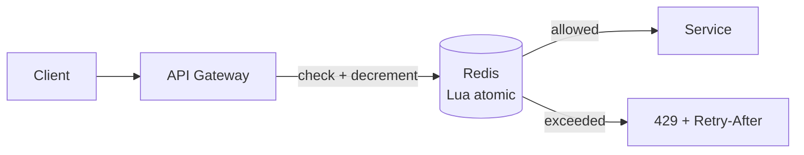

# Rate Limiting

> Say no gracefully — protect shared resources with explicit, fair quotas.

> Rate limiters cap how often clients call: per user, per IP, per API key. They stop abuse, contain costs, and keep one tenant from starving others. Every limiter answers three questions: what is counted, over what window, and what happens on exceed (429 plus Retry-After).

## Why Rate Limiting

Abuse prevention, cost control (per-call APIs and LLM tokens), fairness across tenants, and overload protection. Public APIs need it from day one; internal services need it before the first noisy neighbor appears.

## Fixed Window

Count per fixed bucket (per minute starting at :00). Simple with Redis INCR plus expiry — but boundaries double-allow (100 at :59 plus 100 at :00). Good enough for coarse quotas.

## Sliding Window Log

Store every request timestamp; count trailing window on each call. Exact, but memory-heavy at scale. Use for precise low-volume limits.

## Sliding Window Counter

Hybrid: combine current and previous fixed windows weighted by overlap. Near-exact with O(1) memory — the production default for most APIs.

## Token Bucket

Tokens refill at a fixed rate into a bounded bucket; each request spends one. Bursts pass while tokens last, then steady-state throttles. Best when bursty-but-bounded traffic is legitimate.

## Leaky Bucket

Requests queue and drain at a fixed rate — perfectly smooth output, bursty input waits or overflows. Best when downstream needs constant rate (transcoders, webhooks). Implement with a queue plus paced worker.

## Distributed Rate Limiting

Local counters diverge across servers — centralize in Redis (Lua scripts for atomic check-and-decrement) or synchronize with sticky routing plus reconciliation. Clock skew and races demand atomic operations, not read-then-write.

## Redis-based Rate Limiter

Patterns: fixed window (`INCR` + `EXPIRE`), sliding window (sorted set of timestamps, trim old), token bucket (hash with tokens plus timestamp, Lua-updated). One Lua script per decision keeps it atomic at millions of checks per second.

## Keep in mind

- Fixed window is simple but boundary-abusable; sliding counter is the default.
- Token bucket for bursty-legitimate, leaky bucket for smooth-required.
- Centralize counters in Redis with atomic Lua — local limits diverge.
- Always return 429 plus Retry-After; never silently drop.
- Limit by user or key, not just IP — IPs share (NAT) and rotate.
