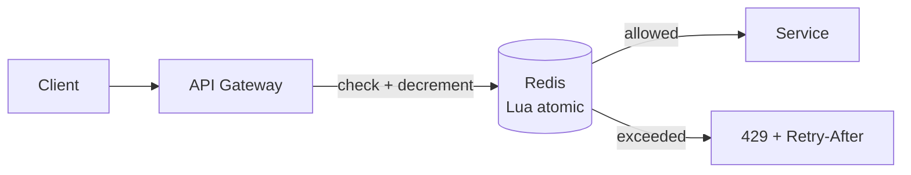

# Rate Limiting

> Say no gracefully — protect shared resources with explicit, fair quotas.

> Rate limiters cap how often clients call: per user, per IP, per API key. They stop abuse, contain costs, and keep one tenant from starving others. Every limiter answers three questions: what is counted, over what window, and what happens on exceed (429 plus Retry-After).

## Why Rate Limiting

Without limits, one scraper, bug loop, or noisy tenant can exhaust DB connections, LLM budgets, or egress caps for everyone on shared infrastructure. Public APIs expose you to unbounded fan-out; internal microservices need limits before cascading retries amplify a single bad client. Rate limiting is also a product lever — free tier 100 req/min, paid 10k — encoded in infrastructure rather than honor system. Good limiters fail open or closed by design: payment auth might fail closed; analytics beacon might fail open with sampling. Document limits in API contracts; surprise 429s erode trust.

- Abuse prevention: credential stuffing, scraping, DDoS at application layer.
- Cost control: per-token LLM calls, paid third-party APIs, SMS sends.
- Fairness: multi-tenant SaaS — one customer cannot monopolize shared pools.
- Overload protection: backpressure before thread pools and DB melt — limit at edge first.

## Fixed Window

Divide time into buckets (e.g., calendar minute): increment a counter per key, reject when count ≥ limit, reset at bucket boundary. Implementation is one Redis key per `(user, window)` with `INCR` and `EXPIRE` — microseconds per check, easy to reason about. The classic flaw is the boundary burst: 100 allowed at 00:59 and 100 at 01:00 yields 200 in two seconds while “100 per minute” sounds tight. Acceptable for coarse quotas (daily email caps) or when clients already backoff on 429; poor for strict SLA bursts at window edges.

- Redis pattern: `INCR rate:{user}:{epoch_minute}` with TTL 60s.
- Window alignment: UTC vs local minute affects global users — be explicit.
- Cheap at millions of keys if TTL cleans up automatically.
- Mitigate edge doubling with small jitter on client retry, or upgrade algorithm.

## Sliding Window Log

Store timestamp of each accepted request (sorted set in Redis, or in-memory deque per key on one node). On each request, drop entries older than `now - window`, count remainder, allow if count < limit. Mathematically exact for “N requests in last W seconds” regardless of clock alignment. Memory grows with allowed rate × window — 1k req/min/user × 1M users is not one deque each in RAM without aggregation. Best for low-volume, high-stakes limits (admin APIs, password reset) where precision beats cost.

- Redis: `ZADD` + `ZREMRANGEBYSCORE` + `ZCARD` — watch memory and hot keys.
- Exactness costs O(log N) per request vs O(1) for counters.
- Sharding hot keys (hash user ID to multiple cells) when one influencer spikes traffic.
- Good interview answer when interviewer asks “how fix fixed window burst?”

## Sliding Window Counter

Approximate sliding window with O(1) memory: keep count for current window and previous window; weight previous by overlap fraction as time advances into current window. Example at 30s into minute: estimate = `0.5 * prev_minute_count + current_minute_count`. Error is small for smooth traffic; still better boundary behavior than pure fixed window. This is the default production compromise for REST APIs at scale — used by many gateways and custom Redis limiters.

- Two counters per key — no per-request timestamp storage.
- Tunable by shrinking windows (10s buckets) if overlap error matters.
- Combine with token bucket at edge if you need burst allowance on top.
- Document as “approximate sliding window” if compliance asks for exactness.

## Token Bucket

Bucket holds up to `B` tokens; refill adds `r` tokens per second up to cap. Each request consumes one token; insufficient tokens → 429 or queue. Allows bursts up to `B` while long-run average stays near `r` — matches human click patterns and batch jobs that spike then idle. Parameters: refill rate = sustained QPS, bucket size = max burst without rejection. Implement with Redis hash `{tokens, last_refill_ts}` updated atomically in Lua.

- Burst-friendly APIs (search autocomplete, mobile sync) fit token bucket naturally.
- Refill on check vs background timer — on-check is simpler in distributed Redis.
- `B=0` degenerates to strict rate with no burst — rarely what product wants.
- Pair with cost-based tokens (heavy query costs 10 tokens) for fair CPU use.

## Leaky Bucket

Incoming requests enter a queue; a worker drains at fixed rate `r` — output smoothness is the goal, not burst tolerance. Excess requests wait (adding latency) or drop when queue full — unlike token bucket which rejects immediately when empty. Models strict downstream contracts: webhook delivery to partner at 50/s, video transcoder feeding GPU at constant pace. In APIs, leaky bucket is less common than token bucket unless you explicitly queue (which needs timeout on wait).

- Smooths traffic to protect fragile downstream (legacy mainframe, per-tenant SMTP).
- Queue depth × drain rate = max wait — bound queue or clients hang.
- Often implemented as rate-limited worker pool consuming from Kafka/SQS.
- Contrast in interviews: token bucket = allow burst then throttle; leaky = shape to constant drip.

## Distributed Rate Limiting

Each app server keeping local counters allows `N × limit` effective throughput for N nodes — unacceptable for global caps. Centralize state in Redis/Memcached/DynamoDB with atomic increment/decrement, or use sticky sessions so one user's traffic hits one node (fragile under redeploys). Geo-distributed APIs may shard limiters per region with global reconciliation for hard caps — complex. Clock skew across nodes breaks time windows unless all logic uses Redis TIME or logical clocks. Every check must be atomic — read-modify-write races double-allow without Lua/scripts or WATCH/MULTI.

- Redis Cluster: hash tag `{user}:rate` keeps one user's keys on one shard.
- Fail-open vs fail-closed when Redis down — product/security decision, not engineering default.
- Edge rate limiting (CDN, API gateway) reduces origin chatter but needs sync for user-specific keys.
- Propagate limit headers (`X-RateLimit-Remaining`, `Retry-After`) on success and failure.

## Redis-based Rate Limiter

Production patterns: fixed window (`INCR` + `EXPIRE`), sliding log (`ZSET` trim), token bucket (Lua updating tokens and timestamp in one round trip). One Lua script per decision guarantees atomicity under concurrent goroutines — never `GET` then `SET` from app code. At millions of checks/sec, pipeline where safe, connection pool tuning, and replica reads only for analytics not enforcement. Alternative: dedicated sidecar (Envoy global rate limit service) sharing Redis backend across mesh.

- Lua script returns `{allowed, remaining, reset_at}` for consistent client headers.
- TTL every key — orphaned keys from abandoned users still cost memory until expiry.
- Hot key on celebrity user — partition limit across sub-keys or local token borrow with sync.
- Monitor reject rate, Redis latency p99, and false positives from clock bugs.

## Keep in mind

- Fixed window is simple but boundary-abusable; sliding window counter is the default at scale.
- Token bucket for bursty-but-legitimate traffic; leaky bucket when downstream needs smooth constant rate.
- Centralize counters in Redis with atomic Lua — per-node limits multiply with fleet size.
- Always return 429 plus `Retry-After` (and rate limit headers); never silently drop without client signal.
- Limit by authenticated user or API key, not IP alone — NAT shares IPs and bots rotate them.
