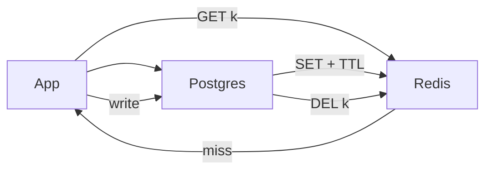

# Redis

> In-memory data structure store. Interview me ye hamesha **cache, sessions, rate limits, ya presence** hota hai — source of truth kabhi nahi.

> **TL;DR Hinglish:** Redis ek single-threaded server hai jo RAM me data rakhta hai, isliye ~1ms me jawab. Process mara to cache khali — isliye DB hamesha source of truth. Cache-Aside + TTL + delete-on-write, aur sabse garam keys pe stampede ka dhyan.

Redis single-threaded hai (per instance), simple protocol bolta hai. Same datacenter me reads/writes ~1ms. Data RAM me, optional snapshot/AOF disk pe. Persistence nahi to process marega to cache khali. DB ko hamesha answer dena aana chahiye — socho `Redis = tez yaad-dasht, Postgres = permanent diary`.

## Kab use karna hai?

1. Garam keys jo Postgres ko pighla dengi (session, feed page 1, short URL lookup) — *socho 50k QPS same key*
2. Counters aur sliding windows [rate limiting](/system-design/rate-limiter) ke liye
3. Pub/sub ya presence heartbeats chat ke liye
4. Distributed locks (`SET key nx ex`) — soch samajh ke, lease + fencing zaruri
5. Chhote job lists — kam volume theek, bada backlog → [Kafka](/system-design/kafka)

**Mat dalo:** user ke bade blobs, full search, ya saalon ka analytics. RAM mehengi hai, eviction surprise dega.

## Patterns jo har design me aate hain

**Cache-aside (lazy loading) — default yahi banao.** App Redis dekhe, miss → DB → `SET` with TTL. Write ke baad key delete/update. Sabse safe.

**Write-through.** Cache + DB saath likho. Read tez, write slow.

**Write-behind.** Pehle cache, DB baad me async. Tez par dangerous — sirf tab bolo jab thoda loss chalega.

**Stampede (Thundering herd).** Popular key expire aur 10k requests DB pe toot pade. Fix: lock/singleflight, thoda random TTL, ya kuch second stale serve karo.

**Hot key.** Ek celebrity `userId` ek hi Redis shard pe. Fix: key split (`feed:123:0`, `feed:123:1`) ya CDN/app layer pe cache.

## Kaunse data structures naam lene hain?

1. **String** — JSON blob, session token, short URL
2. **Hash** — object ke fields bina pura blob rewrite kiye
3. **Sorted set** — leaderboard, "latest N", delayed jobs `score=timestamp`
4. **List** — simple queue (interview ke liye OK, bada backlog nahi)
5. **HyperLogLog** — unique counts thoda error ke saath (views)

## Failure modes — interview me zarur bolo

1. **Eviction** (`allkeys-lru`) — Redis ko maybe-empty samjho
2. **Failover** — replica promote, kuch second stale/lost writes
3. **Persistence** — AOF vs RDB; cache hai to rebuild kar sakte ho, ok
4. **Cluster** — hash slots; multi-key ops ek hi slot pe hone chahiye (`{userId}` hash tags)

**🔴 Galti:** "Redis me sab daal do, DB band kar do" — Data gaya to gaya.
**✅ Sahi:** "Redis hot path, Postgres/S3 source of truth. TTL + delete-on-write, sabse garam keys pe stampede handle."

**Phrase:** "Redis hot path hai. Postgres source of truth. TTL plus delete-on-write, aur sabse garam keys pe stampede."

**Yaad rakho (Revision):** Cache-aside default, TTL random, hot key split, eviction = cache khali ho sakta hai, cluster me `{}` tags.

**See also:** [distributed cache](/system-design/distributed-cache), [rate limiter](/system-design/rate-limiter), [Bitly](/system-design/bitly).
