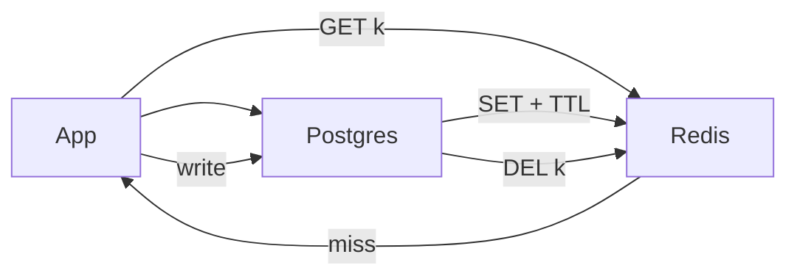

# Redis

> In-memory data structure store. In interviews it is always **cache, sessions, rate limits, or presence** — never the source of truth.

> Redis is a single-threaded server holding data in RAM, answering in ~1ms from the same datacenter. If the process dies, the cache empties — so the database must always be able to answer alone. Think `Redis = fast memory, Postgres = permanent diary`.

## When to pick it

1. Hot keys that would melt Postgres (sessions, feed page 1, short URL lookups) — *picture 50k QPS on one key*
2. Counters and sliding windows for [rate limiting](/hld/rate-limiter)
3. Pub/sub or presence heartbeats for chat
4. Distributed locks (`SET key nx ex`) — carefully, with leases plus fencing
5. Small job lists — fine at low volume; big backlogs belong in [Kafka](/hld/kafka)

**Don't store:** large user blobs, full search indexes, or years of analytics. RAM is expensive and eviction surprises.

## Patterns that show up in designs

**Cache-aside (lazy loading) — make this the default.** App checks Redis, on miss reads DB and `SET`s with TTL. Deletes or updates the key after writes. Safest pattern there is.

**Write-through.** Write cache plus database together. Fast reads, slow writes.

**Write-behind.** Cache first, database asynchronously later. Fast but dangerous — say it only when some loss is acceptable.

**Stampede (thundering herd).** Popular key expires and 10k requests hit the database. Fix: locks or singleflight, slightly random TTLs, or serve stale for a few seconds.

**Hot key.** One celebrity `userId` lands on one Redis shard. Fix: split keys (`feed:123:0`, `feed:123:1`) or cache at CDN and app layers.

## Data structures you should name

1. **String** — JSON blob, session token, short URL
2. **Hash** — object fields without rewriting whole blobs
3. **Sorted set** — leaderboards, "latest N", delayed jobs with `score=timestamp`
4. **List** — simple queue (fine for interviews, not big backlogs)
5. **HyperLogLog** — unique counts with small error (views)

## Failure modes to mention

1. **Eviction** (`allkeys-lru`) — treat Redis as possibly empty
2. **Failover** — replica promotes, seconds of stale or lost writes
3. **Persistence** — AOF vs RDB; rebuildable caches make this acceptable
4. **Cluster** — hash slots; multi-key operations must share one slot (`{userId}` hash tags)

**Mistake:** "Put everything in Redis, drop the database" — lost data stays lost.
**Correct:** "Redis for the hot path, Postgres or S3 as truth. TTL plus delete-on-write, stampede handled on the hottest keys."

**Phrase:** "Redis is the hot path. Postgres is the source of truth. TTL plus delete-on-write, with stampede protection on the hottest keys."

**Remember (Revision):** Cache-aside default, randomized TTL, hot key splitting, eviction means possibly-empty cache, `{}` tags in clusters.

**See also:** [distributed cache](/hld/distributed-cache), [rate limiter](/hld/rate-limiter), [Bitly](/hld/bitly).
