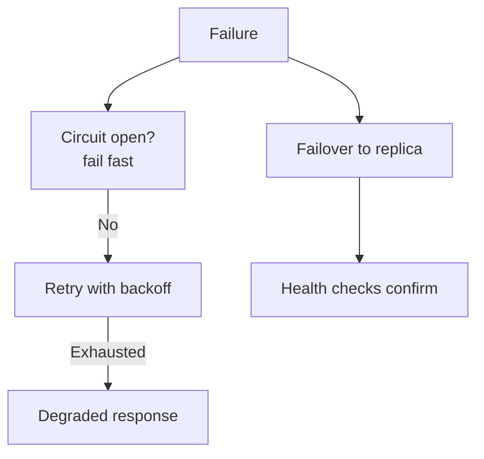

# Reliability & Fault Tolerance

> Keep working through failures — detect fast, isolate damage, degrade gracefully, recover automatically.

> Reliability is a system property built from layered defenses: nothing here is exotic alone, but together they decide whether incidents are blips or outages. Design each layer assuming the ones below it fail.

## Health Checks

Orchestrators and load balancers need a signal to stop sending traffic to broken instances before users become the probe. Liveness asks “is the process wedged?” — fail it to restart the pod. Readiness asks “can this instance accept work?” — fail it to remove from rotation while keeping the process up (migrations, warmup, dependency outage). Checks should be cheap (milliseconds), hit a dedicated endpoint, and avoid calling every downstream on every tick or flapping will eject healthy nodes during a partial outage. Deep checks belong in synthetic monitoring, not in kube `readinessProbe` that runs every second.

- Liveness failure → restart; readiness failure → drain traffic, no restart.
- Return non-200 on readiness when DB pool exhausted — LB stops new requests, in-flight completes.
- Startup probes protect slow-boot apps from liveness kill during JVM/ cache warm.
- Align check interval with SLA — 30s unhealthy delay means 30s of bad traffic if probe is too shallow.

## Retries and Timeouts

Networks and dependencies fail transiently — TCP blips, 503 during deploy, throttling. Retry idempotent operations (GET, PUT with idempotency key) with exponential backoff and jitter so retries don't synchronize into retry storms. Never blind-retry POST payments without dedup keys — duplicates charge customers. Every outbound call needs a client-side timeout shorter than the caller's own deadline; unbounded waits exhaust thread pools and cause cascading stalls. Context deadlines propagate (gRPC metadata, HTTP client timeout) so whole request trees cancel together.

- Retry on 408, 429 (respect Retry-After), 502, 503, 504 — not on 400, 401, 404.
- Cap max attempts (3–5) and total elapsed time — infinite retry is a denial of service on yourself.
- Jitter spreads retry peaks: `sleep = base * 2^attempt + random(0, base)`.
- Idempotency keys on mutating APIs make retries safe — store key → response mapping with TTL.

## Circuit Breaker

When a dependency error rate crosses threshold, open the circuit: fail fast locally without waiting for TCP timeout on a dead service. States: closed (normal, track failures), open (reject immediately for cooldown period), half-open (allow probe requests — success closes, failure reopens). Stops one slow payment service from tying up all checkout threads in hung calls. Per-dependency breakers — one bad vendor must not trip the breaker for unrelated calls. Pair with fallbacks: stale cache, simplified response, queue for async retry, or explicit 503 with Retry-After when no safe fallback exists.

- Failure counts need sliding window or exponential decay — one blip shouldn't open for an hour.
- Half-open probe count is small (1–5 requests) to limit blast radius while testing recovery.
- Monitor state transitions — flapping open/closed signals misconfigured thresholds.
- Bulkheads plus breakers: breaker stops calls; bulkhead limits threads even when breaker is slow to open.
- **Thresholds that trip:** ~50% failures over a window (or ~10 consecutive) or p95 latency breaching budget → open for a cooldown (~30s) → half-open probes → close on success, reopen on failure. Libraries: Hystrix / Resilience4j.
- **Retry vs breaker:** retry helps transient slowness; a dead downstream turns retries into a storm — the breaker stops calling and fails fast with a fallback.
- **Placement:** every sync call (`Order → Payment`); not on queues — the backlog already absorbs.
- **Phrase:** "Circuit MCB-style — fail fast on open, probe half-open, retry only idempotent calls with backoff."

## Bulkhead Pattern

Share nothing critical across failure domains: separate thread pools, connection pools, and semaphores per downstream service or tenant tier. If Payment API latency spikes, catalog reads still have their own pool and won't block. Queue-based bulkheads (bounded queue + fixed workers) add explicit backpressure — submit fails fast when queue full instead of unbounded memory growth. Name from ship compartments — flood one section, vessel stays afloat. In serverless/containers, concurrency limits per function and per-tenant caps play the same role.

- Never one global HTTP client pool for 20 microservices — partition by dependency.
- Timeouts per bulkhead match that dependency's p99, not a global 30s everywhere.
- Tenant bulkheads prevent noisy neighbor in multi-tenant — fair scheduling or hard caps per org.
- Test pool exhaustion path — what error does the user see when bulkhead is full?

## Failover and Redundancy

Run redundant instances across availability zones minimum; regions when RTO/RPO demand it. Active-active serves from all nodes (load balanced, data replicated); active-passive keeps warm standby promoted on failure — lower cost, higher failover time. Automatic failover uses health checks, leader election (etcd, Raft), or DNS TTL flip — manual runbook failover is minutes of outage under stress. Data layer failover is harder than compute: PostgreSQL sync replica promotion, Redis Sentinel, Kafka ISR — each has split-brain rules. Game days and chaos experiments prove failover works; slides don't.

- AZ failure is common design target; region failure needs explicit DR investment.
- Split brain: two writers — use quorum, fencing tokens, or STONITH patterns.
- DNS failover TTL (60–300s) bounds worst-case traffic steering delay.
- Load test standby capacity — passive node that can't handle full prod load isn't real redundancy.

## Graceful Degradation

When load or dependency loss exceeds capacity, shed work deliberately instead of failing entirely. Tier 0: login, checkout, read core catalog. Tier 1: recommendations, reviews. Tier 2: analytics beacons, non-critical personalization. Implement feature flags and load-shed switches tested in advance — on-call flips “degraded mode” rather than inventing under pager stress. Serve stale cache, lower image resolution, disable write-heavy features, or return partial JSON with `degraded: true`. Users prefer slow or simplified service over 500 storm.

- Predefine tiers in design docs — arguments during outage waste minutes.
- Autoscale helps but lags minutes — degradation bridges until scale catches up.
- Communicate status page when degradation is user-visible — silence reads as “we don't know.”
- Measure business impact per tier to decide what to drop first.

## Replication, Backup, Disaster Recovery

Replication keeps live copies for read scaling and failover — synchronous replicas minimize RPO on commit at higher latency; asynchronous replicas may lag and can lose the newest acknowledged-to-primary writes during failover. Backups (snapshots, logical dumps) protect against operator error and corruption that replication would faithfully copy. DR strategies span regions: backup-and-restore (highest RTO), pilot light (minimal infra running), warm standby (scaled-down stack), active-active (full dual region, lowest RTO, highest cost). Runbooks cover promoting a replica, repointing DNS, validating data, and shifting traffic — automation reduces human error at 3 AM.

- Replication ≠ backup — deleted table replicates delete unless versioning/ PITR exists.
- Test restore to isolated env — validates backup integrity and documents time to recover.
- RPO drives sync vs async replication; RTO drives warm vs active-active.
- Compliance may mandate geographic separation — factor legal before picking DR region.

## RPO and RTO

Recovery Point Objective: maximum acceptable data loss measured in time (“lose at most 5 minutes of writes”). Recovery Time Objective: maximum acceptable downtime (“back online within 1 hour”). They are business numbers engineering implements — not the reverse. Example: fintech payments might target RPO near zero and RTO minutes; analytics batch might accept RPO 24h and RTO next business day. Every replica lag monitor, backup schedule, and DR tier exists to meet these two; if stakeholders haven't signed them, you're guessing at spend and architecture.

- Lower RPO → sync replication, frequent backups, dual-write complexity.
- Lower RTO → hot standby, automated failover, rehearsed runbooks — not cold S3 restore alone.
- Document accepted loss windows per data class — not all tables need the same RPO.
- Measure achieved RPO/RTO in drills, not theoretical — lag and human steps dominate.

## Safe deployments

Shipping code without taking the site down is a reliability topic. Name the pattern and the blast radius:

| Pattern | How it works | When to use |
|---------|--------------|-------------|
| **Rolling** | Replace instances a few at a time behind the LB | Default for stateless fleets |
| **Blue-green** | Two full environments; flip traffic (LB/DNS) from blue → green | Fast rollback; need 2× capacity briefly |
| **Canary** | Send 1–5% traffic to new version; watch errors/latency; ramp up | Catch bad releases before full blast |
| **Feature flags** | Ship dark code; enable per user/% gradually | Decouple deploy from release; instant kill switch |

- **Health checks** must fail unhealthy canaries out of the pool — otherwise canary is theater.
- **DB migrations:** expand/contract (add column nullable → dual-write → backfill → switch read → drop old) — never require downtime-breaking renames in one step.
- **Flags ≠ experiments only** — use them for degrade modes and emergency shutoffs (see Graceful Degradation).
- **Serverless:** cold starts and concurrency limits are deploy/runtime constraints — keep hot paths on warm fleets when p99 is tight ([Cloud](/hld/cloud-architecture)).

**Soundbite:** *"Canary plus feature flags — ship dark, ramp traffic, kill switch without a full rollback."*

## Keep in mind

- Timeouts on every outbound call; retries only for transient, idempotent-safe failures.
- Circuit breakers stop cascades — pair with fallbacks or clear 503, not naked errors.
- Bulkheads isolate pools per dependency so one slow API cannot exhaust shared threads.
- Degrade by predefined feature tiers — never all-or-nothing unless truly unavoidable.
- Test failovers, restores, and game days — untested DR plans fail under real pressure.
- RPO bounds data loss, RTO bounds downtime — get both signed before sizing infra.
- Deploy with canary or blue-green; use feature flags to separate release from deploy.
