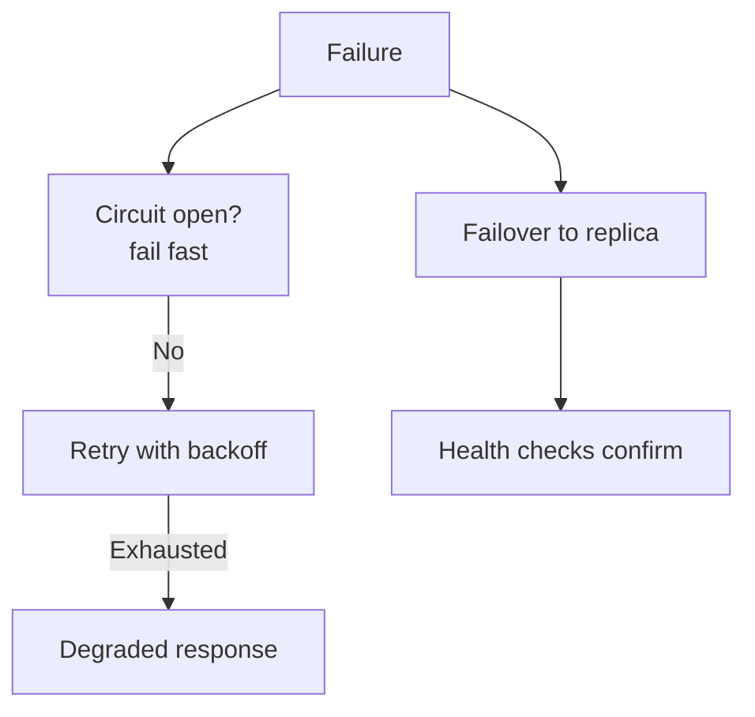

# Reliability & Fault Tolerance

> Keep working through failures — detect fast, isolate damage, degrade gracefully, recover automatically.

> Reliability is a system property built from layered defenses: nothing here is exotic alone, but together they decide whether incidents are blips or outages. Design each layer assuming the ones below it fail.

## Health Checks

Liveness (is it running) versus readiness (can it serve) probes. Load balancers and orchestrators route on them. Checks must be cheap and truthful — a health endpoint that always returns 200 hides death; one that tests deep dependencies flaps on unrelated outages.

## Retries and Timeouts

Retry transient failures (timeouts, 503s), never permanent ones (400s, auth). Every call carries a timeout — no timeout means one slow dependency freezes threads forever. Timeouts bound the worst case; retries handle the flaky case.

## Circuit Breaker

Stop calling dead dependencies: closed (normal, counting failures), open (fail fast immediately), half-open (probe with limited traffic, close on success). Prevents retry storms from cascading one outage across services. Needs per-dependency breakers plus fallbacks (cached data, defaults, 503 with Retry-After).

## Bulkhead Pattern

Isolate resources so one failure can't sink everything: separate thread pools, connection pools, and timeouts per dependency. A slow payments API must never starve the product catalog of threads. Named after ship compartments — one floods, the ship floats.

## Failover and Redundancy

Duplicate everything critical across zones: active-active (all serve, best) or active-passive (standby waits). Automatic promotion via leader election or health-triggered DNS; manual failover is a runbook, not a strategy. Test failovers with game days — untested failover fails.

## Graceful Degradation

Shed features under stress, not the whole site: disable recommendations, serve stale feeds, reduce image quality. Define degradation tiers in advance so on-call engineers flip switches instead of improvising.

## Replication, Backup, Disaster Recovery

Replicate data across zones (sync for money, async for speed). Back up with tested restores. Disaster recovery spans regions: pilot light (minimal standby), warm standby (scaled-down running), multi-site active-active (full redundancy, lowest RTO).

## RPO and RTO

Recovery Point Objective caps acceptable data loss (last backup age); Recovery Time Objective caps acceptable downtime. Example: RTO 1 hour with RPO 5 minutes. Every backup, replica, and DR strategy exists to meet these two numbers — define them first.

## Keep in mind

- Timeouts on everything; retries only for transient faults.
- Circuit breakers stop cascades — with fallbacks, not just failures.
- Bulkheads isolate pools per dependency.
- Degrade features by tier, never the whole site at once.
- Test failovers and restores — untested plans are wishes.
- RPO bounds data loss, RTO bounds downtime — define both first.
