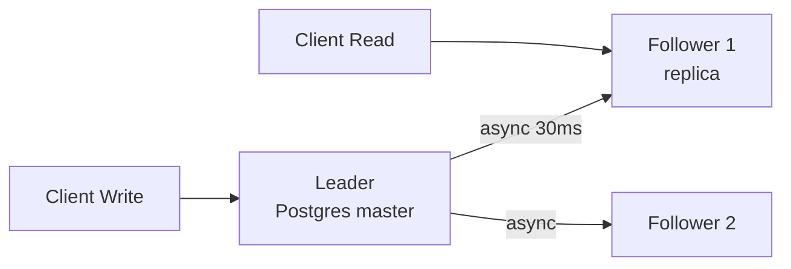

# Replication

> Same data ko kai nodes pe copy rakho — read tez, fail pe backup.

> Replication ek register ki photocopy jaisa — ek master likhe, 2 xerox alag dukaan pe. Ek dukaan band to dusri se kaam, par xerox me thoda delay.

Har DB replication karta hai — Postgres, MySQL, Cassandra, Kafka bhi.

## How it works

**1. Single-leader (master-slave):** sirf master likhe, replicas async copy. Reads replica se. Simple, par master gira to election. **Postgres, MySQL.**

**2. Multi-leader:** 2 masters alag DC me likhe, sync baad me. Conflict hota hai — last-write-wins ya vector clock. **Google Docs multi-DC?**

**3. Leaderless:** har node likh sakta hai (Dynamo, Cassandra) — `W` aur `R` se quorum. No single master.

**Sync vs Async:**
- **Sync:** write tab ok jab replica ne bhi likha — strong par slow (30ms).
- **Async:** master pe likhte hi ok, replica baad me — tez par lag (100ms stale).
- **Semi-sync:** 1 replica sync, baaki async — beech ka rasta.

## Replication lag

- **Read-your-writes:** tumne likha, fir padha to purana dikha (replica lag). Fix: critical read master se.
- **Replica lag monitor:** `pg_stat_replication`, 1 sec se zyada to alert.

**Failover:** master gira → replica ko leader banao (ZooKeeper/Raft election). Split-brain rokne ko fencing.

**🔴 Galti:** "Har read replica se" — Fresh write ke baad stale dikhega.
**✅ Sahi:** "Normal reads replica, critical (payment after write) master."

**Phrase:** "Single-leader simple, async tez par stale, sync strong par slow, critical read master se."

**Yaad rakho:** Master-slave vs leaderless, async lag → read-your-writes, failover election.

**See also:** [postgresql](/hld/postgresql), [quorum](/hld/quorum), [cap-theorem](/hld/cap-theorem).
