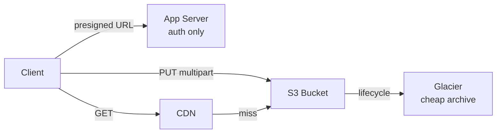

# S3 (Object Storage)

> Files ka godaam — images, videos, backups sab buckets me, practically unlimited scale pe.

> Object storage me har file (object) bucket ke andar key se rehti hai — koi folders nahi, flat namespace hai. Objects immutable hote hain (update matlab naya version). Media, backups, static hosting aur data lakes iski jagah hai. 11 9s durability milti hai kyunki har object multiple facilities me replicate hota hai.

S3 ka golden rule: bytes kabhi app servers se mat guzaaro. **Presigned URLs** do — upload aur download client seedha S3 se kare, server sirf permission de. Badi files **multipart upload** se tukdon me jaati hain (fail hua tukda dobara, poori file nahi). **Versioning** se overwrite se bacho, **lifecycle rules** se purana data saste tiers (IA/Glacier) me bhejo. Saamne [CDN](/system-design/cdn) lagao taaki repeat downloads origin tak na aayein.

## When you pick it

1. Media ho (photos, videos, thumbnails) — app servers bytes proxy na karein, presigned URLs do
2. Backups aur archives hon — versioning + lifecycle se sasta aur safe rakho
3. Static website assets hon — S3 + CDN, server ki zaroorat hi nahi
4. Data lake chahiye ho — Parquet dumps yahan, query engine (Athena/Spark) upar

**Mat lo:** structured queries (RDBMS lo), millisecond reads har request pe (aage [CDN](/system-design/cdn) ya cache rakho), ya chhoti files ka metadata store (DB me pointer, bytes S3 me — hybrid pattern).

## How it works

**Write:** client presigned URL leta hai → multipart me S3 pe upload → DB me sirf key + metadata. **Read:** CDN pehle dekhta hai → miss pe S3 → cache. **Lifecycle:** 30 din baad IA, 90 din baad Glacier — bill aadha.

## Failure modes to mention

1. **Egress bill shock** — Storage sasta, bahar data bhejna mehenga — CDN lagao, lifecycle set karo.
2. **Presigned URL leak** — Lambi expiry wali URL forward ho gayi to koi bhi download kare — chhoti expiry + private buckets.
3. **Hot key throttling** — Ek key pe bahut QPS (rare ab, par hota hai) — key me prefix hash jodo.
4. **No-atomic-rename** — Object overwrite atomic hai par "move" copy+delete hai — bade renames mehnage padte hain.
5. **Versioning cost** — Har overwrite naya version — lifecycle se purane versions expire karo nahi to bill badhega.

**🔴 Galti:** "Files DB me BLOB daal do" — DB phool jayega, backups slow, CDN nahi lagega. Bytes S3 me, pointer DB me.
**✅ Sahi:** "Media/backups S3 me — presigned URLs se direct transfer, multipart for big files, versioning + lifecycle, saamne CDN."

**Phrase:** "S3 files ka godaam hai — bytes kabhi server se mat guzaaro, presigned URLs do, versioning plus lifecycle rakho, CDN saamne lagao."

**Yaad rakho (Revision):** Buckets + keys (flat, no folders), immutable objects, presigned URLs, multipart upload, versioning, lifecycle tiers, CDN pairing, DB me pointer + S3 me bytes.

**See also:** [cdn](/system-design/cdn), [whatsapp](/system-design/whatsapp), [youtube](/system-design/youtube), [dropbox](/system-design/dropbox).
