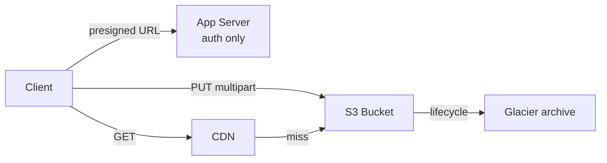

# S3 (Object Storage)

> File warehouse — images, videos, and backups in buckets at effectively unlimited scale.

> Object storage keeps every file (object) under a key in a bucket — flat namespace, no real folders. Objects are immutable (updates create versions). Media, backups, static hosting, and data lakes live here with eleven-nines durability from multi-facility replication.

## When to pick it

1. Media exists (photos, videos, thumbnails) — presigned URLs, never proxied bytes
2. Backups and archives — versioning plus lifecycle keeps them cheap and safe
3. Static website assets — S3 plus CDN needs no servers at all
4. Data lakes wanted — Parquet dumps here, query engines (Athena, Spark) above

**Don't use for:** structured queries (RDBMS territory), millisecond reads on every request (front a [CDN](/hld/cdn) or cache), or tiny-file metadata stores (pointers in DB, bytes in S3 — the hybrid pattern).

## How it works

**Write:** client takes a presigned URL, uploads multipart to S3, database keeps key plus metadata only. **Read:** CDN checks first, fetches from S3 on miss, then caches. **Lifecycle:** 30 days to Infrequent Access, 90 to Glacier — bills halve themselves.

## Failure modes to mention

1. **Egress bill shock** — storage is cheap, outbound bytes are not; add CDN and lifecycles.
2. **Presigned URL leaks** — long-lived forwarded URLs let anyone download; keep expiries short and buckets private.
3. **Hot key throttling** — extreme QPS on one key throttles; hash prefixes into keys.
4. **Non-atomic renames** — moves are copy plus delete; bulk renames cost real money.
5. **Versioning costs** — every overwrite versions; expire old versions or bills climb.

**Mistake:** "Store files as DB BLOBs."
**Correct:** "Media and backups in S3 — direct transfers via presigned URLs, multipart for big files, versioning plus lifecycle, CDN in front."

**Phrase:** "S3 is the file warehouse — bytes never transit servers, presigned URLs always, versioning plus lifecycle set, CDN out front."

**Remember (Revision):** Buckets plus keys (flat, folderless), immutable objects, presigned URLs, multipart upload, versioning, lifecycle tiers, CDN pairing, pointers in DB with bytes in S3.

**See also:** [cdn](/hld/cdn), [whatsapp](/hld/whatsapp), [youtube](/hld/youtube), [dropbox](/hld/dropbox).
