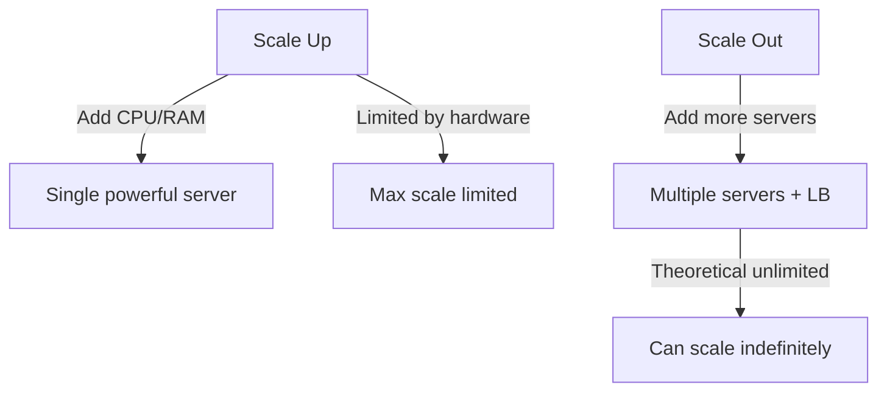

# Scalability

> System handle kar sake badhne ho gaye load ko — scale up ya scale out.

> **TL;DR Hinglish:** Scalability = system handle kar sake badhne ho gaye load ko. Scale up = server badhao (CPU/RAM) — simple par limited. Scale out = servers badhao (distributed) — better, cost effective, complex. Horizontal vs Vertical scaling. Scale out ke liye stateless servers, load balancer, distributed DB zaroori. Auto-scaling = traffic pe based servers auto add/remove.

System kabhi badhne wale load ko handle karne ke liye scale karna padta hai:

**Scale Up (Vertical):**
- Ek server badhao — CPU, RAM, disk zyada
- Simple, but hardware limit hai
- Single server fail = system down (no HA)
- Costly for high-end hardware

**Scale Out (Horizontal):**
- Servers badhao — distributed, parallel
- Better scalability, HA possible
- Stateless architecture zaroori
- Load balancer + distributed DB zaroori
- Cost effective, flexible

## Failure modes to mention

1. **Scale up ceiling** — Hardware limit, can't go beyond
2. **Stateful scaling** — Session data on server = can't scale out easily
3. **Database bottleneck** — App scale hota hai, DB nahi — read replicas, sharding se
4. **Auto-slag delay** — Auto-scaling mein new server ready hone me time lag
5. **Over-provisioning** — Zyada servers = wasted money — right-size karo

**🔴 Galti:** "Scale up always better" — Scale up limited hai hardware se, scale out unlimited scale possible hai.
**✅ Sahi:** "Scale up = add resources to one server (simple, limited). Scale out = add more servers (better, HA). Stateless architecture + LB + distributed DB for scale out."

**Phrase:** Scalability handle karne ke liye badhne wale load ko — scale up (vertical, add CPU/RAM, limited) ya scale out (horizontal, add servers, better). Auto-scaling, stateless architecture, distributed DB.

**Yaad rakho (Revision):** Scale up (vertical, limited) vs scale out (horizontal, better), stateless architecture needed for scale out, LB + distributed DB + sharding, auto-scaling, database bottleneck read replicas se.

**See also:** [Clustering](/system-design/clustering), [Load Balancing](/system-design/load-balancing), [Sharding](/system-design/sharding).
