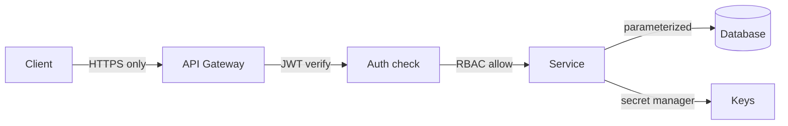

# Security

> Never trust input, identity, or the network — verify each explicitly.

> Security in system design means threat-aware architecture: every boundary validates, every identity proves itself, every secret stays sealed. Interviews expect the standard controls placed correctly, not cryptography expertise.

## Authentication vs Authorization

Authentication proves who you are (login, tokens); authorization decides what you may do (roles, policies). Sessions or tokens carry identity; every request re-verifies it — never trust client claims.

## JWT

Self-contained signed tokens: header, payload (user id, expiry, scopes), signature. Stateless verification without database lookups. Keep lifetimes short, refresh via rotation, never store secrets or PII inside — payloads are merely signed, not encrypted.

## OAuth 2.0

Delegated authorization: users grant apps limited scopes without sharing passwords. Authorization Code flow for web apps, PKCE for mobile, Client Credentials for server-to-server. Access tokens are short-lived; refresh tokens are long-lived and rotatable. OAuth 2.0 authorizes (what access); OpenID Connect on top authenticates (who the user is).

## RBAC and API Keys

Role-Based Access Control maps users to roles to permissions (admin, editor, viewer) — check on every request, cache decisions briefly. API keys identify calling applications for rate limits and billing; they authenticate apps, never users, and rotate on schedule.

## HTTPS, Encryption, Hashing

HTTPS (TLS) encrypts data in transit — everywhere, no exceptions. Encrypt sensitive data at rest (AES) with managed keys and rotation. Hash passwords with bcrypt, scrypt, or Argon2 (slow, salted) — never MD5/SHA alone, never reversible encryption for passwords.

## CORS, CSRF, XSS, SQL Injection, SSRF

CORS whitelists which origins browsers may call your APIs. CSRF forges authenticated browser requests — defend with SameSite cookies plus anti-CSRF tokens on mutations. XSS injects scripts into pages — escape output, enforce Content-Security-Policy. SQL injection dissolves under parameterized queries — never concatenate input into SQL. SSRF tricks servers into calling internal endpoints — validate and allowlist outbound URLs, block metadata endpoints.

## Secrets Management

API keys, DB passwords, and certificates live in secret managers (AWS Secrets Manager, Vault, GCP Secret Manager) — never in code, logs, or env dumps. Inject at deploy, rotate regularly, audit access. Leaked secrets rotate immediately, not eventually.

## Keep in mind

- Authenticate identity, authorize every action — separately, on every request.
- JWTs short-lived and rotated; OAuth flows matched to client type.
- RBAC checked per request; API keys identify apps, never users.
- TLS everywhere; AES at rest; slow salted hashes for passwords.
- Parameterize all queries; escape all output; sign webhooks.
- Secrets live in managers, rotate on schedule — and instantly on leak.
