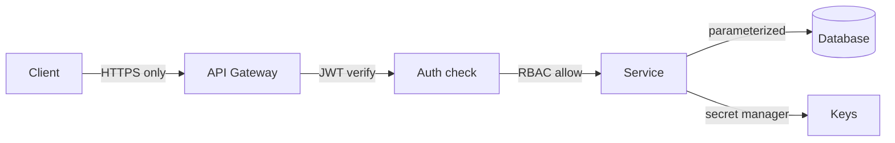

# Security

> Never trust input, identity, or the network — verify each explicitly.

> Security in system design means threat-aware architecture: every boundary validates, every identity proves itself, every secret stays sealed. Interviews expect the standard controls placed correctly, not cryptography expertise.

## Authentication vs Authorization

Authentication proves *who* you are; authorization decides *what* you may do — conflating them is a common design flaw. Login flows, MFA, and token issuance belong to authentication; roles, policies, and resource-level checks belong to authorization. Sessions or bearer tokens carry identity after login, but every protected endpoint must re-verify credentials and permissions — never trust client-supplied user IDs or role claims without signature or server-side lookup. Fail closed: missing or invalid auth returns 401; valid identity without permission returns 403.

- **401 vs 403:** unauthenticated vs authenticated-but-denied — use the right status in APIs and logs.
- **Separate services:** auth service issues tokens; each microservice enforces its own authorization (or central policy engine).
- **Defense in depth:** gateway auth plus service-level checks so a bypass at one layer does not expose data.
- **Session vs token:** sessions need server state or Redis; JWTs trade statelessness for revocation complexity.
- **Interview line:** "Authenticate at the edge, authorize at the resource, on every request."

## JWT

JSON Web Tokens pack header, payload (claims like `sub`, `exp`, `scope`), and signature into one string verifiable with a shared secret or public key. Stateless verification avoids a database hit on every request — ideal for horizontally scaled APIs if you accept limited instant revocation. Keep access-token lifetimes short (minutes to ~15), use refresh tokens with rotation for renewal, and never put secrets or sensitive PII in the payload — signing is not encryption; anyone can read Base64 claims.

- **Sign with RS256** (asymmetric) when many services verify; **HS256** only when one issuer and few verifiers.
- **Validate `exp`, `iss`, `aud`** — reject expired or wrong-audience tokens before business logic.
- **Revocation:** blocklist refresh tokens, short TTL, or session store for high-security logout requirements.
- **Don't use JWT for sessions** with heavy mutable state — use opaque server-side sessions instead.
- **Size:** huge claim sets bloat every request header — keep payloads minimal.

## OAuth 2.0

OAuth 2.0 is delegated *authorization*: users grant third-party apps limited scopes without handing over passwords. Pick the flow for the client: Authorization Code (+ PKCE) for browser and mobile apps, Client Credentials for machine-to-machine, avoid Implicit and password grants in new designs. Access tokens stay short-lived; refresh tokens are long-lived, stored securely, and rotated on use where possible. OAuth answers "what can this app access?"; **OpenID Connect** adds an ID token and standard claims so you also know *who* the user is — use OIDC when you need login, OAuth alone when you only need API access on behalf of a user.

- **PKCE** is mandatory for public clients (SPAs, mobile) — no client secret in the binary.
- **Scopes** should be minimal (`read:orders` not `admin`) — least privilege at consent time.
- **Token storage:** httpOnly cookies for browser sessions beat localStorage for XSS resistance.
- **Resource servers** validate access tokens (introspection or JWT verify) — don't trust the client to enforce scopes.
- **Interview sketch:** user → auth server → auth code → app exchanges for tokens → API with Bearer token.

## RBAC and API Keys

Role-Based Access Control maps users (or service accounts) to roles, roles to permissions — e.g. admin, editor, viewer on resources or actions. Evaluate authorization on every request after authentication; cache role decisions briefly (seconds) if lookups are expensive, but invalidate on role change. API keys identify *applications* or integrations for rate limiting, billing, and audit — they are not a substitute for user authentication and must not appear in browser code. Rotate keys on schedule, support multiple active keys during rotation, and log which key called which endpoint.

- **RBAC vs ABAC:** RBAC is coarse roles; attribute-based policies add context (owner, department) — mention when interviews ask "fine-grained."
- **Hierarchy:** admin ⊃ editor ⊃ viewer — avoid permission explosion with role inheritance.
- **Service accounts:** machines get roles too — separate from human SSO identities.
- **API keys:** header `X-API-Key` or `Authorization: ApiKey ...`; throttle per key, revoke on leak.
- **Never** embed API keys in mobile or SPA bundles — use backend-for-frontend or OAuth instead.

## HTTPS, Encryption, Hashing

HTTPS (TLS 1.2+) encrypts data in transit and authenticates the server — terminate TLS at the load balancer or gateway, enforce HSTS, and redirect HTTP to HTTPS with no exceptions for APIs. Encrypt sensitive data at rest with AES-256 using KMS-managed keys, envelope encryption for large blobs, and a documented rotation plan. Passwords never store plaintext or reversible encryption — hash with **bcrypt**, **scrypt**, or **Argon2** with per-user salt and tuned cost factors; MD5/SHA-256 alone are instant crack fodder. Separate concerns: TLS protects on the wire, at-rest encryption protects stolen disks, hashing protects credential databases.

- **TLS everywhere:** internal service mesh mTLS adds defense if a VPC boundary is breached.
- **KMS:** cloud key management for DEK rotation without re-encrypting all data manually.
- **PII fields:** encrypt or tokenize columns that regulations require; log redaction for PAN/SSN.
- **Certificate lifecycle:** automate ACME/Let's Encrypt or managed certs — expired certs cause outages.
- **Interview:** "In transit TLS, at rest AES-KMS, passwords Argon2 — three different problems."

## CORS, CSRF, XSS, SQL Injection, SSRF

**CORS** is browser-enforced: your API returns `Access-Control-Allow-Origin` for whitelisted origins — it does not stop curl or server-side callers. **CSRF** tricks a logged-in browser into POSTing to your site — use `SameSite=Lax/Strict` cookies, anti-CSRF tokens on state-changing forms, and prefer SameSite cookies over pure localStorage sessions for cookie-based auth. **XSS** injects script into pages — escape output contextually, sanitize rich HTML if needed, and deploy a strict **Content-Security-Policy**. **SQL injection** fails when every query uses bound parameters / prepared statements — never concatenate user input into SQL. **SSRF** makes your server fetch attacker-chosen URLs — block link-local and metadata IPs (`169.254.169.254`), allowlist outbound hosts, and don't pass raw URLs from users to backend fetchers.

- **CORS preflight:** OPTIONS handling must match actual methods/headers or browsers block legitimate clients.
- **Stored vs reflected XSS:** CSP + encoding beats regex blacklists on input.
- **ORM safety:** still parameterize raw queries and `$where`-style escape hatches.
- **SSRF in webhooks:** validate callback URLs, disable redirects, use separate egress network for fetchers.
- **Defense stack:** parameterized DB, CSP, SameSite, CORS whitelist, SSRF egress controls — name all five in security questions.

## Secrets Management

Database passwords, API keys, TLS private keys, and signing secrets belong in a **secret manager** (AWS Secrets Manager, HashiCorp Vault, GCP Secret Manager) — not in git, Docker images, CI logs, or `.env` committed by mistake. Inject secrets at deploy time via sidecars or platform env references; rotate on a schedule and audit who read what. On leak, rotate immediately and assume compromise until proven otherwise — "we'll fix it next sprint" is not a control.

- **Never log secrets** — scrub headers and query params in structured logging pipelines.
- **Separate secrets per environment** — prod keys never in dev laptops or shared staging.
- **Short-lived credentials:** IAM roles for workloads beat long-lived access keys on EC2/Lambda.
- **Break-glass:** document emergency rotation runbooks before the incident.
- **CI/CD:** fetch secrets from vault at pipeline runtime; use OIDC to cloud instead of static cloud keys in GitHub.

## Keep in mind

- Authenticate identity, authorize every action — separately, on every request.
- JWTs short-lived and rotated; OAuth flows matched to client type (Code + PKCE for public clients).
- RBAC checked per request; API keys identify apps, never end users in the browser.
- TLS everywhere; AES at rest with KMS; slow salted hashes for passwords — never MD5.
- Parameterize all queries; escape output; CSP + SameSite; sign and verify webhooks.
- Secrets live in managers, rotate on schedule — and instantly on leak; no secrets in repos or logs.
