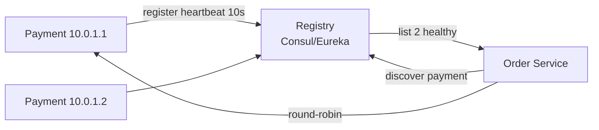

# Service Discovery

> Kaunsa instance zinda aur kahan? — DNS ya registry se dhoondo.

> Service discovery ek phonebook jaisa — `payment` naam bolo to phonebook 3 healthy numbers de: `10.0.1.1:8080, 10.0.1.2:8080`. Instance mar gaya to phonebook se naam kato.

Microservices me IP har deploy pe badalta hai — hardcode nahi.

## 2 tarike

**1. Client-side (Netflix Eureka):** client khud registry se list leke `round-robin` kare. Cache 30 sec, heartbeat 10 sec. **Ribbon, gRPC.**

**2. Server-side (AWS ALB / K8s Service):** client bas `payment.service` DNS bole, LB khud healthy pe bheje. Client simple.

**DNS vs Registry:**
- **DNS (`payment.service → 10.0.1.1`)** — simple, par TTL 30 sec se purana IP mil sakta, health nahi dekhta.
- **Registry (Eureka, Consul, etcd):** `REGISTER` + `HEARTBEAT 10s` + `WATCH` — real health.

## Health checks

- **Heartbeat:** instance har 10 sec `PUT /heartbeat` → 30 sec nahi aaya to `DOWN`.
- **Watch:** client `WATCH /services/payment` → change pe turant nayi list.

## K8s me

`Service` = DNS + virtual IP (kube-proxy) → endpoints. `Endpoints` controller health dekhe.

## Failure handling

- **Cache stale:** 30 sec purana list → circuit breaker + retry next.
- **Thundering:** saare clients ek saath registry puchenge → cache + gossip.
- **Split-brain:** registry khud 3 nodes quorum — CP.

**🔴 Galti:** "IP hardcode" — Deploy pe sab toot jayega.
**✅ Sahi:** "Registry heartbeat 10s, watch, client cache 30s, DNS TTL kam."

**Phrase:** "Service discovery phonebook — register + heartbeat, discover via registry or DNS, health watch."

**Yaad rakho:** Register 10s, cache 30s, watch, DNS TTL, K8s Service.

**See also:** [load-balancer](/hld/load-balancer), [zookeeper](/hld/zookeeper), [gossip-protocol](/hld/gossip-protocol).
