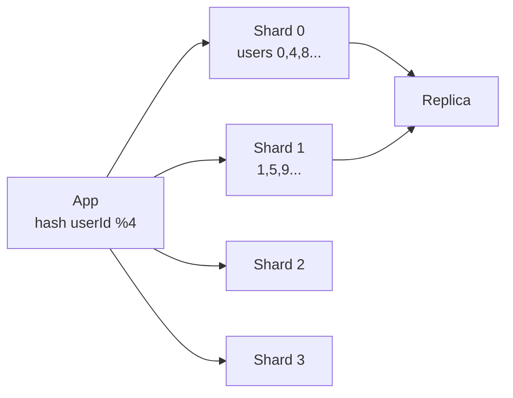

# Sharding

> Ek bada DB 4 chhote DBs me baanto. Key se decide karo row kis shard pe jayega.

> Ek diary moti ho gayi to 4 diary me baanto — `userId % 4` se decide. Har diary apna hissa, ek sath search karna mehenga. Shard key galat to ek diary garam, baaki thandi.

Jab single Postgres 1TB / 10k QPS cross kare, vertical scale mehenga — shard karo.

## How to shard

**1. Hash sharding:** `shard = hash(userId) % N` — barabar, par range query mushkil (`WHERE ts BETWEEN` ko saare shards pucho).

**2. Range sharding:** `userId 1-1M → shard1, 1M-2M → shard2` — range easy, par naya user sirf last shard pe → hot spot (append-only).

**3. Directory / Lookup:** map `userId → shard` alag table me — flexible par ek aur hop.

**4. Geo sharding:** `cityId` pe — NYC data NYC shard, Uber me yehi.

**Shard key kaise chune?**
- Query dekho — `WHERE userId=?` to `userId` pe, `WHERE chatId=?` to `chatId` pe.
- Cardinality high — `userId` theek, `country` nahi (4 hi values).
- Even distribution — `hash(userId)` barabar, `created_at` nahi.

## Challenges

- **Cross-shard join:** `JOIN users, orders` do shards pe → app me 2 queries karke jodo, ya denormalize.
- **Cross-shard transaction:** 2 shards pe `transfer` — 2PC heavy. Better: outbox + saga, ya same shard pe rakho (co-locate `user` + `orders` same `userId` shard pe).
- **Rebalancing:** N=4 se 5 kiye to `hash%N` se 80% move — consistent hashing use karo ya logical shards (1000 shards → 4 nodes pe 250 each, add node to 200 each).

## Shard vs Partition vs Replica

- **Shard:** horizontal split, alag data
- **Replica:** same data copy, read scale + failover
- **Partition:** Cassandra me shard jaisa, hash ring pe

**Hot shard fix:** celebrity `userId` pe 10k QPS → key split `userId#1`, `userId#2` ya cache + write-behind.

**Auto-sharding:** Vitess, Citus, Aurora Limitless — par interview me manual `hash(userId)` bolo.

**🔴 Galti:** "Shard key `created_at`" — Saare naye writes ek shard pe.
**✅ Sahi:** "Query pattern pe shard key, co-locate related tables, cross-shard avoid, consistent hash for rebalance."

**Phrase:** "Shard key = query ka `WHERE`, hash barabar, co-locate kar ke cross-shard kam, rebalance consistent hashing se."

**Yaad rakho (Revision):** Hash vs Range vs Geo, shard key = high cardinality + query, cross-shard → app join / outbox, hot shard → split/cache.

**See also:** [postgresql](/hld/postgresql), [consistent-hashing](/hld/consistent-hashing), [cassandra](/hld/cassandra).
