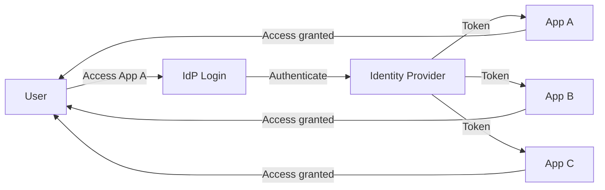

# Single Sign-On

> Ek login poore applications pe kaam kare — centralized authentication.

> **TL;DR Hinglish:** SSO ek hi login poore applications ke liye kaam karta hai. Identity Provider (IdP) authenticate karta hai, applications IdP pe depend karte hain. SAML, OIDC, OAuth 2.0 protocols use hote hain. Benefits: better UX (one login), security centralized (IdP manage karta), less password fatigue. Kerberos, SAML, OIDC popular protocols hain. Jab user login karta hai IdP pe, token milega applications ko — no re-login needed.

Single Sign-On ek hi credential se multiple apps access karta hai:

**How SSO works:**
1. User tries to access App A
2. Redirected to Identity Provider (IdP)
3. User logs in to IdP (one time)
4. IdP sends token/certificate to App A
5. User authenticated — no need to login again for App B, C, D
6. **Centralized** — IdP manages authentication

**Protocols:**
- **SAML** — XML-based, enterprise SSO, old but widely used
- **OIDC** — JSON/JWT-based, modern, REST-friendly
- **OAuth 2.0** — Delegation protocol (authorization)
- **Kerberos** — Ticket-based, internal enterprise SSO

## Failure modes to mention

1. **IdP SPOF** — IdP fail = no access to any app — HA IdP, fallback
2. **Token theft** — Stolen token = access to all apps — short-lived tokens, MFA
3. **SAML vulnerabilities** — XML signature bypass — use OIDC instead
4. **Logout complexity** — Single logout across all apps — SLO (Single Logout) protocol

**🔴 Galti:** "SSO = no security" — SSO centralized authentication actually improves security — one place to secure, MFA easier.
**✅ Sahi:** "SSO = one login for multiple apps, IdP manages authentication. Protocols: SAML (XML), OIDC (JWT), Kerberos. IdP SPOF risk, token security important."

**Phrase:** SSO ek login se multiple apps access karta hai — IdP (Identity Provider) centralized authentication, protocols SAML/OIDC/Kerberos, better UX + security.

**Yaad rakho (Revision):** SSO = one login multiple apps, IdP manages authentication, protocols (SAML/OIDC/Kerberos), IdP SPOF risk, token theft risk, SLO for logout, better UX + centralized security.

**See also:** [OAuth 2.0 and OIDC](/system-design/oauth2-and-openid-connect), [SSL, TLS, mTLS](/system-design/ssl-tls-mtls), [Microservices](/system-design/microservices).
