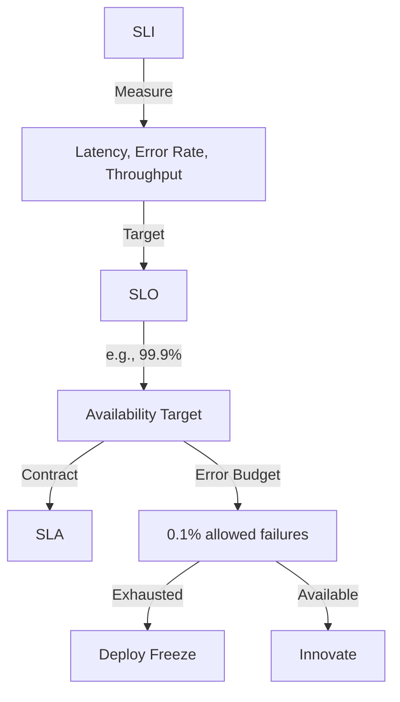

# SLA, SLO, SLI

> Service quality measure karo — agreements, objectives, indicators.

> **TL;DR Hinglish:** SLA (Service Level Agreement) contractual commitment hai — availability, uptime guarantee. SLO (Service Level Objective) internal target hai — 99.9% uptime. SLI (Service Level Indicator) metric hai jo measure karta performance — latency, error rate, throughput. SLA = contract, SLO = internal target, SLI = measurement. Error budgets se risk manage karo — if error budget exhaust hota hai, deploy freeze.

SLA/SLO/SLI service quality ka framework hai:

**Definitions:**
- **SLI (Indicator)** — Metric jo measure karta service performance (latency, error rate, availability)
- **SLO (Objective)** — Internal target based on SLI (e.g., p99 latency < 200ms, availability 99.9%)
- **SLA (Agreement)** — Customer-facing contract, breach pe penalty

**How they relate:**
- SLI = what you measure
- SLO = what you target
- SLA = what you promise

**Error budgets:**
- SLO 99.9% → error budget = 0.1% allowed failures
- Budget exhaust = stop deploying, fix reliability first
- Budget available → innovate, deploy features

## Failure modes to mention

1. **SLA breach** — Uptime below guaranteed → penalties, customer loss
2. **Error budget exhaustion** — Too many incidents → deploy freeze, feature freeze
3. **Wrong SLO** — Too strict = no innovation, too loose = unreliable
4. **SLI blind spot** — Measuring wrong metric → false confidence

**🔴 Galti:** "SLA = SLO = SLI" — Teeno different hain — SLI measure karta, SLO target set karta, SLA promise karta.
**✅ Sahi:** "SLI = metric (latency), SLO = target (99.9%), SLA = contract (penalty). Error budget = allowed failures. Budget exhausted = deploy freeze."

**Phrase:** SLA/SLO/SLI — SLI measure karta (metrics), SLO target set karta (internal), SLA promise karta (contract). Error budgets se risk manage karo.

**Yaad rakho (Revision):** SLI (measure), SLO (target), SLA (contract), error budget = allowed failures, budget exhausted = deploy freeze, p99/p95 latency, availability targets.

**See also:** [Availability](/system-design/availability), [Metrics Monitoring](/system-design/metrics-monitoring), [Observability](/system-design/observability).
