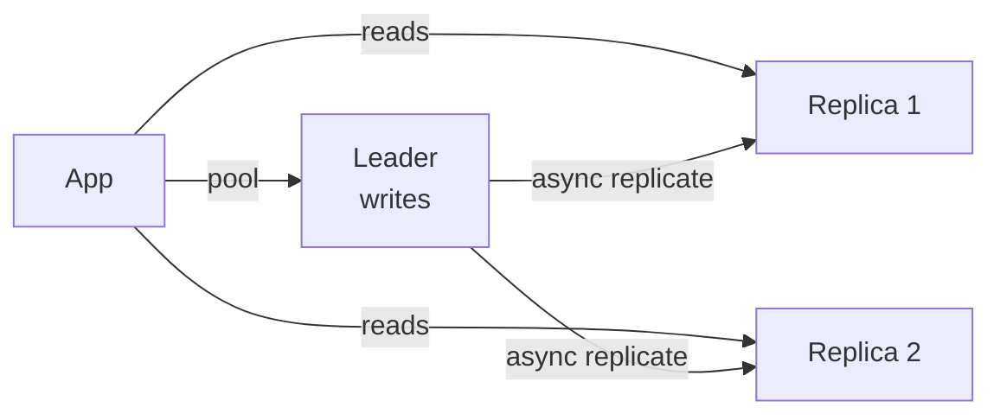

# SQL Databases

> Structured tables with relationships — the default until scale forces you out.

> Relational databases store rows in tables with fixed schemas, linked by foreign keys. Their superpower is ACID transactions plus expressive queries: joins, aggregations, constraints. PostgreSQL and MySQL cover 90% of applications — start here unless a concrete scale number pushes you out.

## Tables, Keys, and Normalization

Primary keys uniquely identify rows — use surrogate BIGINT or UUID when natural keys change; foreign keys enforce referential integrity so orphans cannot exist. Normalization splits data into tables so each fact lives once: 1NF requires atomic columns (no comma-separated lists), 2NF removes partial dependencies on composite keys, 3NF removes transitive dependencies (city stored only on `addresses`, not duplicated on every `orders` row). Normalized schemas make updates cheap and constraints easy to enforce, which is why OLTP systems default here.

- **Primary vs natural keys:** Surrogate keys survive business rule changes; natural keys (email, SKU) work when truly immutable.
- **Foreign keys:** Enable joins and CASCADE rules; skipping them in app-only validation invites drift under race conditions.
- **1NF–3NF:** Interview shorthand — "one fact, one place" beats memorizing formal definitions.
- **When to stop normalizing:** Beyond 3NF (BCNF) matters for edge cases; most apps stop at 3NF unless analytics forces otherwise.

## Denormalization

Denormalization deliberately duplicates data to speed reads — precomputed counts, embedded JSON snapshots, or flattened reporting tables that mirror how dashboards query. Use it when measured join cost dominates (wide fan-out joins, aggregations over millions of rows) and the duplicated fields change infrequently. The price is write amplification: every update must touch every copy, or you accept temporary inconsistency between the canonical row and the denormalized view.

- **OLAP vs OLTP:** Warehouses and read replicas often denormalize; transactional cores stay normalized until profiling proves pain.
- **Materialized views:** Postgres/MySQL can refresh denormalized snapshots on a schedule — safer than hand-maintained duplicates.
- **Embedded documents in SQL:** JSON columns (Postgres `jsonb`) blend flexibility with relational constraints when duplication is localized.
- **Staleness budget:** Name how stale denormalized counts may be (e.g., "likes within 30s") before choosing async refresh.

## Indexes

B-tree indexes (default in Postgres/MySQL) support equality, range, and `ORDER BY` on indexed columns; hash indexes help exact-match-only workloads but are niche. Composite indexes follow left-prefix rules — index `(user_id, created_at)` serves `WHERE user_id=?` and `WHERE user_id=? AND created_at>?`, not `WHERE created_at=?` alone. Every index accelerates targeted reads and slows inserts/updates/deletes because the tree must stay balanced; aim for fewer, wider indexes that match real query plans, not one index per column.

- **Covering index:** Includes all selected columns so the planner satisfies the query from the index alone (index-only scan).
- **Selectivity:** Low-cardinality columns (boolean flags) rarely benefit alone — combine with high-selectivity leading columns.
- **Partial indexes:** Index only active rows (`WHERE deleted_at IS NULL`) to shrink size and write cost.
- **Write tax rule of thumb:** Each extra index can add 10–30% write latency on hot tables — measure, don't guess.

## Query Optimization

Start with `EXPLAIN (ANALYZE, BUFFERS)` on production-like data: sequential scans on large tables, nested-loop joins with huge inner loops, and sort/hash spills to disk are red flags. Fix the highest-latency, highest-QPS queries first — a 50ms query at 10k RPS beats a 5s batch job. Common wins: add or adjust indexes, rewrite correlated subqueries as joins, paginate with keyset (`WHERE id > ? LIMIT n`) instead of `OFFSET` on deep pages.

- **Seq scan vs index scan:** Small tables or "most rows match" filters may correctly seq-scan — forcing indexes can hurt.
- **N+1 queries:** ORMs hide them; batch with `IN (...)` or joins in one round trip.
- **Statistics:** Stale stats cause bad plans — run `ANALYZE` after large loads; consider extended stats on correlated columns.
- **Connection + query together:** A perfect plan still fails if the pool is exhausted — optimize queries and pool sizing in parallel.

## Transactions and ACID

A transaction groups statements into one atomic unit: **Atomicity** rolls back everything on failure; **Consistency** keeps constraints true (balances non-negative, FKs valid); **Isolation** prevents concurrent sessions from seeing impossible interleavings; **Durability** persists committed work after crash (WAL/fsync). Use explicit transactions for multi-step invariants — transfer money, reserve inventory, create order + line items — never rely on "each statement auto-commits" for business rules.

- **BEGIN/COMMIT boundaries:** Keep transactions short; long transactions hold locks and bloat MVCC versions (Postgres).
- **Savepoints:** Partial rollback inside a transaction for complex flows without losing the whole unit.
- **Read-only transactions:** Mark read-only when possible to reduce lock footprint and enable replica routing.
- **Interview line:** "Money moves in one transaction with isolation chosen for the race you're preventing."

## Isolation Levels and Locks

**Read Uncommitted** allows dirty reads (rarely used). **Read Committed** sees only committed rows — default in Postgres; each statement sees a fresh snapshot. **Repeatable Read** holds a snapshot for the whole transaction (MySQL InnoDB default). **Serializable** prevents phantom reads via predicate locking — slowest, use when correctness dominates. Row-level locks block writers; `SELECT ... FOR UPDATE` locks rows you intend to mutate after a read — essential for read-modify-write without lost updates.

- **Lost update:** Two reads then two writes — fix with `FOR UPDATE`, optimistic versioning (`UPDATE ... WHERE version=?`), or serializable.
- **Phantom reads:** New rows appear in a repeated range scan — repeatable read or serializable stops them.
- **MVCC vs locking:** Postgres readers rarely block writers; understand your engine — InnoDB differs from Postgres defaults.
- **Pick level by symptom:** Double spends → serializable or explicit row locks; stale dashboard → read committed on replica is fine.

## Deadlocks

Deadlocks occur when transaction A holds lock on row 1 and waits on row 2 while B holds row 2 and waits on row 1 — the engine detects cycles via wait-for graphs or timeouts and aborts one victim (usually the cheaper rollback). Prevention beats detection: acquire locks in a global order (always lock `accounts` by ascending `id`), keep transactions short, and avoid user-facing work inside transactions.

- **Retry deadlocks:** Treat deadlock error codes as transient — retry with jitter once or twice.
- **Index gaps:** Next-key locks in InnoDB can deadlock on inserts — consistent index design reduces gap contention.
- **Hot row updates:** Single counter row serializes everyone — shard counters or use append-only event tables.
- **Monitoring:** Log deadlock graphs in Postgres/MySQL — recurring patterns point to lock-order bugs.

## Read Replicas and Replication

The **leader** (primary) accepts writes and ships WAL/binlog to **followers** (replicas) that apply changes and serve read traffic — classic horizontal read scaling. **Synchronous** replication waits for follower ack before commit (strong durability, higher latency); **asynchronous** commits locally and replicates later (fast writes, lag and possible loss if leader dies before ship). **Read-your-writes** is not automatic on async replicas — route session-critical reads to the leader or use lag-aware routing.

- **Replication lag:** Measure seconds behind primary; UI that "saved" then reads stale replica confuses users — stick to leader after write.
- **Failover:** Promote replica with orchestration (Patroni, RDS Multi-AZ); expect brief unavailability or split-brain without fencing.
- **Replica roles:** Analytics and reports on replicas; never run heavy migrations only on replicas without understanding replay load.
- **Semi-sync:** Middle ground — wait for one replica ack — common compromise in MySQL setups.

## Partitioning, Sharding, Connection Pooling

**Partitioning** splits one logical table into physical chunks (range by date, hash by id, list by region) on one server — easier archival and partition pruning. **Sharding** spreads partitions across many servers keyed by **shard key** — scale writes when a single primary caps out (~ tens of k writes/s depending on hardware). Cross-shard queries and distributed transactions are expensive; co-locate data accessed together (`user_id` shards user, orders, and settings). **Connection pools** (PgBouncer, HikariCP) bound open connections — Postgres dies around hundreds of idle connections per instance; pool size ≈ `(cores * 2) + spindle` per app tier, not "one connection per request."

- **Shard key = WHERE clause:** If 99% of queries filter `tenant_id`, shard by `tenant_id` — not by `user_id` if tenants span users.
- **Rebalancing:** Consistent hashing or virtual shards ease moving load when nodes join — plan before keys cement.
- **Global tables:** Small reference data replicated to every shard avoids cross-shard joins for lookups.
- **Pool modes:** Transaction pooling (PgBouncer) saves connections but breaks session-level features — know what your ORM needs.

## Keep in mind

- Start with Postgres/MySQL; leave only on measured scale pain (QPS, storage, write ceiling).
- Normalize for transactions, denormalize for analytics — deliberate choice with a staleness budget.
- Index by query pattern; every index taxes writes — covering indexes when reads dominate.
- Money flows use ACID transactions with isolation matched to the race (often `FOR UPDATE` or serializable).
- Deadlocks come from lock order — consistent ordering, short transactions, retry on victim.
- Replicas scale reads; sharding scales writes — shard key equals the dominant WHERE clause.
- Pool connections always (PgBouncer/HikariCP); never one connection per HTTP request.
