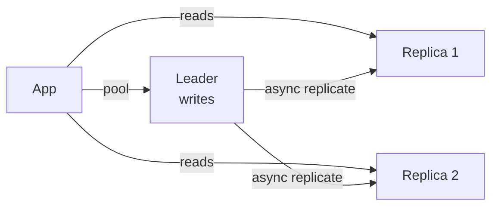

# SQL Databases

> Structured tables with relationships — the default until scale forces you out.

> Relational databases store rows in tables with fixed schemas, linked by foreign keys. Their superpower is ACID transactions plus expressive queries: joins, aggregations, constraints. PostgreSQL and MySQL cover 90% of applications — start here unless a concrete scale number pushes you out.

## Tables, Keys, and Normalization

Primary keys uniquely identify rows; foreign keys link tables. Normalization (1NF atomic values, 2NF no partial dependency, 3NF no transitive dependency) removes redundancy and keeps writes clean.

## Denormalization

Denormalization deliberately duplicates data to speed up reads — precomputed counts, embedded details, flattened reporting tables. Use it for read-heavy analytics (OLAP) where joins cost more than duplication. The price is update anomalies: every copy must change together, so reserve it for data that rarely changes or tolerates brief staleness.

## Indexes

B-tree indexes (the default) accelerate equality and range lookups; hash indexes serve exact matches; composite indexes cover multi-column queries in column order. Every index speeds reads and taxes writes plus storage — index by query pattern, not by column count. A covering index answers the query without touching the table.

## Query Optimization

Read query plans (`EXPLAIN`): sequential scans on big tables, missing index usage, and nested loops over large joins are the usual suspects. Optimize selectively — the slowest query first, measured before and after.

## Transactions and ACID

Atomicity (all or nothing), Consistency (valid states), Isolation (concurrent safety), Durability (survives crashes). Money movements live here: debit plus credit commit together or roll back together.

## Isolation Levels and Locks

Read Uncommitted (dirty reads), Read Committed (committed only), Repeatable Read (stable within transaction), Serializable (full isolation, slowest). Higher isolation means less concurrency. Locks enforce isolation: row locks for writers, with `SELECT FOR UPDATE` for read-then-write patterns.

## Deadlocks

Two transactions waiting on each other's locks — detect via timeouts or wait-graphs, then abort one. Prevent with consistent lock ordering and short transactions holding minimal locks.

## Read Replicas and Replication

Leader handles writes; followers replicate and serve reads — horizontal read scaling. Synchronous replication loses nothing but waits; asynchronous is fast but lags (stale reads, possible loss on leader crash). Read-your-writes consistency may require reading from the leader afterWrites.

## Partitioning, Sharding, Connection Pooling

Partitioning splits one table (by range, hash, or time) for manageability; sharding splits across servers by shard key for scale — choose the key from the query pattern (`WHERE userId=?` means shard by userId). Cross-shard joins and transactions hurt — co-locate related data. Connection pools cap database connections; every app server shares a bounded pool, never one connection per request.

## Keep in mind

- Start with Postgres/MySQL; leave only on measured scale pain.
- Normalize for transactions, denormalize for analytics — deliberate choice.
- Index by query pattern; every index taxes writes.
- Money flows use ACID transactions with appropriate isolation.
- Deadlocks come from lock order — keep transactions short and ordered.
- Replicas scale reads; sharding scales writes — shard key equals the WHERE clause.
- Pool connections always; never one per request.
