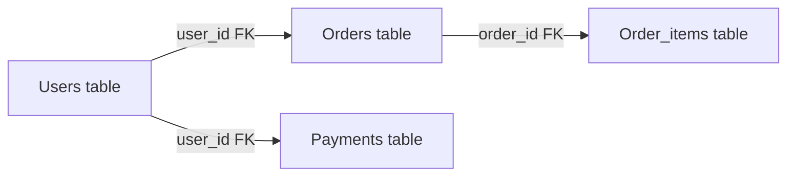

# SQL Databases

> Relational databases — structured tables with relationships, ACID transactions.

> SQL databases structured tables mein data rakhte hain — rows and columns, foreign keys se relate hote hain. ACID properties (Atomicity, Consistency, Isolation, Durability) transactions reliable banate hain. SQL query language se data retrieve karte hain — SELECT, JOIN, WHERE, GROUP BY. Postgres, MySQL, Oracle popular hain. Best for financial apps, inventory, anything structured.

SQL databases structured relational data store karte hain:

**Key features:**
- Tables with rows (records) and columns (fields), predefined schema
- Primary keys (unique identifier), Foreign keys (relationships)
- ACID properties for reliable transactions
- SQL language — SELECT, INSERT, UPDATE, DELETE, JOIN
- Indexes for fast queries (B-tree, hash)

**Popular SQL databases:**
- **PostgreSQL** — feature-rich, JSON support, open source
- **MySQL** — fast, popular for web apps
- **Oracle** — enterprise, expensive, feature-complete

## Failure modes to mention

1. **Deadlock** — Two transactions wait for each other — timeout/deadlock detection
2. **Schema migration** — ALTER TABLE locks table — use online migrations
3. **Write contention** — Same row update by multiple users — optimistic/pessimistic locking

**🔴 Galti:** "SQL databases always scale horizontally" — SQL primarily vertical, read replicas for horizontal (not native sharding).
**✅ Sahi:** "SQL = structured tables, ACID, joins, foreign keys. Postgres/MySQL popular. Horizontal scaling limited — read replicas + connection pooling."

**Phrase:** SQL databases structured tables with relationships, ACID transactions, SQL query language, Postgres/MySQL/Oracle — best for structured, transactional data.

**Yaad rakho (Revision):** Tables + rows + columns, primary/foreign keys, ACID (Atomicity, Consistency, Isolation, Durability), SQL queries, Postgres/MySQL, vertical scaling, read replicas.

**See also:** [PostgreSQL](/hld/postgresql), [Database Replication](/hld/database-replication), [Databases and DBMS](/hld/databases-and-dbms).
