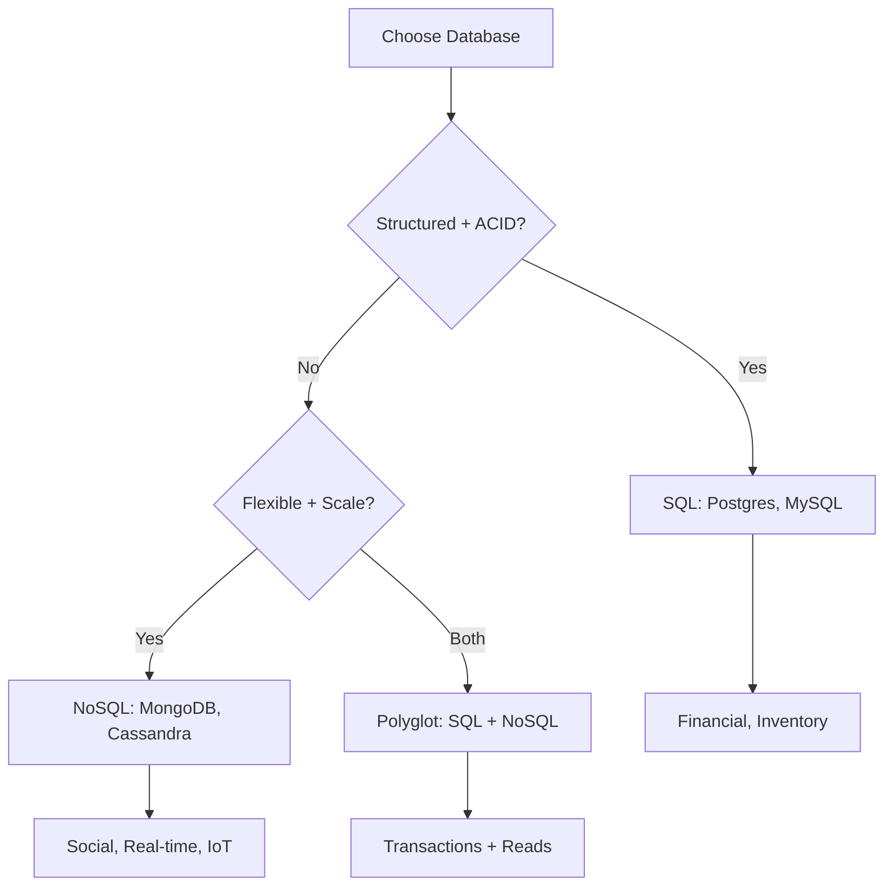

# SQL vs NoSQL databases

> Kaunsa database choose karo — structured ya flexible? ACID ya scale?

> SQL vs NoSQL ka sawaal: structured + ACID (SQL) vs flexible + scale (NoSQL). SQL = tables, joins, ACID, vertical scaling. NoSQL = documents, flexible schema, horizontal scaling, eventual consistency. Jab financial data ho SQL, jab real-time social data ho NoSQL. Polyglot persistence — dono use karo alag-alag purposes ke liye.

SQL aur NoSQL ka comparison — interview mein bohot poochha jaata hai:

**Key differences:**
- **Schema** — SQL predefined (rigid), NoSQL flexible
- **Scaling** — SQL vertical (scale up), NoSQL horizontal (scale out)
- **Consistency** — SQL ACID, NoSQL eventual (tunable)
- **Joins** — SQL supported, NoSQL not (denormalize)
- **Query language** — SQL standard, NoSQL varies by type

**When to choose:**
- **SQL** — Financial data, inventory, complex queries, transactions
- **NoSQL** — Social media, real-time analytics, IoT, flexible schema
- **Both** — Polyglot persistence — use SQL for transactions, NoSQL for reads

## Failure modes to mention

1. **Wrong choice** — SQL for high-write app = bottleneck, NoSQL for financial = no ACID = data corruption
2. **Mixed data model** — SQL and NoSQL data sync complexity — change data capture
3. **Migration cost** — SQL to NoSQL migration hard — data denormalization, application rewrite

**🔴 Galti:** "SQL ya NoSQL — ek hi choose karo sab ke liye" — Polyglot persistence — alag-alag purposes ke liye alag DB use karo.
**✅ Sahi:** "SQL = ACID + joins, NoSQL = flexible + scale. Financial data = SQL, social/real-time = NoSQL. Polyglot persistence = both based on use case."

**Phrase:** SQL structured + ACID + joins + vertical scale vs NoSQL flexible + horizontal scale + eventual consistency. Choose based on data structure and consistency needs.

**Yaad rakho (Revision):** SQL (structured, ACID, joins, vertical) vs NoSQL (flexible, scale, eventual, horizontal), when to choose which, polyglot persistence (use both).

**See also:** [SQL databases](/hld/sql-databases), [NoSQL databases](/hld/nosql-databases), [Database Replication](/hld/database-replication).
