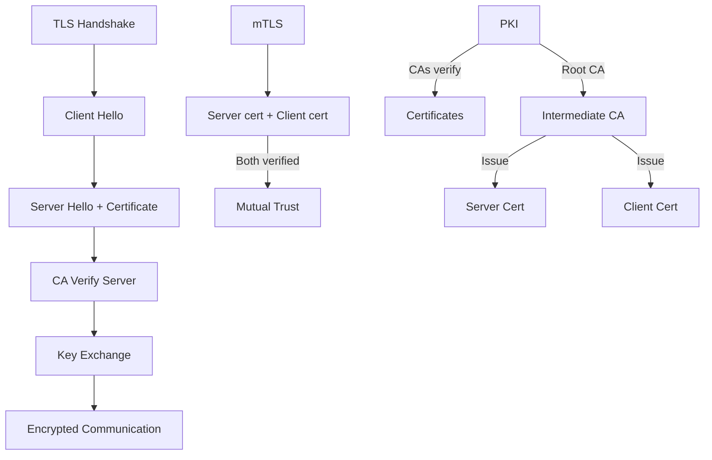

# SSL, TLS, mTLS

> Encryption protocols — data secure channel mein bhejo.

> **TL;DR Hinglish:** SSL/TLS data encryption karta hai — client-server communication secure. TLS = updated SSL (TLS 1.2/1.3). mTLS (mutual TLS) dono parties authenticate karte hain — client bhi certificate dikhata server ko. Encryption = data unreadable, Integrity = data unmodified, Authentication = who is communicating. HTTPS = HTTP + TLS. Certificate Authorities (CAs) verify identity. PKI (Public Key Infrastructure) backbone hai.

SSL/TLS/mTLS secure communication ke liye:

**How TLS works:**
1. Client hello — supported TLS versions, cipher suites
2. Server hello — chosen cipher, sends certificate
3. Certificate verification — CA verifies server identity
4. Key exchange — Diffie-Hellman, shared secret establish
5. Encrypted communication — symmetric encryption with shared secret

**mTLS (Mutual TLS):**
- Server authenticates client too (not just server)
- Client sends certificate to server
- Both sides verified
- Use cases: service-to-service, API gateways, internal microservices

## Failure modes to mention

1. **Certificate expiry** — Expired certificate = connection failure — auto-renewal (Let's Encrypt)
2. **Weak cipher** — Outdated cipher suites vulnerable — TLS 1.3 only
3. **MITM attack** — Man-in-the-middle intercepts — certificate pinning, mTLS prevents
4. **mTLS overhead** — Mutual authentication adds latency — performance cost
5. **CA compromise** — Root CA breached = all certificates untrusted — certificate transparency

**🔴 Galti:** "SSL still used" — SSL deprecated, TLS 1.2/1.3 use karo. SSL = old, TLS = current.
**✅ Sahi:** "TLS = current encryption (TLS 1.2/1.3). mTLS = both client+server authenticate. HTTPS = HTTP + TLS. PKI infrastructure, CA verify certificates."

**Phrase:** SSL/TLS/mTLS encryption protocols — TLS (updated SSL), HTTPS = HTTP + TLS, mTLS = mutual authentication, PKI/CA verify, TLS 1.3 preferred.

**Yaad rakho (Revision):** TLS 1.2/1.3 current, HTTPS = HTTP+TLS, handshake (client+server hello, certificate, key exchange), mTLS = mutual auth, PKI/CA, certificate expiry risk, TLS 1.3 preferred.

**See also:** [OAuth 2.0 and OIDC](/system-design/oauth2-and-openid-connect), [Single Sign-On](/system-design/single-sign-on), [API Gateway](/system-design/api-gateway).
