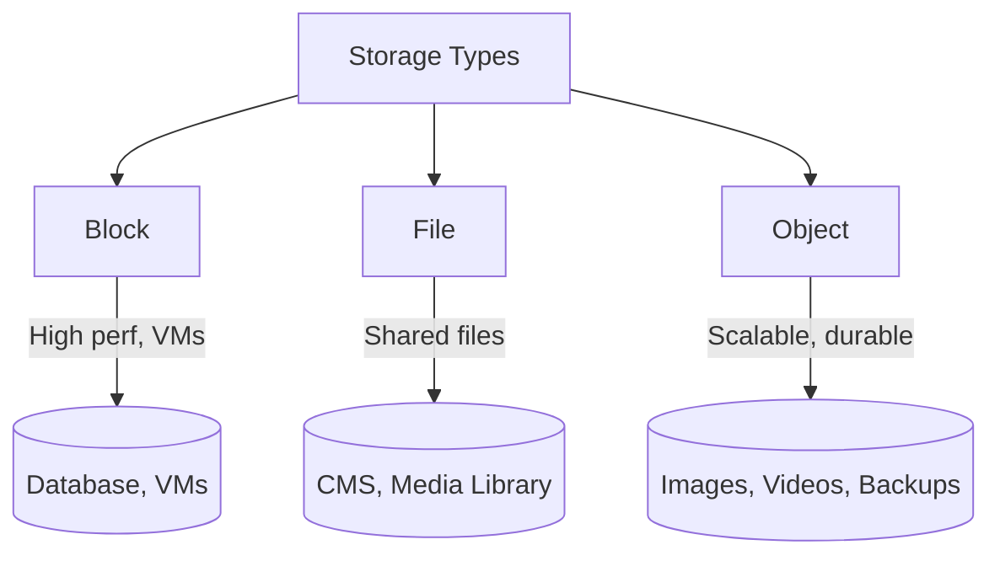

# Storage

> Data ka jagah — persistent storage options: block, file, object. Har ek ka use case alag hai.

> **TL;DR Hinglish:** Storage 3 types: Block (raw disk, VMs ke liye), File (hierarchy, shared access), Object (blobs, S3, scalable). Database storage (Postgres, MySQL) structured ke liye, cache storage (Redis) fast reads ke liye, object storage (S3) media/files ke liye. CAP theorem se storage decisions lo — consistency vs availability trade-off.

Storage system mein data persist karne ke options:

**Block Storage:**
- Raw block-level storage, like a hard disk
- Attached to VMs, high performance
- Use cases: databases, VMs, transactional apps
- Examples: EBS (AWS), Persistent Disk (GCP)

**File Storage:**
- Hierarchical (folders/files), shared access
- NFS/SMB protocols, network-accessible
- Use cases: shared files, media libraries, CMS
- Examples: EFS (AWS), Azure Files

**Object Storage:**
- Flat namespace (buckets), scalable, durable
- Metadata-rich, versionable
- Use cases: images, videos, backups, archives
- Examples: S3 (AWS), GCS (Google Cloud)

## Failure modes to mention

1. **Data loss** — Storage failure = data lost — replication/snapshots se bachna
2. **Consistency issues** — Distributed storage mein stale reads possible — quorum read/write
3. **Latency** — Remote storage = network latency — caching, CDN, local cache
4. **Cost** — Object storage cheap, block storage expensive — right storage for right use

**🔴 Galti:** "S3 jaise object storage database replace kar sakta hai" — Object storage queries nahi support karta, structured queries ke liye RDBMS needed.
**✅ Sahi:** "Block = raw disk (VMs/DBs), File = hierarchical (shared access), Object = flat buckets (S3/media). Use RDBMS for queries, S3 for files, Redis for cache."

**Phrase:** Storage 3 types — block (raw disk, VMs), file (hierarchical, shared), object (S3 buckets, scalable, media). RDBMS for structured data, cache for speed, object for files.

**Yaad rakho (Revision):** Block storage (VMs/DBs), File storage (shared/NFS), Object storage (S3, media), right storage for right use case, replication/snapshots for durability, CAP theorem storage decisions.

**See also:** [Caching Strategies](/system-design/caching-strategies), [Database Replication](/system-design/database-replication), [Distributed Cache](/system-design/distributed-cache).
