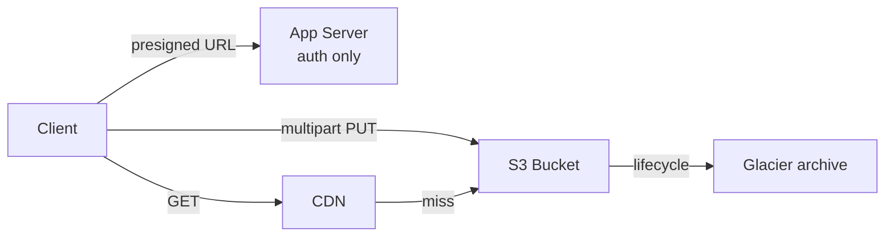

# Storage

> Durable bytes in three shapes — pick by access pattern, not habit.

> Storage splits three ways: object (flat buckets, infinite scale), block (raw disks for VMs and databases), file (hierarchical shared folders). Media and backups go object; database volumes go block; shared team files go file storage.

## Object Storage

Object storage treats data as blobs addressed by bucket + key in a flat namespace — “folders” are key prefixes only. Scale is effectively unlimited with provider-managed replication (often eleven-nines durability claims for multi-AZ layouts). Standard features include versioning, server-side encryption, lifecycle transitions, and event notifications on `PUT`. Access is HTTP REST (S3 API de facto standard); latency is higher than attached disk but throughput and cost per GB favor large, write-once-read-many workloads. Ideal for user uploads, logs, backups, ML datasets, and static site assets fronted by CDN.

- No POSIX semantics — append/rename in place is not the model; overwrite key or version.
- Strong consistency for read-after-write on new objects (S3 model) — know your cloud's guarantees.
- Request costs (PUT/LIST) matter at billions of small objects — partition keys and avoid LIST in hot paths.
- Cross-region replication (CRR) adds DR and global read locality at duplicate storage cost.

## Block Storage

Block volumes attach to a single compute instance as raw LUNs — the OS formats ext4/XFS and databases manage pages. Latency and IOPS are tunable (gp3, io2 on AWS; PD-SSD on GCP) for OLTP workloads that need random read/write. Snapshots incrementally back up volumes; restore to new volume for DR or cloning. Replication and durability are the cloud provider's problem below the API; you still configure RAID-like behavior via multi-attach only where explicitly supported. Use for PostgreSQL/MySQL data directories, Elasticsearch data nodes, and any workload that expects a local disk abstraction.

- One volume ↔ one instance (typically); multi-attach is exceptional and complicates filesystem choice.
- Size and IOPS scale independently on modern clouds — right-size both, not just GB.
- Snapshots are crash-consistent unless app quiesces — DBs need logical backup or volume freeze hooks.
- Ephemeral instance store is faster/cheaper but dies with the VM — not for primary DB data.

## File Storage

Managed NFS (EFS, Azure Files, NetApp) exposes a hierarchical path space multiple instances mount simultaneously — great for shared config, CMS assets, legacy apps expecting POSIX, and HPC scratch that needs directory semantics. Throughput scales with capacity tier or provisioned mode; latency sits between object and local block. Not a substitute for database storage — locking and metadata ops don't match OLTP engines. Choose when many servers must read/write the same tree without building a custom sync layer.

- NFSv4/SMB protocols — security groups and export policies define who mounts what.
- Performance modes (EFS IA vs Standard) trade cost for latency on infrequent files.
- File storage + CDN is awkward for public web assets — object + CDN is the default pattern.
- Watch inode/metadata limits and small-file overhead vs object for tiny blobs.

## S3 Deep Dive

S3 buckets are global-name unique; objects hold data, user metadata, and optional object tags for lifecycle and IAM conditions. Storage classes (Standard, IA, One Zone-IA, Glacier Instant/Flexible/Deep Archive) map to access frequency and retrieval time — lifecycle rules automate transition and expiration. Strong consistency on overwrite/list helps build pipelines without custom sync. Event notifications (SNS, SQS, Lambda) fire on `s3:ObjectCreated:*` for virus scan, thumbnail, ETL. Multipart upload, versioning, and MFA delete protect large files and accidental overwrites. Cross-region replication copies to a DR bucket; same-region replication feeds aggregation or compliance copies.

**When S3 fits:** media (presigned URLs, never proxied bytes); backups and archives (versioning + lifecycle); static sites (S3 + CDN, no servers); data lakes (Parquet dumps, query engines above). Pointers in DB, bytes in S3 — never BLOBs in the database.

- Prefix design affects request rate — AWS scales per prefix but extreme hot keys still need sharding tricks.
- Lifecycle to Glacier saves money; restore minutes-to-hours — not for interactive reads.
- Bucket policies + IAM + Block Public Access layers prevent accidental public exposure.
- S3 Select / Glacier Select query subsets without full download — niche but cost-saving at TB scale.
- **Failure modes:** egress bill shock (storage cheap, outbound bytes not — CDN + lifecycles); presigned URL leaks (short expiries, private buckets); hot-key throttling (hash prefixes into keys); non-atomic renames (copy + delete bills real money); versioning cost creep (expire old versions).
- **Phrase:** "S3 is the file warehouse — bytes never transit servers, presigned URLs always, versioning plus lifecycle set, CDN out front."

## Blob Storage and Presigned URLs

Application servers should not stream gigabyte uploads/downloads through app CPU and bandwidth — authenticate the user, authorize the action, then hand out a presigned URL (time-limited, scoped HTTP verb and key). The client talks directly to S3/GCS/Azure Blob; your API records metadata after upload completes via callback or event. Presigned PUT for uploads and GET for downloads; shorten expiry (minutes) and bind to content-type/size where SDK allows. For private buckets, CloudFront signed URLs/cookies add CDN caching on top of origin auth.

- Server never sees raw bytes — scales upload/download without scaling API replicas for bandwidth.
- Scope signatures to one key and operation — don't presign entire bucket wildcards.
- Virus scan and content moderation hook on `ObjectCreated` events, not on presigned generation alone.
- Rotate signing credentials (IAM role/session) — long-lived root keys in app config are a breach waiting.

## Multipart and Large File Upload

Multipart upload splits objects into parts (5 MiB–5 GiB each, up to 10,000 parts) uploaded in parallel with independent retries — failed part 7 does not restart parts 1–6. CompleteMultipartUpload assembles the final object server-side. Mandatory past ~100 MB for reliability on mobile and cross-region paths; also required for some transfer accelerators. Clients track upload ID and completed part ETags for resume after crash. Server-side copy and multipart copy replicate large objects without download-reupload through a client.

- Minimum part size rules apply except last part — validate client chunking logic in tests.
- Abort incomplete multipart uploads — lifecycle rules clean orphaned parts that still bill storage.
- Parallelism × part size sets throughput; tune to link capacity without overwhelming client memory.
- Checksum (SHA-256) per part on newer S3 APIs catches corruption before Complete.

## Data Lifecycle, Backup and Recovery

Lifecycle policies move objects to colder tiers and expire per prefix/tags — operational data ages to IA/Glacier, temp uploads delete after N days. Backups combine snapshots (block), object versioning + cross-region copies, and logical dumps (pg_dump) — each targets different RPO. Restores must be tested quarterly; backup without verified restore is inventory, not insurance. Define RPO (max acceptable data loss window) and RTO (max acceptable downtime) before choosing replication sync vs async, backup frequency, and DR region strategy — they drive cost more than any single storage SKU.

- 3-2-1 rule still applies: three copies, two media types, one offsite/region.
- Versioning protects against overwrite/delete mistakes; pair with lifecycle to cap version stack cost.
- Compliance holds (legal lock, object lock WORM) override lifecycle — plan retention policies explicitly.
- DR drills expose missing runbooks — measure actual RTO, not slide-deck RTO.

## Keep in mind

- Object for media and backups, block for database volumes, file for shared POSIX workloads.
- Bytes never transit app servers for large objects — presigned URLs (or equivalent) always.
- Multipart past ~100 MB with per-part retries; abort stale uploads to avoid silent storage creep.
- Lifecycle tiers cut bills; test restores and DR failover — untested backups fail when needed.
- RPO and RTO size every replication, backup, and storage class decision — define numbers first.
