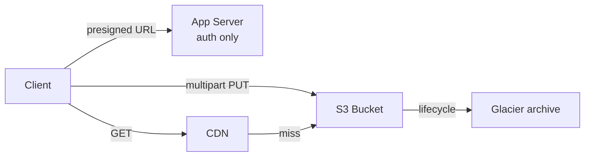

# Storage

> Durable bytes in three shapes — pick by access pattern, not habit.

> Storage splits three ways: object (flat buckets, infinite scale), block (raw disks for VMs and databases), file (hierarchical shared folders). Media and backups go object; database volumes go block; shared team files go file storage.

## Object Storage

Flat namespaces of buckets and keys, no real folders, practically unlimited scale with eleven-nines durability. S3, GCS, and Azure Blob lead. Immutable versions, rich metadata, and lifecycle tiers come standard.

## Block Storage

Raw volumes attached to single machines — EBS, Persistent Disk. Databases and VM filesystems live here for low-latency random I/O. Snapshots back them up; replication is the provider's job.

## File Storage

Shared hierarchical filesystems over NFS or SMB — EFS, Filr, Azure Files. Teams and legacy apps share files directly. Slower than block, simpler than building sharing yourself.

## S3 Deep Dive

Buckets hold versioned objects addressed by key. Lifecycle rules tier aging data (Standard → Infrequent Access → Glacier) to cut bills. Cross-region replication guards against regional loss. Event notifications trigger pipelines on upload.

## Blob Storage and Presigned URLs

Never proxy bytes through app servers: issue time-boxed presigned URLs so clients upload and download directly from object storage. The server authenticates and authorizes; the bytes bypass it entirely.

## Multipart and Large File Upload

Split big files into parts uploaded in parallel with per-part retries; the server completes the assembly. Resumable uploads survive flaky mobile networks. Past ~100MB, multipart is mandatory.

## Data Lifecycle, Backup and Recovery

Lifecycle policies age data across tiers then expire it. Backups pair snapshots with tested restores — untested backups are wishes. Define RPO (acceptable data loss) and RTO (acceptable downtime) first; they size every storage decision.

## Keep in mind

- Object for media and backups, block for databases, file for sharing.
- Bytes never transit app servers — presigned URLs always.
- Multipart past ~100MB with per-part retries.
- Lifecycle tiers cut bills; test restores, don't assume backups.
- RPO and RTO size every storage choice.
