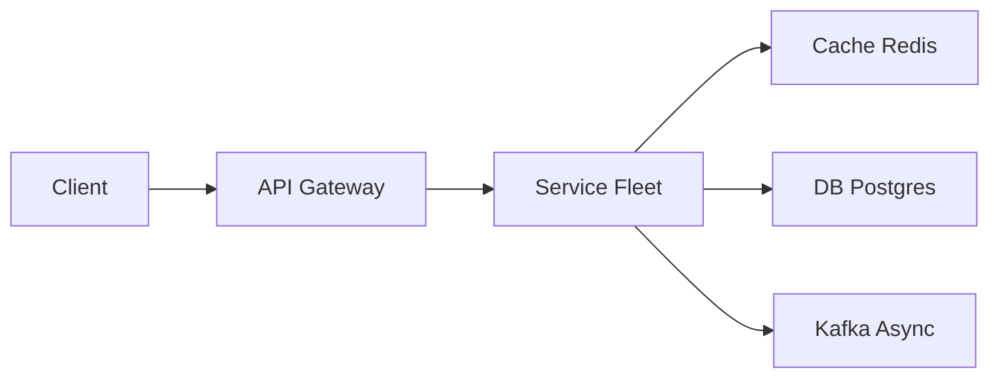

# Strava

> Fitness social network. GPS traces are **fat time-series**. Segments and leaderboards are the spicy extra — not just "Instagram for runs."

> **TL;DR Hinglish:** Strava already covered

## Kya poochte hain? (What they ask) — Hinglish me samjho

"Design Strava." Record a run/ride on the phone, store the GPS trace, show the activity page with map + stats, let users follow friends and scroll a feed, and — the hard part — match the trace against known **segments** (a famous climb, a park loop) and maintain **leaderboards** (fastest times ever / this year / friends only). Privacy: don't leak where you live.

What they really test: can you keep **fat GPS files out of the OLTP DB** (S3 is the store), build an **async pipeline** (simplify polyline, compute stats, match segments, fan-out feed) so upload stays snappy, and explain **segment matching at scale** (geo-indexed corridor check, not O(segments × points)) plus leaderboard hot keys.

Example scale: 100M users, 20M activities/month (~8/sec avg, ~80/sec peak season), avg trace 5k points (~80 KB polyline), 5M defined segments worldwide. Feed QPS ~15k avg.

## Requirements — Kya chahiye? (Functional / Non-functional)

**Functional:**
- Record/upload activity: mobile uploads GPX/TCX or encoded polyline (chunked/presigned), with sport type (run, ride, hike), title, description, gear, photos.
- Activity detail: map (polyline), distance, moving time, elapsed time, elevation gain, pace/speed splits, heart-rate if present, privacy zones.
- User graph: follow/unfollow, followers/following, privacy (public / followers-only / private).
- Feed: friends' activities ranked mostly by recency, cursor-paginated.
- Segments: define a segment (name, polyline, start/end corridor, sport), match each activity against nearby segments, record **efforts** (activity × segment with elapsed time).
- Leaderboards per segment: overall, this year, friends-only, weight/age filtered — sorted by elapsed time.
- Comments, kudos (like), leaderboards pagination, personal records (PR) + achievements.
- Privacy: hide start/end within ~500 m of home/work.

**Non-functional:**
- Upload must ACK without waiting for segment matching (seconds-to-minutes eventual is fine).
- Traces immutable once uploaded; edits only to metadata.
- Leaderboards must be strongly consistent per segment (no two winners for same time) but can be cached for reads.
- p95 activity page < 200 ms (polyline via CDN, summary from DB/cache).
- Durable GPS storage (S3 11-9s); stats recomputable from trace.
- Don't match every activity against every segment on earth.

**Clarify:**
- Is live tracking / beacons needed? Say no for v1; mention TTL store if asked.
- Auto-pause vs moving time — compute on server, store both.
- Segments: user-created or curated? Say both; curated segments are indexed.
- Cheating / impossible speeds — filter later?

**Out of scope (v1):**
- Live segments / real-time cheering during a run.
- Route planning / heatmaps aggregation (defer, mention as batch job).
- Full social inbox DMs, shopping, coaching.
- ML training plans.

## Scale ka andaaza — Kitna load? (Math jo design badle)

| Quantity | Assumption | Math | Result |
|---|---|---|---|
| Activities | 20M/month → 240M/yr | 240M × 1 KB summary row | ~240 GB/yr in Postgres (+ indexes) |
| GPS storage | 20M × 80 KB polyline avg (orig + simplified) | — | ~1.6 TB/month → ~19 TB/yr in S3 |
| Segment defs | 5M segments, avg 200 points each (~3 KB) | 5M × 3 KB | ~15 GB (fits in geo index) |
| Efforts | Each activity matches ~5 segments avg | 20M × 5 | 100M efforts/month (~3.8 writes/s avg) |
| Efforts storage | Effort row ~80 bytes | 100M × 80 B | ~8 GB/month |
| Feed reads | 15k QPS avg, 40k peak | — | ~1.3B/day |
| Upload QPS | 8 avg, 80 peak | — | trivial vs reads |
| Leaderboard QPS | Hot segments (e.g. Alpe d'Huez) ~2k reads/s peak | cached top-100 | ~few DB hits/s |
| Bandwidth (map) | 15k activity views/s × 80 KB polyline | — | ~1.2 GB/s via CDN |

Reasoning: GPS bytes live in S3; Postgres holds summaries + efforts. The surprising number is segment-matching: naive N×M is 20M × 5M checks — impossible. Geo pre-filter is mandatory.

## API Design — Endpoints kya honge?

**Activities**
```http
POST /v1/activities/presign
{ "sport":"run", "fileType":"gpx", "byteLength": 84211 }
200 { "activityId":"a_...", "uploadUrl":"https://s3.../a_...?sig=...", "expiresAt":"..." }

POST /v1/activities
{ "activityId":"a_...", "title":"Morning loop", "sport":"run", "gearId":"g_...",
  "privacy":"followers_only", "description":"..." }
201 { "activityId":"a_...", "status":"processing" }

GET /v1/activities/{activityId}
200 { "id":"a_...", "user":{"id":"u_...","name":"Alex"}, "sport":"run",
      "distanceM":10234, "movingMs":3120000, "elapsedMs":3300000, "elevationM":142,
      "polylineUrl":"https://cdn.../a_.../line.json", "mapThumbUrl":"https://cdn.../a_.../thumb.png",
      "startLat":37.77,"startLng":-122.41, "segmentEfforts":[{"segmentId":"s_...","elapsedMs":412000,"rank":12}],
      "kudosCount":14, "commentCount":3, "privacy":"followers_only", "createdAt":"..." }

GET /v1/activities/{id}/laps  -> splits per km/mile
GET /v1/activities/{id}/efforts -> segment efforts for this activity
POST /v1/activities/{id}/kudos -> 204
POST /v1/activities/{id}/comments { "text":"..." } -> 201
```

**Feed, segments, social**
```http
GET /v1/feed?cursor=&limit=20
200 { "items":[{"activityId":"a_...","userId":"u_...","distanceM":10234,"createdAt":"..."},...], "nextCursor":"..." }

POST /v1/segments
{ "name":"Hawk Hill Climb","sport":"ride", "polyline":"_p~iF~ps|U...", "startRadiusM":30, "endRadiusM":30, "corridorM":20 }
201 { "segmentId":"s_..." }

GET /v1/segments/{segmentId}
200 { "id":"s_...","name":"Hawk Hill","distanceM":3400,"avgGrade":6.2,"polyline":"...", "effortCount":48211 }

GET /v1/segments/{segmentId}/leaderboard?filter=overall|this_year|friends&cursor=&limit=50
200 { "entries":[{"rank":1,"userId":"u_...","elapsedMs":412000,"activityId":"a_...","achievedAt":"..."},...] }

GET /v1/segments/nearby?lat=37.77&lng=-122.41&radius=3000 -> candidate segments for map

POST /v1/users/{id}/follow -> 204
GET  /v1/users/{id}/activities?cursor=
```

**Idempotency:** `Idempotency-Key` on `POST /activities` so retry does not double-create.

## High-Level Design (HLD) — Boxes kaise judenge? (Hinglish)

```
[ Mobile App — GPS recorder ]
      |
     presigned PUT -----> [ S3 — raw GPS ]  (polyline / GPX / FIT)
      |                          |
      +-- POST /activities ------+--> [ API Gateway ] — auth, validation
                                      |
                           [ Postgres — activity summary, user, follow, segment defs ]
                                      |
                                 [ Kafka — ActivityUploaded ]
                                      |
              +-----------+-----------+-----------+-----------+
              |           |           |           |           |
          Simplify   Compute stats  Privacy   Segment    Feed fan-out
          worker     (dist/elev/    fuzz     matcher    worker
          (Douglas   pace, splits)  worker   (geo index)
           -Peucker)                                              |
              |           |           |           |        [ Redis / Cassandra inbox ]
              +-----------+-----------+-----------+               |
                       |                                    Leaderboards
                  [ S3 — simplified polyline,            [ Redis Sorted Set per segment ]
                   map thumb, splits JSON ]                s:{segId}:overall, s:{segId}:2026
                       |                                          |
                      CDN <------ polyline + thumb serving -------+ (cache top 100)
                       |
                 [ Activity Service ] — serves summary + CDN URLs
```



**Component roles:**
- **API Gateway + Activity Service:** validate sport, create `activity` row with `status=processing`, return 201 immediately. Trace bytes never touch app servers.
- **Pipeline workers (Kafka consumers):** (1) **Simplify** polyline (Douglas-Peucker ε=3-5 m) + generate map thumbnail via tile renderer; (2) **Compute stats** (distance via haversine sum, elevation gain filtered, moving time via speed threshold); (3) **Privacy fuzz** — trim or mask first/last 400 m if user has home zone; (4) **Segment matcher** — query geo index for segments whose bbox intersects activity bbox; (5) **Leaderboard updater** + **feed fan-out**.
- **Segment geo index:** [Elasticsearch](/system-design/elasticsearch) with `geo_shape` or S2 / H3 index on segment corridor; query by activity bounding box (+ buffer) to get ~50 candidates, not 5M.
- **Leaderboard store:** [Redis](/system-design/redis) sorted set per segment (`score=elapsedMs`, member=`userId:activityId`) for overall + per-year shards; Postgres `effort` table is source of truth.
- **Feed store:** push `activityId` to followers' inboxes (Redis sorted set by `createdAt`), similar to [Instagram](/system-design/instagram) but lower QPS.
- **CDN:** serves `line.json` (simplified polyline + elevation array) and static map thumbnail; 1-year immutable cache.

**Write path (upload):** Phone records GPS → `presign` → PUT to S3 → `POST /activities` → Postgres row `processing` → Kafka `ActivityUploaded` → workers run in parallel, each idempotent → mark `ready` → fan-out.

**Read path (activity page):** `GET /activities/{id}` → Activity Service checks privacy (can caller see it?) → reads summary from Postgres/Redis `activity:{id}` → returns CDN URLs for polyline+thumb (client fetches polyline from CDN). Efforts fetched from `effort` table or leaderboard cache.

**Read path (feed):** `GET /feed` → Feed Service `ZREVRANGE inbox:{userId}` → hydrate summaries → return.

## Low-Level Design (LLD) — DB + Classes (Hinglish notes)

**Database schema (Postgres):**
```sql
CREATE TABLE users (
  id            TEXT PRIMARY KEY,
  handle        TEXT UNIQUE NOT NULL,
  display_name  TEXT NOT NULL,
  home_geohash  TEXT, -- approx, for privacy fuzz radius
  privacy_default TEXT NOT NULL DEFAULT 'followers_only',
  created_at    TIMESTAMPTZ NOT NULL DEFAULT now()
);

CREATE TABLE activity (
  id            TEXT PRIMARY KEY,            -- a_...
  user_id       TEXT NOT NULL REFERENCES users(id),
  sport         TEXT NOT NULL CHECK (sport IN ('run','ride','hike','swim','other')),
  title         TEXT,
  description   TEXT,
  s3_key_raw    TEXT NOT NULL,               -- original GPX/FIT
  s3_key_line   TEXT,                        -- simplified polyline JSON/ECEF
  s3_key_thumb  TEXT,
  distance_m    INT,                         -- computed
  moving_ms     INT, elapsed_ms INT,
  elevation_gain_m INT,
  start_lat     DOUBLE PRECISION, start_lng DOUBLE PRECISION,
  start_geohash TEXT,
  bbox_json     JSONB,                       -- {minLat,maxLat,minLng,maxLng}
  privacy       TEXT NOT NULL DEFAULT 'followers_only',
  status        TEXT NOT NULL DEFAULT 'processing', -- processing|ready|failed
  created_at    TIMESTAMPTZ NOT NULL DEFAULT now(),
  started_at    TIMESTAMPTZ                  -- from GPS timestamps
);
CREATE INDEX ON activity (user_id, created_at DESC);
CREATE INDEX ON activity (start_geohash);
CREATE INDEX ON activity (created_at DESC); -- feed pull fallback
CREATE INDEX ON activity USING GIN (bbox_json);

CREATE TABLE follow (
  follower_id   TEXT NOT NULL REFERENCES users(id),
  followee_id   TEXT NOT NULL REFERENCES users(id),
  created_at    TIMESTAMPTZ NOT NULL DEFAULT now(),
  PRIMARY KEY (follower_id, followee_id)
);

CREATE TABLE segment (
  id            TEXT PRIMARY KEY,            -- s_...
  creator_id    TEXT REFERENCES users(id),
  name          TEXT NOT NULL,
  sport         TEXT NOT NULL,
  polyline      TEXT NOT NULL,               -- encoded + bbox denorm
  bbox_json     JSONB NOT NULL,
  start_lat     DOUBLE PRECISION NOT NULL, start_lng DOUBLE PRECISION NOT NULL,
  end_lat       DOUBLE PRECISION NOT NULL, end_lng DOUBLE PRECISION NOT NULL,
  corridor_m    INT NOT NULL DEFAULT 20,     -- how far off the line still counts
  distance_m    INT NOT NULL,
  avg_grade     NUMERIC(4,2),
  effort_count  INT NOT NULL DEFAULT 0,
  created_at    TIMESTAMPTZ NOT NULL DEFAULT now()
);
CREATE INDEX ON segment USING GIN (bbox_json);
CREATE INDEX ON segment (sport);

CREATE TABLE effort (
  id            TEXT PRIMARY KEY,            -- e_...
  segment_id    TEXT NOT NULL REFERENCES segment(id),
  activity_id   TEXT NOT NULL REFERENCES activity(id) ON DELETE CASCADE,
  user_id       TEXT NOT NULL REFERENCES users(id),
  elapsed_ms    INT NOT NULL,                -- time on segment (moving)
  distance_m    INT NOT NULL,
  achieved_at   TIMESTAMPTZ NOT NULL,        -- activity started_at
  rank_snapshot INT,                         -- cache rank at write time
  UNIQUE (segment_id, activity_id),          -- one effort per activity×segment
  UNIQUE (segment_id, user_id, achieved_at)  -- avoid dupe retries
);
CREATE INDEX ON effort (segment_id, elapsed_ms ASC); -- leaderboard query
CREATE INDEX ON effort (user_id, achieved_at DESC);
CREATE INDEX ON effort (activity_id);

CREATE TABLE kudos (
  user_id       TEXT NOT NULL REFERENCES users(id),
  activity_id   TEXT NOT NULL REFERENCES activity(id) ON DELETE CASCADE,
  created_at    TIMESTAMPTZ NOT NULL DEFAULT now(),
  PRIMARY KEY (user_id, activity_id)
);
CREATE TABLE comment (
  id            TEXT PRIMARY KEY,
  activity_id   TEXT NOT NULL REFERENCES activity(id) ON DELETE CASCADE,
  author_id     TEXT NOT NULL REFERENCES users(id),
  text          TEXT NOT NULL,
  created_at    TIMESTAMPTZ NOT NULL DEFAULT now()
);
```

**Key classes:**
```java
class ActivityService {
  Activity create(String userId, CreateActivity cmd) {
    Activity a = activityRepo.insert(userId, cmd); // status=processing
    kafka.emit(new ActivityUploaded(a.id));
    return a;
  }
  Activity get(String callerId, String activityId) {
    Activity a = cache.get("activity:"+activityId, ()->repo.findById(activityId));
    checkPrivacy(callerId, a); // public | followers_only | private
    return a.withCdnUrls(cdn.sign(a.s3_key_line));
  }
}
class SegmentMatcher {
  void onActivityReady(ActivityUploaded e) {
    Activity a = repo.findById(e.activityId);
    List<Segment> candidates = geoIndex.queryByBbox(a.bbox_json, bufferM=500);
    for (Segment s : candidates)
      if (followsCorridor(a.polyline, s.polyline, s.corridor_m))
        effortRepo.insert(s.id, a.id, elapsedOnSegment(a, s));
  }
  boolean followsCorridor(Polyline act, Polyline seg, int corridorM) {
    // 1) start within startRadius, end within endRadius
    // 2) Frechet-ish: every seg point has an activity point within corridorM (Hausdorff check with spatial index)
    // Simplified: sample seg every 50m, check min haversine to act points via R-tree
  }
}
class LeaderboardService {
  void onEffortCreated(Effort eff) {
    redis.zadd("s:"+eff.segmentId+":overall", eff.elapsedMs, eff.userId+":"+eff.activityId);
    redis.zadd("s:"+eff.segmentId+":"+year(eff.achievedAt), eff.elapsedMs, eff.userId+":"+eff.activityId);
    redis.expire("s:"+eff.segmentId+":overall:top100cache", 60); // invalidate cached top-100 page
  }
  List<Entry> top(String segmentId, String filter, String cursor) {
    String key = keyFor(segmentId, filter);
    return redis.zrange(key, 0, 49, WITHSCORES); // then hydrate user/activity
  }
}
```

**Algorithms / concurrency:**
- **Polyline simplification:** Douglas-Peucker ε=3 m reduces 5k points → ~600 with <1% distance error; keeps map snappy.
- **Distance / elevation:** haversine sum + Savitzky-Golay or simple moving-average filter on elevation to remove GPS noise; moving time = sum of intervals where speed > 0.8 m/s.
- **Segment corridor check:** not O(N×M) — index segments by bbox (S2 cell covering), query with activity bbox, then fine-grained check: ensure activity enters start circle, exits end circle, and stays within corridor (sampled Hausdorff). v1 can use bounding-box + start/end radius only.
- **Cheat detection:** drop efforts where avg speed > world-record threshold per sport (e.g. run > 7 m/s sustains > 60s) → flag for manual review, don't insert into leaderboard.
- **Dedup double upload:** hash of `userId + started_at_trunc_min + distance_m` or content hash of raw file; `INSERT ... ON CONFLICT DO NOTHING`.

**Patterns:** Pipeline (chain of workers), CQRS (S3 write, Postgres read), Cache-Aside for activity/leaderboard, Idempotent consumer with `effort(segment_id, activity_id)` unique constraint.

## Deep Dive — Gehrai se (Interview yahi puchega) — segments: from 5M to 50 candidates

Naive: compare every activity to every segment — 20M × 5M impossible. **Two-phase matching:**

1. **Coarse (index):** store each segment's bbox (+ corridor buffer) in a geo index (ES `geo_shape` or S2 covering). For an activity, query `segments where bbox INTERSECTS activity_bbox_expanded_500m AND sport = activity.sport`. This typically returns 20-100 candidates for a 10 km run.
2. **Fine (corridor):** for each candidate, check: (a) activity has a point within `startRadius` of segment start, (b) a point within `endRadius` of segment end, (c) the path between those points stays within `corridor_m` of the segment line. Implement by projecting activity points onto segment line segments and checking max deviation. Compute elapsed time between matched start/end indices (interpolate). Insert `effort`.

Map-match is done async — upload ACK does not wait. Index updates for new segments are independent of activity flow.

## Deep Dive — Gehrai se (Interview yahi puchega) — leaderboards and hot keys

A famous segment like "Hawk Hill" has 50k efforts and is read thousands of times per second. `ZADD` + `ZRANGE` on a single Redis key is a hot key. Mitigations:

- **Source of truth is Postgres** (`effort` unique on `(segment_id, elapsed_ms)` ordering); Redis is a cache.
- **Top-100 cache:** cache `GET /segments/{id}/leaderboard` top page in Redis/CDN with 30-60s TTL; only cache-miss hits the sorted set.
- **Sharding by time:** `overall` vs `2026` vs `friends` are separate keys; friends leaderboard is computed per-viewer by intersecting `effort` with `follow` (friends' userIds) — `ZRANGE` + app-side filter for friends (up to ~500 friends, cheap) or a precomputed `friends:{userId}:{segmentId}` key updated on kudos.
- **Write path:** `effort` insert in Postgres first (unique constraint prevents dupe), then `ZADD` to Redis; on Redis failover, rebuild from Postgres with `SELECT ... ORDER BY elapsed_ms LIMIT 100`.

Privacy nuance: hide start location by **fuzzing** — if activity starts within user's home geohash, clip first 400 m of polyline before storing `s3_key_line` and before segment matching near home (so home segments don't leak).

## Deep Dive — Gehrai se (Interview yahi puchega) — GPS pipeline, privacy, and feed

**Pipeline ordering:** simplify → stats → privacy fuzz → segment match → leaderboard → feed fan-out. Each step is idempotent and retriable via Kafka offsets; a DLQ catches malformed GPX.

**Elevation / pace:** raw GPS elevation is noisy; apply median filter before summing gains > 3 m. Splits: bucket by 1 km/1 mi cumulative distance.

**Feed:** same push model as Instagram: `activityId` into followers' inbox `inbox:{userId}` (Redis sorted set). Strava's feed is lower QPS and mostly chronological — ranking is simple (recency + maybe kudos boost). Pagination via cursor (`last_created_at:last_id`). Photos optional — if present, stored in S3/CDN like Instagram but smaller volume.

## Hinglish Tip — Galti vs Sahi

**🔴 Galti:** Hot path pe DB direct without cache/queue.
**✅ Sahi:** Cache/queue beech me, DB source of truth.

## Failures & Scale — Kya tootega aur kaise bachenge? (Hinglish)

- **S3 unavailable:** upload presign fails → client retries with backoff; incomplete uploads expire via S3 lifecycle (abort multipart after 24h).
- **Pipeline worker crash:** Kafka offset not committed → replay; idempotent `effort` unique constraint + `activity.status` state machine prevent doubles.
- **Geo index down:** segment matching pauses, activities stay `ready` without efforts; matcher replays from `ActivityUploaded` topic with retention (7 days).
- **Postgres down:** activity page serves from Redis `activity:{id}` + S3 polyline via CDN; writes queue in Kafka.
- **Redis leaderboard hot shard:** consistent hash shards `s:{segmentId}` by hash slot ([Redis](/system-design/redis) cluster); top-page CDN cache absorbs 90% of reads.
- **Sharding:** activities sharded by `user_id` hash; segments sharded by geohash region; efforts co-located with segment shard (partition by `segment_id`).
- **Replication:** Postgres streaming replica per shard; S3 cross-region; Kafka 3×; Redis replica + AOF.
- **Probes:** pipeline consumer lag, segment match rate (efforts/activity), leaderboard cache hit ratio, GPS parse failure rate, feed fan-out lag.

## Aur kya puch sakte hain? (Extra probes) / Interview follow-ups

1. **Live segments / beacons:** WebSocket per active activity with TTL in [Redis](/system-design/redis); phone pushes location every 5s; server does corridor check live. Similar to [Uber](/system-design/uber) location.
2. **Route planning / heatmaps:** nightly batch aggregates `activity` polylines into H3 cells → heatmap tiles served from S3/CDN; not on the hot path.
3. **Cheating / GPS sanity:** speed sanity filter, duplicate trace hash, flag sudden teleport (> 50 m between 1s points).
4. **Dedup accidental double uploads:** `hash(raw_file)` + `user_id` uniqueness; or `started_at` + `distance` near-duplicate window 10 min.
5. **Gear / devices:** FIT file parsing for heart-rate, power; store raw in S3, summarized time-series in a TSDB if needed.
6. **Analytics:** `segment_effort_created` events to [Kafka](/system-design/kafka) → warehouse for segment popularity, PR notifications via [notification system](/system-design/notification-system).

**Yaad rakho (Revision):** Write durable, read cache, async Kafka/Flink, failure me degrade gracefully.

**Phrase:** "S3 for the GPS file, Postgres for the summary, async workers to match nearby segments and update Redis leaderboards. The feed only stores activity ids."
