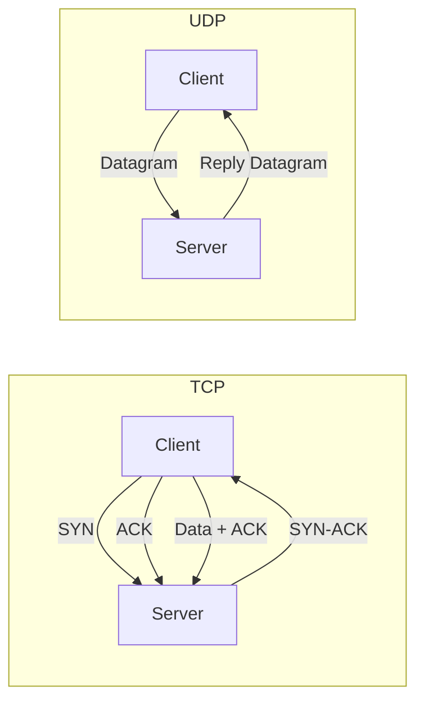

# TCP and UDP

> Transport layer protocols — TCP reliable hai, UDP fast hai. Interview mein ye dono bohot important hain.

> TCP connection-oriented hai — 3-way handshake se connection banaata hai, guaranteed delivery deta hai, ordering bhi. UDP connectionless hai — bas send karta hai, guarantee nahi. TCP jaise chat, email; UDP jaise video streaming, gaming, DNS lookup.

TCP aur UDP dono Transport layer ke protocols hain:

**TCP (Transmission Control Protocol):**
- Connection-oriented — 3-way handshake (SYN, SYN-ACK, ACK)
- Reliable — acknowledgment, retransmission, ordering
- Flow control — receiver ke liye window size adjust
- Congestion control — slow start, congestion avoidance
- Use cases: HTTP, FTP, email, SSH

**UDP (User Datagram Protocol):**
- Connectionless — just send, no handshake
- Unreliable — no guarantee, no ordering
- Fast — low overhead, no retransmission
- Use cases: video streaming, gaming, DNS, VoIP

## How it works

### TCP 3-way handshake:
1. Client → Server: `SYN` (sync, want to connect)
2. Server → Client: `SYN-ACK` (acknowledge, also want to connect)
3. Client → Server: `ACK` (connected!)

### TCP vs UDP:
- TCP = registered post (track, guarantee, slow)
- UDP = normal post (no tracking, fast, possible loss)

## Failure modes to mention

1. **TCP head-of-line blocking** — Packet 2 lost, packet 3 waits — increases latency
2. **UDP packet loss** — Video freezes, game desync — acceptable for real-time apps
3. **SYN flood attack** — Attacker sends many SYN without ACK, server resources exhausted

**🔴 Galti:** "UDP use karo jab reliability chahiye" — UDP unreliable hai, TCP use karo jab guaranteed delivery chahiye.
**✅ Sahi:** "TCP for reliability (HTTP, email), UDP for speed (video, gaming, DNS). UDP + app-layer reliability = QUIC/HTTP3."

**Phrase:** TCP connection-oriented, reliable, ordered. UDP connectionless, fast, unreliable. TCP = handshake + ACKs, UDP = fire and forget.

**Yaad rakho (Revision):** TCP 3-way handshake, reliable + ordered, flow/congestion control. UDP fast + connectionless, no guarantee. TCP = HTTP/FTP, UDP = video/gaming/DNS.

**See also:** [IP](/hld/ip), [Load Balancing](/hld/load-balancing), [Long Polling vs SSE vs WebSocket](/hld/long-polling).
