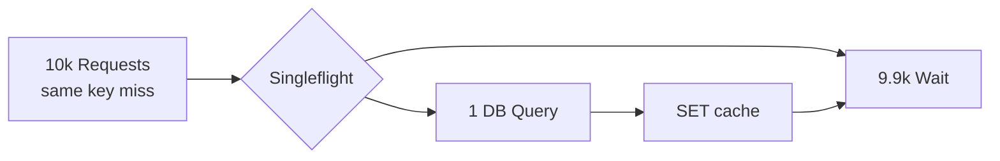

# Thundering Herd

> Ek garam key expire hote hi 10k requests DB pe toot pade — DB marega.

> **TL;DR Hinglish:** Ek samosa 10k bachon ka favourite, dukaan band hote hi sab ek saath daude — dukaan loot gayi. Isliye ek ko jaane do, baaki ko purana samosa do ya wait karwao.

Stampede / Dogpile bhi kehte hain. Har cache wali design me puchenge.

## How it works

- **Cache expiry:** `feed:123` TTL 60 sec, 60 pe 10k miss → 10k DB queries.
- **Process restart:** saara cache khali → sab miss.
- **Hot key miss:** celebrity post ek shard pe.

## 4 fix

**1. Singleflight / Lock:** ek hi thread DB jaye, baaki wait → result share.
```go
singleflight.Do("feed:123", func() (any, error){ return db.Query(...) })
```

**2. Stale-while-revalidate:** expiry pe bhi 5 sec purana data serve karo + background me refresh. `Cache-Control: max-age=60, stale-while-revalidate=5`.

**3. Jittered TTL:** `EX 300 + rand(60)` — sab keys ek saath expire nahi.

**4. Early recompute (Probabilistic):** expiry se 10 sec pehle hi 1% requests refresh kar de.



## How to answer in interview

- **Bitly:** singleflight + `SETNX lock` 2 sec, stale 5 sec.
- **Distributed cache:** local `singleflight` + Redis `SETNX`.

**🔴 Galti:** "TTL bada kar do" — Stale zyada, herd kam nahi.
**✅ Sahi:** "Jitter + singleflight + stale-while-revalidate."

**Phrase:** "Thundering = expiry pe herd, fix singleflight + jitter + stale serve."

**Yaad rakho:** Herd = expiry, singleflight 1 DB, jitter random, stale 5 sec.

**See also:** [caching-strategies](/system-design/caching-strategies), [distributed-cache](/system-design/distributed-cache), [redis](/system-design/redis).
