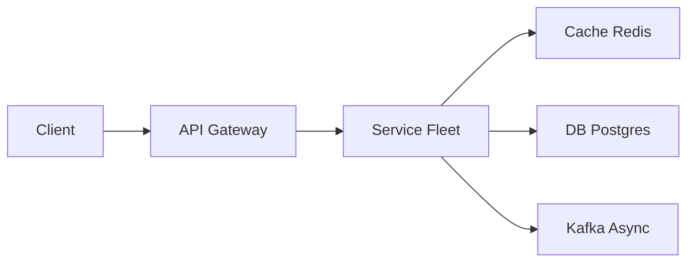

# Ticketmaster

> Flash sale for seats. The system is a **correct inventory lock**, not a pretty map of the arena. If two people can buy seat 12A, you failed.

> **TL;DR Hinglish:** Flash sale me inventory Postgres me `FOR UPDATE` se lock, 10 min hold TTL, waiting room queue se spike absorb, shard by eventId.

## Kya poochte hain? (What they ask) — Hinglish me samjho

**Scenario:** "Design Ticketmaster — on-sale at 10:00. 50k people, 5k seats. Hold a seat for 10 minutes while checkout finishes. No oversell."

**What the interviewer really tests:**
- Can you enforce **strong consistency** on inventory under a thundering herd without overselling?
- How you implement **holds with TTL** and atomic **hold → sold** conversion.
- Whether you put a **waiting room / queue** in front of the inventory so the DB isn't the first thing that dies.
- How you handle **reserved vs GA**, sharding by `event_id`, and idempotent payment.

**Example scale:** 10k events, avg 5k seats each = 50M seat rows. Hot event: 50k concurrent users at on-sale second, 10k holds/s attempted, 500 checkouts/s. Reads (browse) 100k QPS, writes (hold/checkout) 10k QPS burst for 5 minutes.

## Requirements — Kya chahiye? (Functional / Non-functional)

**Functional:**
- Browse events, venues, seat map (availability view).
- Select seats (reserved: specific `seatId`s) or GA quantity (e.g., "3 GA tickets").
- Hold seats for N minutes (e.g., 10m) → `holdId` + `expiresAt`. While held, seats unavailable to others.
- Checkout held seats with payment → issue tickets (barcode/QR).
- View orders, transfer/cancel (scoped), waitlist if sold out.

**Non-functional:**
- **Correctness:** zero oversell — linearizable inventory per event. Holds expire reliably.
- **Latency:** seat map < 300ms, hold < 500ms, checkout < 2s (payment dominates).
- **Availability:** browse highly available (cached); checkout strongly consistent but may queue.
- **Fairness:** FIFO or random queue, bot mitigation, no starvation.
- **Throughput:** absorb 50k concurrent at on-sale — queue absorbs, DB sees controlled write QPS.

**Clarify — questions to ask:**
- Reserved seating, GA, or both? Hold duration?
- Max tickets per user per event? (4-6 to prevent scalping)
- Need waiting room (virtual queue) or first-come-first-serve?
- Ticket transfer / resale — signed barcode or dynamic rotation?
- Payment provider and idempotency requirements?
- Sharding expectation — single arena or global platform (many concurrent events)?

**Out of scope (v1):**
- Dynamic pricing / auction, seat upgrade bidding.
- Secondary marketplace matching engine.
- Full venue 3D map rendering (client concern).

## Scale ka andaaza — Kitna load? (Math jo design badle)

| Metric | Assumption | Math | Result |
|--------|-----------|------|--------|
| Seat rows | 10k events * 5k seats | 10k * 5k | 50M rows, ~50B per row → ~2.5 GB + indexes ~5 GB (fits single DB, but hot row contention) |
| GA events | 20% GA, remaining=1000 | counter per event | negligible |
| On-sale burst | 50k users * 5 polls each in 60s | 250k reads | ~4k reads/s sustained, ~10k holds attempted/s at peak second |
| Hold writes | 10k holds/s attempted, 50% success | 5k successful holds/s | 5k `UPDATE ... WHERE status='free'`/s — hot partition per event |
| Storage (orders) | 1M orders/day * 1KB | 1M * 1KB | ~1 GB/day, ~365 GB/year |
| Bandwidth | Seat map ~100KB * 50k users | 50k * 100KB | ~5 GB burst at on-sale — CDN-cacheable |

**Key insight:** total data size is modest; contention on `event_id` hot rows is the killer. Shard and queue to serialize access.

## API Design — Endpoints kya honge?

| Method | Path | Description |
|--------|------|-------------|
| `GET` | `/v1/events` | List events (paginated, filter by venue/date) |
| `GET` | `/v1/events/{eventId}` | Event + venue details |
| `GET` | `/v1/events/{eventId}/seats?section=` | Seat map with availability (cached) |
| `POST` | `/v1/holds` | Hold seats |
| `POST` | `/v1/checkout` | Pay for hold → create order |
| `GET` | `/v1/orders/{orderId}` | Order + tickets |
| `GET` | `/v1/queue/token` | Waiting room token (poll position) |
| `POST` | `/v1/holds/{holdId}/release` | Explicit release (or auto-expire) |

**Hold:**
```json
POST /v1/holds
Authorization: Bearer <token>
X-Idempotency-Key: <uuid>
{
  "eventId": "evt_123",
  "seatIds": ["A-12", "A-13"],
  "gaQuantity": null
}
→ 201 { "holdId": "hld_abc", "eventId": "evt_123", "seatIds": ["A-12","A-13"], "expiresAt": "2026-08-25T10:10:00Z", "priceCents": 15000 }
→ 409 { "error": "seats unavailable", "availableNearby": ["A-14","A-15"] }
```

**Checkout:**
```json
POST /v1/checkout
Authorization: Bearer <token>
X-Idempotency-Key: <uuid>
{
  "holdId": "hld_abc",
  "paymentMethodId": "pm_xyz"
}
→ 201 { "orderId": "ord_789", "tickets": [{ "ticketId": "tkt_1", "barcode": "signed..." }] }
→ 410 { "error": "hold expired" }
→ 402 { "error": "payment failed" }
```

**Seats (cached, ETag):**
```
GET /v1/events/evt_123/seats
→ 200 { "eventId": "evt_123", "sections": [{ "name":"A", "seats":[{ "id":"A-12","status":"held", "price":7500 }]}] }
Cache-Control: public, max-age=5
ETag: "rev-1234"
```

## High-Level Design (HLD) — Boxes kaise judenge? (Hinglish)

```
Client (Web/Mobile)
  |
 CDN (seat map, event catalog — cached, ETag)
  |
 L4 LB → Waiting Room Service (virtual queue, token bucket)
  |
 API Gateway (auth, [rate limiter](/system-design/rate-limiter), WAF, bot check)
  |
 +-- Catalog Service (events, venues — Postgres + [Redis](/system-design/redis) cache)
 |
 +-- Inventory Service (holds, seats — Postgres primary per event shard + Redis fast-hold)
 |        |--> Postgres (seat rows, holds, orders) — sharded by event_id
 |        |--> [Redis](/system-design/redis) (optional fast hold: SET seat NX EX 600)
 |        `--> Expiry Worker (sweeper + lazy check)
 |
 +-- Order Service (checkout, tickets — Postgres, idempotency)
 |        `--> Payment Service → PSP (Stripe) — authorize then capture
 |
 +-- Queue/Kafka → Notifications, Analytics
```



**Component roles:**
- **Waiting Room:** At on-sale second, 50k users don't hit DB. Queue issues `queueToken` with position, admits N users/s (e.g., 500/s) to Inventory Service. FIFO or random — prevents thundering herd. This is an [API gateway](/system-design/api-gateway) + Redis sorted set, not a bigger DB.
- **Catalog Service:** event/venue/seat map metadata — barely changes, heavily cached in [Redis](/system-design/redis) + CDN. Reads from replicas/Cache, not primary.
- **Inventory Service:** the critical path. Owns `seats(event_id, seat_id, status)` and `holds`. All writes go to **primary** of the event's shard. Implements `hold` and `hold→sold` transactions.
- **Order Service:** owns checkout, idempotency key table, ticket issuance (signed barcodes). Calls Payment Service; on success, marks hold sold in same transaction.
- **Expiry Worker:** frees `hold_until < now()` via periodic sweeper + lazy check on read. Publishes `HoldExpired`.

**Write flow (hold):** Client (with valid queue token) `POST /holds{eventId, seatIds}` → Inventory `BEGIN` → `SELECT ... FOR UPDATE` or `UPDATE ... WHERE status='free'` per seat → if all free, insert `holds` row + update `seats.status='held', hold_until=now()+10m, user_id` → commit → return `holdId`. If any seat not free → rollback → `409`.

**Read flow (browse):** `GET /events/{id}/seats` → CDN → Catalog cache → if miss, read replica. Availability is computed as `status` column; stale by few seconds acceptable (hold race will be caught at `POST /holds`).

**Checkout flow:** `POST /checkout{holdId}` → validate hold not expired + owned by user → authorize payment (idempotent) → in one transaction: `UPDATE seats SET status='sold' WHERE hold_id=:hid AND status='held'` + insert `orders`/`tickets` → capture payment → return tickets. If payment fails → release hold.

## Low-Level Design (LLD) — DB + Classes (Hinglish notes)

**Database schema (Postgres, sharded by `event_id`):**
```sql
CREATE TABLE venues (
  id            BIGSERIAL PRIMARY KEY,
  name          VARCHAR(255) NOT NULL,
  capacity      INT NOT NULL
);

CREATE TABLE events (
  id            BIGSERIAL PRIMARY KEY,
  venue_id      BIGINT REFERENCES venues(id),
  name          VARCHAR(255) NOT NULL,
  starts_at     TIMESTAMPTZ NOT NULL,
  sale_starts_at TIMESTAMPTZ NOT NULL,
  ga_capacity   INT, -- NULL for reserved, else GA total
  ga_remaining  INT, -- counter for GA, guarded by transaction
  created_at    TIMESTAMPTZ DEFAULT now()
);

CREATE TABLE seats ( -- one row per physical seat for reserved events
  event_id      BIGINT REFERENCES events(id),
  seat_id       VARCHAR(32) NOT NULL, -- "A-12"
  section       VARCHAR(32) NOT NULL,
  row_label     VARCHAR(16) NOT NULL,
  status        VARCHAR(16) NOT NULL DEFAULT 'free', -- free|held|sold
  hold_id       BIGINT REFERENCES holds(id),
  hold_until    TIMESTAMPTZ,
  user_id       BIGINT,
  price_cents   INT NOT NULL,
  PRIMARY KEY (event_id, seat_id)
);
CREATE INDEX idx_seats_event_status ON seats(event_id, status);
CREATE INDEX idx_seats_hold_until ON seats(hold_until) WHERE status='held';

CREATE TABLE holds (
  id            BIGSERIAL PRIMARY KEY,
  event_id      BIGINT NOT NULL REFERENCES events(id),
  user_id       BIGINT NOT NULL,
  status        VARCHAR(16) NOT NULL DEFAULT 'held', -- held|sold|expired|released
  expires_at    TIMESTAMPTZ NOT NULL,
  created_at    TIMESTAMPTZ DEFAULT now()
);

CREATE TABLE hold_seats (
  hold_id       BIGINT REFERENCES holds(id) ON DELETE CASCADE,
  event_id      BIGINT NOT NULL,
  seat_id       VARCHAR(32) NOT NULL,
  PRIMARY KEY (hold_id, event_id, seat_id),
  FOREIGN KEY (event_id, seat_id) REFERENCES seats(event_id, seat_id)
);

CREATE TABLE orders (
  id            BIGSERIAL PRIMARY KEY,
  user_id       BIGINT NOT NULL,
  event_id      BIGINT NOT NULL REFERENCES events(id),
  hold_id       BIGINT UNIQUE REFERENCES holds(id),
  status        VARCHAR(16) NOT NULL, -- paid|refunded|cancelled
  total_cents   INT NOT NULL,
  idempotency_key VARCHAR(64) UNIQUE NOT NULL,
  created_at    TIMESTAMPTZ DEFAULT now()
);

CREATE TABLE tickets (
  id            BIGSERIAL PRIMARY KEY,
  order_id      BIGINT REFERENCES orders(id),
  event_id      BIGINT NOT NULL,
  seat_id       VARCHAR(32) NOT NULL,
  barcode       VARCHAR(255) UNIQUE NOT NULL, -- signed JWT
  status        VARCHAR(16) NOT NULL DEFAULT 'valid',
  FOREIGN KEY (event_id, seat_id) REFERENCES seats(event_id, seat_id)
);
```

**GA alternative:** don't use `seats` rows for GA — use `events.ga_remaining` counter:
```sql
UPDATE events SET ga_remaining = ga_remaining - :qty
WHERE id=:eid AND ga_remaining >= :qty;
```

**Key classes:**
```python
class InventoryService:
    def hold(self, event_id, seat_ids, user_id, ttl=600) -> Hold: ... # txn
    def release_expired(self): ... # sweeper
    def available(self, event_id) -> SeatMap: ... # cached

class Hold:
    id: int; event_id: int; seat_ids: List[str]; user_id: int; expires_at: datetime

class OrderService:
    def checkout(self, hold_id, user_id, payment_method, idempotency_key) -> Order: ... # hold→sold txn + payment
    def issue_tickets(self, order_id) -> List[Ticket]: ... # signed barcode

class WaitingRoom:
    def enqueue(self, user_id, event_id) -> QueueToken: ...
    def admit(self, event_id, n) -> List[QueueToken]: ...
    def position(self, token) -> int: ...

class ExpiryWorker:
    def sweep(self): ... # UPDATE seats SET status='free' WHERE status='held' AND hold_until < now()
```

**Algorithms / concurrency:**
- **Hold transaction (reserved):**
  ```sql
  BEGIN;
  -- lock rows in deterministic order to avoid deadlock
  SELECT * FROM seats WHERE event_id=:eid AND seat_id IN (:ids) ORDER BY seat_id FOR UPDATE;
  -- verify all status='free'
  UPDATE seats SET status='held', hold_id=:hid, hold_until=now()+interval '10 min', user_id=:uid
  WHERE event_id=:eid AND seat_id IN (:ids) AND status='free';
  -- check rowcount == len(ids), else ROLLBACK
  INSERT INTO holds(id, event_id, user_id, expires_at) VALUES (...);
  INSERT INTO hold_seats ...;
  COMMIT;
  ```
- **Checkout (hold→sold):**
  ```sql
  BEGIN;
  SELECT * FROM holds WHERE id=:hid AND user_id=:uid AND status='held' AND expires_at > now() FOR UPDATE;
  -- authorize payment (outside DB, idempotent)
  UPDATE seats SET status='sold' WHERE hold_id=:hid AND status='held';
  UPDATE holds SET status='sold' WHERE id=:hid;
  INSERT INTO orders ...; INSERT INTO tickets ...;
  COMMIT;
  ```
- **Expiry:** lazy on read (`if hold_until < now() then treat as free`) + sweeper every 10s: `UPDATE seats SET status='free', hold_id=NULL WHERE status='held' AND hold_until < now()`.

**Patterns:** State Machine (seat/hold), Optimistic/Pessimistic Locking, Token Bucket (waiting room), Saga-ish (payment + inventory), Idempotency Key.

## Deep Dive — Gehrai se (Interview yahi puchega) — holds and expiry

**Hold is not sold.** Three states matter: `free → held (TTL) → sold`. The transition `held → sold` must be **one transaction** checking `hold_until > now()`. If two checkouts race for same hold (retry), only one `UPDATE ... WHERE status='held'` succeeds — the other gets `0 rows updated` → `409`.

**Don't use a counter for reserved seats.** `remaining--` drifts when seat map matters (which seats?). Counters only for GA. For reserved, the source of truth is per-seat row.

**Redis fast-hold trade-off:** `SET seat:{event}:{seatId} {userId} NX EX 600` is fast but lossy — Redis eviction/crash loses holds → double-sell risk. If you use it, treat as **advisory cache** in front of DB transaction, not replacement. Reconcile on DB as arbiter. Mention this explicitly.

**Expiry worker:** don't rely solely on Redis TTL. DB sweeper is authoritative. Use `SKIP LOCKED` to parallelize sweeper across shards. On read, also lazy-free: `if seat.status=='held' and seat.hold_until < now(): treat as free`.

## Deep Dive — Gehrai se (Interview yahi puchega) — waiting room and fairness

**Why queue?** Without it, 50k connections hit Postgres at 10:00:00 — connection pool exhausted, timeouts, retries amplify. Queue absorbs spike and admits controlled QPS (e.g., 500 holds/s) so DB stays healthy.

**Implementation:** [Redis](/system-design/redis) sorted set `queue:{eventId}` with `score = enqueue_time` (or random for lottery). On admission, `ZPOPMIN` N tokens and issue signed `queueToken` (JWT with `eventId, position, admittedAt`). API Gateway validates token before allowing `POST /holds`. Clients poll `GET /queue/token → { position: 1243, etaSeconds: 150 }` or via WebSocket.

**Fairness:** FIFO is perceived fair but bots that poll fastest win. Lottery (random shuffle at on-sale) is fairer for hype drops — mention both and ask interviewer preference. Add CAPTCHA/device attestation + [rate limiter](/system-design/rate-limiter) (10 `POST /holds`/min per user) to damp bots.

## Deep Dive — Gehrai se (Interview yahi puchega) — sharding and read scaling

**Shard by `event_id`:** One hot event (Taylor Swift) hashes to one shard — that's desired. All seats/holds/orders for that event co-located, so transactions stay local. Shard count ≈ `num_events / shard_capacity` (e.g., 10 shards). Consistent hashing for growth.

**Read scaling:** Seat map reads go to **replicas** or [Redis](/system-design/redis) cache (`event:{id}:seatmap → JSON`). Invalidate on `hold`/`sold` via pub/sub or short TTL (5s) — slight staleness OK because `POST /holds` validates against primary. Browsing never contends with checkout writes.

**Payment idempotency:** Store `idempotency_key` unique per checkout attempt. On retry, return existing `orderId` if key seen. Authorize before DB commit, capture after. If capture fails after DB sold, run reconciler: refund or mark `payment_pending` and retry.

## Hinglish Tip — Galti vs Sahi

**🔴 Galti:** Hot path pe DB direct without cache/queue.
**✅ Sahi:** Cache/queue beech me, DB source of truth.

## Failures & Scale — Kya tootega aur kaise bachenge? (Hinglish)

- **DB failover:** per-shard primary + sync replica; failover via automated proxy. During failover, holds may 503 — clients retry with backoff; waiting room holds admission.
- **Redis loss:** if fast-hold cache lost, DB still correct — just more misses. Rebuild from `seats WHERE status='held'`.
- **Expiry lag:** if sweeper stalls, held seats appear unavailable longer — clients see `409`. Mitigate with lazy check + multiple sweeper workers with `SKIP LOCKED`.
- **Overload:** circuit breaker on Inventory Service; when DB QPS > threshold, return `429` with `Retry-After`, waiting room slows admission.
- **Replication lag:** catalog replicas may lag 1-2s — acceptable for browsing; inventory writes always to primary.
- **Ticket delivery:** barcodes are signed JWTs `sign(eventId+seatId+orderId+secret)`; rotation on scan via `tickets.status`. Store QR in S3/CDN.

## Aur kya puch sakte hain? (Extra probes) / Interview follow-ups

1. **Transfers / resale:** Transfer creates new `hold` for recipient, invalidates old barcode (`tickets.status='transferred'`), issues new signed barcode.
2. **Waitlist:** When `sold out`, enqueue `waitlist(eventId, userId)` in Redis; on hold expiry, auto-offer to waitlist head via push.
3. **Analytics:** [Kafka](/system-design/kafka) → `seat hold rate`, `conversion funnel`, `bot score` dashboards.
4. **Multi-venue:** Venue service owns physical seat map; Event references it — don't duplicate venue geometry per event.
5. **Idempotent holds:** `POST /holds` with `Idempotency-Key` — if same key+same seats retried, return same `holdId` instead of double-holding.

**Yaad rakho (Revision):** Write durable, read cache, async Kafka/Flink, failure me degrade gracefully.

**Phrase:** Browse is cached. Buying is a transactional seat row: hold with TTL, then sell on payment. A waiting room absorbs the 10:00 spike so inventory isn't the first thing that dies.
