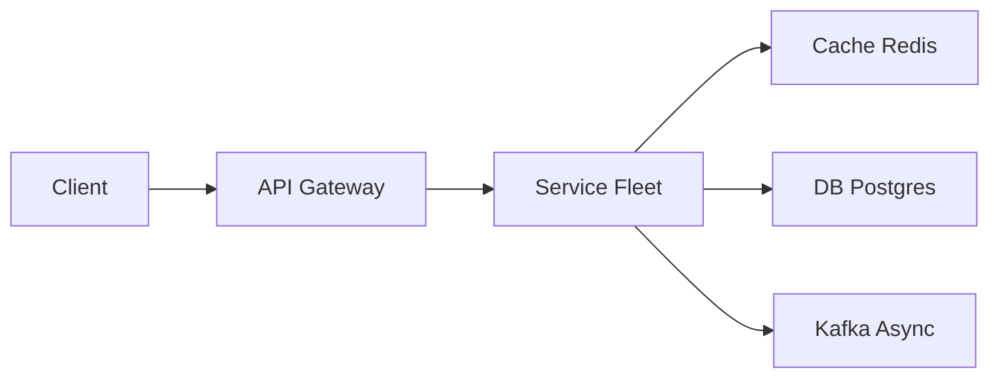

# Tinder

> Swipe app. The product is **geo + recs + a cheap deck**, not a full social graph. Don't design Facebook.

> **TL;DR Hinglish:** Geo + filters se candidate nikalo, swipe queue, recommendation async. Location Redis GEO, photos S3 + CDN.

## Kya poochte hain? (What they ask) — Hinglish me samjho

**Scenario:** "Design Tinder — show a stack of nearby people, swipe right/left, mutual right = match + chat."

**What the interviewer really tests:**
- How you index **geo + filters** (age, gender) without scanning a city?
- Where you store **swipes** so "already swiped" is O(1) and a **match** is a double-key check?
- Can you make **recs cheap** — precomputed deck vs live geo query, Bloom filter for history?
- Whether you handle **location privacy**, hot users, and chat auth (only matched users).

**Example scale:** 50M users, 1M DAU per large metro, 500M swipes/day (~5.8k/s avg, 30k/s peak evening). Each `GET /recs` must return 20 profiles in <200ms.

## Requirements — Kya chahiye? (Functional / Non-functional)

**Functional:**
- Profile: create/edit, photos (S3/CDN), bio, age, gender, preferences (age range, distance, gender preference).
- Location: update `lat/lng` (or travel passport), query nearby candidates.
- Recs: `GET /recs?limit=20` — ranked, filtered, excluding already-swiped and blocked.
- Swipe: `POST /swipes{ targetId, dir: left|right }` — record direction, detect mutual like → create match.
- Match: list matches, unmatch/block.
- Chat: 1:1 only if matched (reuse [WhatsApp](/system-design/whatsapp) lite — WebSocket + history).

**Non-functional:**
- **Latency:** deck load p95 < 200ms; swipe < 100ms; match notification < 1s.
- **Availability:** recs highly available (cache); swipe/match strongly consistent per pair.
- **Throughput:** 30k swipes/s peak, 5k recs/s per metro.
- **Consistency:** exactly-once swipe per pair; match creation idempotent.
- **Privacy:** don't leak exact `lat/lng`; show distance buckets; location updates rate-limited.

**Clarify — questions to ask:**
- Max distance default? (50km? 100km?) Filters beyond age/gender?
- Boost / Super Like / Passport — need priority injection?
- Chat scope — text only v1 or media?
- Need to prevent same profile appearing twice?
- Paid tier affects recs ordering?
- How to handle inactive users (last active > 30d)?

**Out of scope (v1):**
- Full ML attractiveness scoring pipeline (mention offline scoring).
- Video profiles, group swipes, or social feed.
- Advanced safety: photo verification, ML moderation beyond async flagging.

## Scale ka andaaza — Kitna load? (Math jo design badle)

| Metric | Assumption | Math | Result |
|--------|-----------|------|--------|
| Users | 50M total, 5M active/week | — | 5M weekly active profiles to index |
| Swipes per day | 500M | 500M / 86400 | ~5.8k/s avg, ~30k/s peak (evening) |
| Recs QPS | Each active user 20 recs/day | 5M*20/86400 | ~1.2k/s avg, ~6k/s peak |
| Swipe storage | 500M rows/day * ~50B (userId+targetId+dir+ts) | 500M*50B | ~25 GB/day, ~9 TB/year — before compression; TTL or cold archive |
| Geo index | 5M active users * ~100B geo entry | 5M*100B | ~500 MB per replica — fits in [Redis](/system-design/redis) GEO |
| Photos | 5 photos/user avg 500KB | 50M*5*500KB | ~125 TB in S3 — CDN cached |
| Bandwidth (recs) | 20 profiles * 2KB meta + thumb URLs | 20*2KB=40KB *6k QPS | ~240 MB/s |

**Insight:** swipe ledger dominates writes; recs pipeline must avoid city-wide scans.

## API Design — Endpoints kya honge?

| Method | Path | Description |
|--------|------|-------------|
| `PUT` | `/v1/me` | Create/update profile + preferences |
| `PUT` | `/v1/me/location` | Update location |
| `GET` | `/v1/recs?limit=20&cursor=` | Get recommendation deck |
| `POST` | `/v1/swipes` | Swipe on target |
| `GET` | `/v1/matches` | List matches (paginated) |
| `POST` | `/v1/matches/{matchId}/unmatch` | Unmatch |
| `WS` | `/v1/chat/{matchId}` | 1:1 chat (only if matched) |

**Update location:**
```json
PUT /v1/me/location
Authorization: Bearer <token>
{ "lat": 40.7128, "lng": -74.0060, "accuracy": 10 }
→ 200 { "geohash": "dr5ru7", "updatedAt": "2026-08-25T10:00:00Z" }
```

**Get recs:**
```
GET /v1/recs?limit=20
→ 200 {
    "profiles": [
      { "userId":"u_456", "name":"Alex", "age":27, "distanceKm":3, "photos":["https://cdn/..."], "bio":"..." }
    ],
    "nextCursor": "eyJvZmZzZXQiOjIwfQ=="
  }
```

**Swipe:**
```json
POST /v1/swipes
{ "targetId": "u_456", "dir": "right" }
→ 200 { "matched": true, "matchId": "m_789" }
→ 200 { "matched": false }
→ 409 { "error": "already swiped" }
```

**Chat:** `WS /v1/chat/m_789` with `{ type:"send", text:"hi" }` — authorized only if `match` exists and not unmatched.

## High-Level Design (HLD) — Boxes kaise judenge? (Hinglish)

```
Client (Mobile)
  |
 CDN (photos)
  |
 L4 LB → API Gateway (auth, [rate limiter](/system-design/rate-limiter): swipes/min)
  |
 +-- Profile Service → Postgres (users, prefs) + S3 (photos)
 |
 +-- Location Service → [Redis](/system-design/redis) GEO / ES geo / S2 index
 |        `--> GEOADD tinder:geo:nyc lng lat userId
 |
 +-- Recs Service → orchestrates: geo query ∩ filters − swiped set → rank → deck cache
 |        |--> [Redis](/system-design/redis) deck cache: deck:{userId} → list<userId> (next 50)
 |        |--> [Redis](/system-design/redis) Bloom filter: swiped:{userId} → Bloom
 |        `--> Offline scorer (batch) → score table
 |
 +-- Swipe Service → Cassandra/Dynamo (swipes PK=userId SK=targetId) → Match check → [Kafka](/system-design/kafka)
 |        `--> Match table (Postgres) + Notification
 |
 +-- Chat Service (WS + Cassandra history) — only if match
```



**Component roles:**
- **Profile Service:** CRUD for `users`, preferences, photos (pre-signed S3). Validates age/gender filters.
- **Location Service:** writes `GEOADD` on `PUT /location`; on recs, queries `GEORADIUS` or geohash neighbors + age/gender filters. Maintains `last_active` for recency.
- **Recs Service:** builds deck. Two modes: (a) **precompute** offline — nightly batch scores candidates per user, caches `deck:{userId}` in Redis; (b) **live geo query** at request time for freshness (location changes). Preferred: **mix** — precompute + live geo fallback, then filter by `already_swiped` set and cache next 50 ids.
- **Swipe Service:** writes `swipes(userId, targetId, dir, ts)` with `PK=(userId, targetId)`. On `dir=right`, checks reverse key `PK=(targetId, userId) dir=right` — if exists, create `matches` row + notify both via Kafka/push.
- **Chat Service:** 1:1 WebSocket, history in Cassandra `PK=matchId, SK=timestamp`, authz `match exists && not unmatched`.

**Write flow (swipe):** `POST /swipes{targetId, right}` → Swipe Service `PUT` swipe row (`IF NOT EXISTS` → 409 if duplicate) → if `right`, `GET` reverse swipe → if reverse is `right`, `INSERT` into `matches` (idempotent) → publish `MatchCreated` to Kafka → push notification to both.

**Read flow (recs):** `GET /recs` → Recs Service: check `deck:{userId}` cache (hit → return 20, async refill). On miss: `GEORADIUS` for `lat/lng ± distance`, filter by `age BETWEEN pref.min AND pref.max` and `gender IN pref.genders`, subtract `swiped set` (Redis SET or Bloom), exclude `blocked`, fetch 50 candidate profiles from DB, rank (offline score + distance + last_active), cache, return 20.

## Low-Level Design (LLD) — DB + Classes (Hinglish notes)

**Database schema:**
```sql
CREATE TABLE users (
  id            BIGSERIAL PRIMARY KEY,
  name          VARCHAR(255) NOT NULL,
  dob           DATE NOT NULL,
  gender        VARCHAR(16) NOT NULL, -- male|female|nonbinary|...
  bio           TEXT,
  lat           DOUBLE PRECISION,
  lng           DOUBLE PRECISION,
  geohash       VARCHAR(12),
  last_active   TIMESTAMPTZ DEFAULT now(),
  is_boosted    BOOLEAN DEFAULT false,
  boosted_until TIMESTAMPTZ,
  created_at    TIMESTAMPTZ DEFAULT now()
);
CREATE INDEX idx_users_geohash ON users(geohash);
CREATE INDEX idx_users_last_active ON users(last_active DESC);

CREATE TABLE preferences (
  user_id       BIGINT PRIMARY KEY REFERENCES users(id),
  min_age       INT NOT NULL DEFAULT 18,
  max_age       INT NOT NULL DEFAULT 35,
  genders       VARCHAR(32)[] NOT NULL, -- array of desired genders
  max_distance_km INT NOT NULL DEFAULT 50
);

CREATE TABLE photos (
  id            BIGSERIAL PRIMARY KEY,
  user_id       BIGINT REFERENCES users(id),
  s3_key        VARCHAR(512) NOT NULL,
  order_idx     INT NOT NULL,
  created_at    TIMESTAMPTZ DEFAULT now()
);

-- Swipe ledger: Cassandra/Dynamo style — shown as Postgres for interview
CREATE TABLE swipes (
  user_id       BIGINT NOT NULL,
  target_id     BIGINT NOT NULL,
  dir           VARCHAR(8) NOT NULL, -- 'left'|'right'
  created_at    TIMESTAMPTZ DEFAULT now(),
  PRIMARY KEY (user_id, target_id)
);
CREATE INDEX idx_swipes_target ON swipes(target_id, user_id);

CREATE TABLE matches (
  id            BIGSERIAL PRIMARY KEY,
  user_a        BIGINT NOT NULL REFERENCES users(id),
  user_b        BIGINT NOT NULL REFERENCES users(id),
  created_at    TIMESTAMPTZ DEFAULT now(),
  status        VARCHAR(16) DEFAULT 'active', -- active|unmatched|blocked
  UNIQUE (LEAST(user_a, user_b), GREATEST(user_a, user_b))
  -- ensures one match per unordered pair
);
CREATE INDEX idx_matches_user ON matches(user_a, status) INCLUDE (user_b);

CREATE TABLE blocks (
  blocker_id    BIGINT REFERENCES users(id),
  blocked_id    BIGINT REFERENCES users(id),
  created_at    TIMESTAMPTZ DEFAULT now(),
  PRIMARY KEY (blocker_id, blocked_id)
);
```

**Cassandra swipe table (preferred for scale):**
```cql
CREATE TABLE swipes (
  user_id bigint,
  target_id bigint,
  dir text,
  created_at timestamp,
  PRIMARY KEY (user_id, target_id)
) WITH CLUSTERING ORDER BY (target_id ASC);
```

**Key classes:**
```python
class RecsService:
    def get_recs(self, user_id, limit=20) -> List[Profile]: ...
    def candidates_geo(self, lat, lng, radius_km, filters) -> List[int]: ...
    def filter_swiped(self, user_id, candidate_ids) -> List[int]: ... # Redis SET or Bloom
    def rank(self, candidate_profiles) -> List[Profile]: ... # score offline + distance
    def refill_deck(self, user_id): ... # async

class SwipeService:
    def swipe(self, user_id, target_id, dir) -> SwipeResult: ...
    def has_swiped(self, user_id, target_id) -> bool: ...
    def check_match(self, user_id, target_id) -> Optional[Match]: ...

class MatchService:
    def create_match(self, user_a, user_b) -> Match: ... # idempotent
    def list_matches(self, user_id) -> List[Match]: ...

class LocationService:
    def update(self, user_id, lat, lng): ... # GEOADD + geohash
    def nearby(self, lat, lng, radius_km, filters, exclude) -> List[int]: ...

class ChatService:
    def send(self, match_id, sender_id, text): ... # check match active
    def history(self, match_id, cursor) -> List[Message]: ...
```

**Algorithms / concurrency:**
- **Geo query:** `[Redis](/system-design/redis) GEO`: `GEORADIUS tinder:geo:nyc lng lat 50 km WITHDIST COUNT 200 ASC` then filter by age/gender in app or via Lua/ES. Alternative: geohash prefix scan — query `geohash[0:5]` cell + 8 neighbors, then Haversine prune.
- **Already-swiped filter:** keep `swiped:{userId}` as Redis SET (`SADD` on swipe) for exact check, plus Bloom filter for memory efficiency on large history (10k swipes/user → Bloom ~12KB at 1% FP). On Bloom positive, confirm via DB.
- **Match detection:** double-key check idempotent:
  ```python
  put_swipe(userA, userB, dir)  # IF NOT EXISTS else 409
  if dir == 'right' and get_swipe(userB, userA) == 'right':
      create_match(least(A,B), greatest(A,B))  # unique constraint prevents dup
  ```
  Race on simultaneous mutual swipe: both try to create match → unique constraint ensures one winner; other catches exception and returns existing match.
- **Distance privacy:** store precise `lat/lng` but return `distanceKm` bucketed (`<1km`, `2km`, `5km`).

**Patterns:** Geohash/S2 Index, Bloom Filter, Cache-Aside (deck), Double-Key Match, Observer (Kafka for match events).

## Deep Dive — Gehrai se (Interview yahi puchega) — making recs cheap

**Naive "all users in 50km" is huge** — NYC 50km radius ≈ 8k km², density 10k/km² → 80M candidates impossible.

**Narrow aggressively:**
1. Only `last_active > now() - 7d` and `geohash` same city prefix.
2. Filter by `age BETWEEN pref` and `gender IN pref` at query time (or pre-partition index by `gender:geohash`).
3. Subtract `already_swiped` Bloom filter — majority have been seen in dense city.
4. Fetch 100 candidates, rank, return 20. Cache next 50 in `deck:{userId}` so swipe UI never waits on city-wide query.

**Don't run ML in request.** Offline scorer (Spark) computes `attractiveness / activity / response_rate` per user nightly, writes `user_scores(userId, score)`. Online ranking is `0.5*offline_score + 0.3*distance_penalty + 0.2*last_active_boost`. Boost injection: insert boosted users into decks via priority queue (paying users at head with decay).

## Deep Dive — Gehrai se (Interview yahi puchega) — swipe ledger and match correctness

**Swipe store:** Dynamo/Cassandra `PK=userId SK=targetId` gives O(1) "have I swiped" and paginable history. Use `IF NOT EXISTS` to prevent double swipe. TTL optional for left swipes (expire after 30d to re-show).

**Match creation:** must be **idempotent** and race-safe. Two simultaneous right swipes:
- `PUT swipe A→B` and `PUT swipe B→A` both succeed (different PKs).
- Both check reverse → both see `right` → both `INSERT match(A,B)`. Unique constraint on `(least, greatest)` ensures one succeeds, other gets `duplicate key` → fetch existing match and return it.

**Hot user (1M incoming rights):** incoming likes fan-in to one `targetId` partition — hot key. Mitigate by sharding counter (`likes_received:{userId}` as Redis counter) and not listing all likers at once — paginate `SELECT * FROM swipes WHERE target_id=:uid AND dir='right' LIMIT 20`.

## Deep Dive — Gehrai se (Interview yahi puchega) — location and safety

**Location updates:** `PUT /me/location` rate-limited (1/min) to prevent spoofing. Store `geohash` for bucket queries, precise `lat/lng` for distance calc but never expose precise to other users — `distanceKm = bucket(Haversine(myLatLng, theirLatLng))`.

**Passport / travel:** user can set `lat/lng` manually to another city — treat as normal location update but flag `is_passport=true` for analytics.

**Safety:** block creates `blocks` row + removes from deck/matches; photo moderation via async [Kafka](/system-design/kafka) workers (Rekognition); GDPR delete purges `swipes`, `matches`, deck cache, and S3 photos.

## Hinglish Tip — Galti vs Sahi

**🔴 Galti:** Hot path pe DB direct without cache/queue.
**✅ Sahi:** Cache/queue beech me, DB source of truth.

## Failures & Scale — Kya tootega aur kaise bachenge? (Hinglish)

- **Sharding:** `users` by `geohash` region or `userId` hash; `swipes` by `userId` hash (so `has_swiped` local); `matches` by `least(user_a,user_b)` hash. Redis GEO sharded by city (`tinder:geo:{city}`).
- **Caching:** deck cache in [Redis](/system-design/redis) with TTL 10m + invalidation on location change; profile hydrate cache (`user:{id} → JSON` 1m TTL). Swipe Bloom in Redis, rebuilt from `swipes` table on miss.
- **Replication:** Postgres primary + replicas for profiles; Cassandra multi-AZ for swipes/matches. Kafka for swipe→match→notification.
- **Failure modes:** Redis GEO down → degrade to Postgres `WHERE geohash LIKE 'dr5ru%'` (slower, fewer recs but available). Swipe DB down → queue swipes in Kafka, replay when back (show "swipe queued"). Match notification via push; if push fails, client polls `GET /matches`.
- **Abuse:** [rate limiter](/system-design/rate-limiter) 100 swipes/min, device attestation, shadow-ban suspicious bots (serve empty deck).

## Aur kya puch sakte hain? (Extra probes) / Interview follow-ups

1. **Boost:** `is_boosted=true` users injected at top of others' decks via `ZADD boosted:{city} score=boosted_until member=userId` — recs service merges boosted candidates with higher weight for 30m window.
2. **Super Like:** `dir='super_right'` with separate notification and badge; stored as `dir` enum, match still mutual right.
3. **GDPR delete:** tombstone `users` row, async workers delete `swipes` partitions, `deck` keys, S3 photos, search index; confirm via audit log.
4. **Analytics:** Kafka → Druid for `swipes per metro`, `match rate`, `time to first swipe`.
5. **Chat auth:** every `WS /chat/{matchId}` message checks `matches` table `status='active' AND (user_a=:me OR user_b=:me)` — no match, no send.

**Yaad rakho (Revision):** Write durable, read cache, async Kafka/Flink, failure me degrade gracefully.

**Phrase:** GEO for candidates, a swipe ledger keyed by pair, match when the reverse swipe is right. Precompute a small deck so the swipe UI never waits on a city-wide query.
