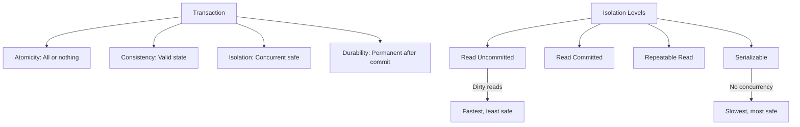

# Transactions

> Multiple operations ek atomic unit mein — ya sab theek, ya sab galat.

> **TL;DR Hinglish:** Transaction multiple database operations ek ke liye group karta hai — chahe sab successful ho ya koi nahi. ACID properties se guarantee: Atomicity (all or nothing), Consistency (valid state), Isolation (concurrent safe), Durability (permanent after commit). Isolation levels: Read Uncommitted, Read Committed, Repeatable Read, Serializable. Higher isolation = more consistency, less concurrency.

Transaction multiple operations ko ek reliable unit mein handle karta hai:

**ACID Properties:**
- **Atomicity** — Sab operations complete honi chahiye ya koi nahi (all or nothing)
- **Consistency** — Database valid state mein rahe, constraints respected
- **Isolation** — Concurrent transactions interfere nahi karen
- **Durability** — Once committed, data permanent (even after crash)

**Isolation levels (low to high):**
1. **Read Uncommitted** — Dirty reads possible
2. **Read Committed** — Only committed data visible
3. **Repeatable Read** — Same data in same transaction
4. **Serializable** — Full isolation, slowest

## Failure modes to mention

1. **Deadlock** — Two transactions wait for each other — timeout or deadlock detection
2. **Dirty read** — Read uncommitted data that might roll back
3. **Lost update** — Two transactions update same row, last one wins — optimistic locking
4. **Phantom read** — New rows appear between reads — serializable isolation needed

**🔴 Galti:** "Highest isolation always best" — Serializable = no concurrency, very slow. Choose isolation based on use case.
**✅ Sahi:** "ACID guarantees: Atomicity, Consistency, Isolation, Durability. Isolation levels trade-off concurrency vs consistency. Deadlocks via timeout/detection."

**Phrase:** Transaction ACID properties — Atomicity (all or nothing), Consistency, Isolation (concurrent), Durability (permanent). Isolation levels: Read Uncommitted → Serializable.

**Yaad rakho (Revision):** ACID (Atomicity, Consistency, Isolation, Durability), isolation levels (4 levels, trade-off), dirty/phantom/deadlock issues, optimistic/pessimistic locking.

**See also:** [ACID vs BASE](/system-design/acid-vs-base), [Distributed Transactions](/system-design/distributed-transactions), [Database Replication](/system-design/database-replication).
