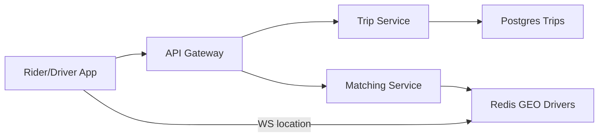

# Uber

> Ride hailing. The unique piece is **nearby search on moving drivers**, then a **trip state machine**. Payments and maps are boxes, not the whole hour.

> **TL;DR Hinglish:** Trip state Postgres me lock, driver GPS Redis GEO me. Match = GEOSEARCH + CAS assignment, pricing surge Redis me.

## Kya poochte hain? (What they ask) — Hinglish me samjho

Design a ride-hailing system like Uber / Lyft: a rider opens the app, sees nearby cars and an ETA, requests a ride, gets matched to a driver, watches live location until pickup, rides, pays, and rates. The driver app streams GPS the whole time.

What the interviewer actually tests:

- Can you keep **moving location data** out of the transactional trip store?
- Can you do **geo nearby search at scale** (geohash / S2 / quadtree) without `SELECT * WHERE lat BETWEEN`?
- Is the **assign** atomic so two riders cannot get the same car?
- Do you treat maps, pricing, and payments as external boxes and focus on the trip lifecycle?

A strong answer: *per-city geo index in memory → atomic match → durable trip state machine → WebSocket live tracking → payment after completion*.

## Requirements — Kya chahiye? (Functional / Non-functional)

| Category | Details |
|---|---|
| **Functional** | Rider: see nearby drivers + ETA, request ride (pickup, dropoff, product=UberX/Pool), cancel, track driver, rate. Driver: go online/offline, accept/reject, update location at ~1–4s, start/complete trip. Trip lifecycle: requested → matched → enroute → in_progress → completed/cancelled |
| **Non-functional** | Match in < 2s, location freshness < 5s, no double-assign, exactly-once money, trip history durable, 10M+ concurrent drivers globally |
| **Clarify** | v1: one rider per car (no Pool), city-sharded, cash + card (call [Payment System](/system-design/payment-system) a box), surge pricing yes/no, scheduled rides v2 |
| **Out of scope v1** | In-car navigation turn-by-turn, driver payroll, fraud/ML ETA, Pool matching optimization |

## Scale ka andaaza — Kitna load? (Math jo design badle)

Assume 50M riders, 5M drivers, 10% concurrent.

| Metric | Math | Result |
|---|---|---|
| Trip QPS | 5M trips/day = **~58 trips/s** avg, peak ~300/s (rush hour 5×) | ~300 writes/s to trip DB |
| Location writes | 500K online drivers × 0.33 Hz (every 3s) | **~165K updates/s** — must NOT hit Postgres |
| Location reads (nearby) | Each `POST /trips` fans to GEOSEARCH of ~50 drivers | ~300 × 50 = 15K GEO lookups/s |
| Storage (trips) | 5M × 1 KB = **5 GB/day**, 1.8 TB/year | Postgres per city shard is fine |
| Bandwidth (WS) | 500K drivers × 200 bytes × 0.33 Hz ≈ 33 MB/s + riders | WebSocket fleet sharded |

Conclusion: **trip writes are tiny**, **location writes dominate** — they belong in [Redis](/system-design/redis) / memory, not `UPDATE drivers SET lat=` in Postgres at 165K TPS.

## API Design — Endpoints kya honge?

```http
POST /v1/trips
Authorization: Bearer <riderToken>
{ "pickup": { "lat": 19.07, "lng": 72.87 }, "dropoff": { "lat": 19.12, "lng": 72.91 }, "product": "UberX" }
→ 201 { "tripId": "trip_8a2f", "status": "requested", "etaSec": 240 }

GET /v1/trips/{tripId}
→ 200 { "tripId":"...", "status":"matched","driver":{"id":"drv_1","name":"A","phone":"...","etaSec":120}, "pickup":..., "dropoff":..., "fareEstimate": 180 }

POST /v1/trips/{tripId}/accept   // driver
Authorization: Bearer <driverToken>
→ 200 { "status":"matched" } | 409 { "error":"already_matched" }

POST /v1/trips/{tripId}/start    // driver at pickup
POST /v1/trips/{tripId}/complete // driver at dropoff → triggers payment
POST /v1/trips/{tripId}/cancel   { "reason": "rider_cancel" }
POST /v1/trips/{tripId}/rate     { "stars":5, "tip": 50 }

WS /v1/stream?token=...          // bidirectional
  → { "type":"location","tripId":"...","lat":19.07,"lng":72.87,"heading":90,"at": 1714000000 }
  ← { "type":"eta_update","etaSec": 110 }
  ← { "type":"trip_state","status":"enroute" }
GET /v1/drivers/nearby?lat=19.07&lng=72.87&radiusM=2000  // for map pins
```

All state transitions are **idempotent** (`Idempotency-Key` header). Location WS authenticates via short-lived token; HTTP fallback polls `GET /trips/{id}` if WS drops.

## High-Level Design (HLD) — Boxes kaise judenge? (Hinglish)

```
[ Rider App ] --HTTPS/WS-->                [ Driver App ] --WS location-->
        \                                      /
         v                                    v
     [ CDN (static map tiles) ]      [ L4 LB → API Gateway (auth, rate-limit) ]
                                          |
                    +----------+----------+----------+----------+
                    |          |          |          |          |
              [Trip Service] [Matching] [Location] [Pricing] [Payment]
                    |          |          |          |          |
              [Postgres]   [Redis GEO]  [Redis+WS]  [Cache]  [Payment Svc]
              (per city)   per city     Fleet      Surge    external
                    |          |          |
                 [ Kafka → Analytics, Receipts, Fraud, Search Index ]
```



**Components:**

- **API Gateway + LB:** Auth, [Rate Limiter](/system-design/rate-limiter), city-aware routing (`city_id` from pickup geohash → shard).
- **Trip Service:** Source of truth for money. State machine in [Postgres](/system-design/postgres) (or Cockroach) sharded by `city_id`. All transitions via atomic `UPDATE ... WHERE status=expected`.
- **Location Service:** Drivers stream GPS via WS to a fleet sharded by `city_id`. Each node maintains a [Redis](/system-design/redis) GEO index (`GEOADD drivers:{city} lng lat driverId`) + in-memory TTL map. Never writes to Postgres.
- **Matching / Dispatch:** Finds N closest candidates via GEOSEARCH, filters by product/occupancy, offers via push. First `accept` wins via DB CAS.
- **WebSocket Fleet:** Holds `userId → {node, conn}` map in Redis; routes `eta_update` and `trip_state` via pub/sub ([Kafka](/system-design/kafka) or Redis PubSub).
- **Pricing / Surge:** Computes fare, multiplier per geohash when `demand/supply` high; cached 30s.
- **Maps / Routing:** External provider (Google/OSRM) for ETA and route; cache popular edges in Redis.

**Write flow (request → match):** Rider `POST /trips` → Trip Service inserts `requested` → Matching does `GEOSEARCH drivers:{city} FROMLONLAT lng lat BYRADIUS 2 km` → push offer to 5 drivers → first driver `POST /accept` → `UPDATE trips SET driver_id=?, status='matched' WHERE trip_id=? AND status='requested'` (CAS) → publish `trip.matched` → WS notify rider.

**Read flow (track):** Driver WS `location` → Location node `GEOADD + EXPIRE` + publish to trip's channel → rider's WS node (subscribed to `trip:{id}`) pushes `location` + `eta_update` (maps cached). Rider map polls `GET /drivers/nearby` for pins (served from Redis GEO).

## Low-Level Design (LLD) — DB + Classes (Hinglish notes)

### DB schema

```sql
CREATE TABLE cities (
  city_id     INT PRIMARY KEY,
  name        TEXT NOT NULL,
  -- shard key; all trips/drivers routed by city
  timezone    TEXT
);

CREATE TABLE users (
  user_id     UUID PRIMARY KEY,
  role        TEXT CHECK (role IN ('rider','driver')),
  phone       TEXT UNIQUE,
  city_id     INT REFERENCES cities(city_id)
);

CREATE TABLE drivers (
  driver_id   UUID PRIMARY KEY REFERENCES users(user_id),
  product     TEXT[] NOT NULL DEFAULT '{UberX}', -- UberX, XL, etc.
  status      TEXT CHECK (status IN ('offline','online','busy')),
  city_id     INT NOT NULL,
  updated_at  TIMESTAMPTZ DEFAULT now()
);
CREATE INDEX idx_drivers_city_status ON drivers(city_id, status);

CREATE TABLE trips (
  trip_id       UUID PRIMARY KEY,
  city_id       INT NOT NULL,
  rider_id      UUID NOT NULL REFERENCES users(user_id),
  driver_id     UUID REFERENCES users(user_id),
  pickup_lat    DOUBLE PRECISION NOT NULL,
  pickup_lng    DOUBLE PRECISION NOT NULL,
  dropoff_lat   DOUBLE PRECISION NOT NULL,
  dropoff_lng   DOUBLE PRECISION NOT NULL,
  product       TEXT NOT NULL,
  status        TEXT NOT NULL CHECK (status IN ('requested','matched','enroute','in_progress','completed','cancelled')),
  fare_cents    INT,
  surge_x       NUMERIC(3,2) DEFAULT 1.0,
  requested_at  TIMESTAMPTZ DEFAULT now(),
  matched_at    TIMESTAMPTZ,
  started_at    TIMESTAMPTZ,
  completed_at  TIMESTAMPTZ,
  version       INT NOT NULL DEFAULT 0 -- optimistic lock
);
CREATE INDEX idx_trips_rider ON trips(rider_id, requested_at DESC);
CREATE INDEX idx_trips_driver ON trips(driver_id, requested_at DESC);
CREATE INDEX idx_trips_city_status ON trips(city_id, status);

-- Location is NOT here. It lives in Redis GEO + ephemeral WS state.
-- Redis key: drivers:{cityId}  ZSET with geohash score
-- TTL hash: driver_last_seen:{cityId}  driverId -> unix_ms  (expire 15s)
```

### Key classes / responsibilities

```java
class TripService {
  Trip requestTrip(riderId, pickup, dropoff, product) // INSERT requested
  Trip acceptTrip(tripId, driverId) // CAS: UPDATE ... WHERE status='requested'
  Trip startTrip(tripId, driverId)  // WHERE status='matched'
  Trip completeTrip(tripId, driverId) // WHERE status='in_progress' → emit payment event
}
class LocationService {
  void onLocation(driverId, cityId, lat, lng) // GEOADD + update TTL, pub to trip channel
  List<Driver> nearby(cityId, lat, lng, radiusM, product) // GEOSEARCH + filter
  void reapStale(cityId) // periodic scan, ZREM if no ping in 15s (ghost cars)
}
class MatchingService {
  void dispatch(trip) // nearby() → push to N drivers → race on acceptTrip()
}
class WSConnectionRegistry { // backed by Redis hash userId -> nodeId
  void register(userId, nodeId); void route(tripId, msg)
}
```

### Concurrency & algorithms

- **No double-assign:** `accept` is a single-row atomic transaction. Second driver gets `409`. No distributed lock, no [Kafka](/system-design/kafka) for the assign lock — Kafka is for analytics only.
- **Optimistic locking:** `UPDATE trips SET status=?, version=version+1 WHERE trip_id=? AND version=?` prevents lost start/complete races.
- **Geo index:** [Redis GEO](https://redis.io/commands/geoadd) = sorted set of geohash; `GEOSEARCH` is O(log N + M). Alternative: S2 cells / quadtree per city for even finer control.
- **Ghost cars:** TTL 15s; `ZREM` on expiry so stale pins disappear. Client heartbeat every 3s.

### Patterns used

State Machine (trip lifecycle), Sharding (city), Cache-Aside (Redis GEO), Publish-Subscribe (WS fan-out), Optimistic Concurrency (version column), Saga (trip → payment compensatable).

## Deep Dive — Gehrai se (Interview yahi puchega) — geo index (why not SQL?)

Naive `WHERE lat BETWEEN ? AND ? AND lng BETWEEN ?` scans an index poorly, cannot do radius, and at 165K writes/s would kill Postgres. A **geohash** interleaves lat/lng bits into a string — nearby points share a prefix; neighbors are 8 adjacent cells. Writes: remove from old cell, add to new. Reads: query cell + 8 neighbors, then precise haversine filter. **S2 / quadtree** use hierarchical cells with better shape at poles. Shard everything by `city_id` so NYC's index never contends with Bangalore — dispatch workers and Redis belong to the city.

## Deep Dive — Gehrai se (Interview yahi puchega) — surge and ETA without melting maps

Maps is expensive. Cache route + ETA for popular edges (`geohash5:geohash5 → {distance, duration}`) with 60s TTL. Surge computed per geohash cell: `multiplier = f(demand/supply)` where demand = `requested` trips/min, supply = online drivers/min. Computed every 30s by an aggregator consuming Kafka trip events + Redis driver counts; cached in Redis. Rider sees `fareEstimate × surge` before confirming — stale by seconds is acceptable (show "surge").

## Deep Dive — Gehrai se (Interview yahi puchega) — exactly-once money

Trip row is the **source of truth for money**, not GPS. `complete` emits `trip.completed` exactly once (outbox pattern: write to `outbox` table in same TX, relay to [Kafka](/system-design/kafka)). Payment service consumes idempotently (`tripId` deduped). If driver app is offline in a tunnel, `complete` still succeeds when it reconnects — location was stale but `status` remained `in_progress` in DB. Cancel/no-show are state transitions with fee rules, not location deletes.

## Hinglish Tip — Galti vs Sahi

**🔴 Galti:** Hot path pe DB direct without cache/queue.
**✅ Sahi:** Cache/queue beech me, DB source of truth.

## Failures & Scale — Kya tootega aur kaise bachenge? (Hinglish)

- **Driver WS drop / tunnel:** Trip row persists; rider sees last known location + stale ETA. On reconnect, driver re-registers and replay is unnecessary.
- **Redis down:** Location degraded (nearby returns fewer drivers, dispatch queues), but trip accept/start/complete still work via Postgres. Fail open for nearby, fail closed for payments.
- **Double accept race:** DB CAS ensures one winner; loser gets 409 and offer retracted via push.
- **City hotspot (NYE):** Per-city autoscale + per-city Redis cluster; add read replicas for trip history; throttle `GET /drivers/nearby` with [Rate Limiter](/system-design/rate-limiter) per IP.
- **Kafka lag:** Analytics/receipts may delay, but trip state never waits on Kafka — only the outbox relay is async and retried.
- **Clock skew:** Store `server_received_at` for location, not just client timestamp; ETA calc uses server time.

## Aur kya puch sakte hain? (Extra probes — Hinglish)

1. **Driver offline / ghost:** TTL reap + `status=offline` after 30s; trip stays `matched` if already assigned.
2. **Cancel & no-show fees:** Events on state machine with idempotent fee charge; rider cancel window (e.g., free for 2 min).
3. **Kafka for analytics and receipts, not for the assign lock** — the lock is a single-row DB transaction.
4. **Pool / shared rides:** Separate matching optimization (batching by direction) — v2; mention as extension.
5. **Safety & fraud:** Shadow trip log + async ML; not in critical path.

**Yaad rakho (Revision):** 1) Trip Postgres CAS 2) Location Redis GEO 3) Match = GEOSEARCH 4) City-sharded.

**Phrase:** Trips are a durable state machine. Drivers live in a per-city geo index in Redis. Assign is atomic so two riders can't get the same car. GPS never is the source of truth for money.

