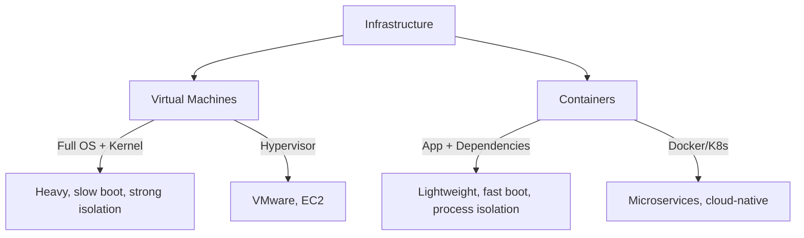

# Virtual Machines and Containers

> Infrastructure abstraction — VMs heavy, containers lightweight.

> **TL;DR Hinglish:** VM full operating system virtualize karta hai — hypervisor pe OS run hota hai, heavy, boot slow. Container application + dependencies share host OS kernel — lightweight, boot fast, portable. Docker containers popular hain, Kubernetes manage karta container orchestration ke liye. VMs better for isolation, containers better for microservices. VM = full OS, container = app-level isolation.

VM aur containers infrastructure abstraction ke tools hain:

**Virtual Machines:**
- Full OS virtualized, hypervisor pe run hota hai
- Heavy — each VM mein full OS, kernel, libraries
- Boot time: minutes
- Isolation: strong (kernel level)
- Use cases: legacy apps, full OS isolation
- Examples: VMware, EC2, Hyper-V

**Containers:**
- Application + dependencies, share host OS kernel
- Lightweight — no OS overhead
- Boot time: seconds
- Isolation: process level (weaker than VM)
- Use cases: Microservices, cloud-native apps
- Examples: Docker, containerd

## Failure modes to mention

1. **VM resource waste** — Full OS = unused memory/CPU, over-provisioning cost
2. **Container escape** — Container breakout → host compromise — security isolation
3. **Orchestration complexity** — Kubernetes complex — learning curve, operational overhead
4. **Image vulnerability** — Container image has security issues — scan regularly
5. **Stateful containers** — Containers ephemeral, stateful apps hard — persistent volumes

**🔴 Galti:** "VMs aur containers same cheez hain" — VM full OS virtualize karta, container app-level isolate karta.
**✅ Sahi:** "VM = full OS (heavy, slow, strong isolation), container = app-level (lightweight, fast, process isolation). Docker for containers, K8s for orchestration."

**Phrase:** VMs full OS virtualize karte hain (heavy, slow, strong isolation), containers app-level isolate karte hain (lightweight, fast, Docker/K8s).

**Yaad rakho (Revision):** VM = full OS + hypervisor, heavy + slow boot, strong isolation. Container = app + dependencies + shared kernel, lightweight + fast. Docker + Kubernetes for orchestration.

**See also:** [Microservices](/system-design/microservices), [Clustering](/system-design/clustering), [N-tier Architecture](/system-design/n-tier-architecture).
