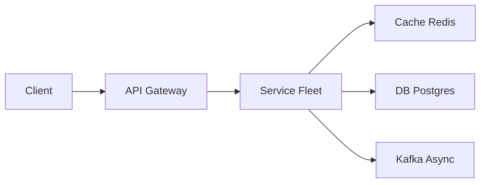

# Web Crawler

> Download the web politely. The core is a **URL frontier + dedup + robots.txt**, not a recursive `wget` on one box.

> **TL;DR Hinglish:** URL frontier (queue), politeness per domain, dedup via Bloom/Set, fetcher → parser → dedup → store S3 + index.

## Kya poochte hain? (What they ask) — Hinglish me samjho

Interviewer: "Design a web crawler like Googlebot — start from seeds, crawl billions of pages, feed a search index. How do you avoid DDoSing wikipedia.org, looping on calendar URLs, and re-crawling the same content forever?" They expect you to reason about politeness, scale, and freshness, not HTML parsing trivia.

**What they really test:** (1) Frontier as a distributed priority queue (not DFS/BFS in memory). (2) Per-host rate limiting + robots.txt cache as first-class. (3) URL canonicalization + seen-set at billions scale (Bloom + exact). (4) Decoupling fetch, parse, store, index via queues. (5) Trade-offs: throughput vs politeness vs freshness.

**Scale anchor:** Web ~40-60B indexable pages (debatable), crawler targeting 1-10B pages. Fetch 10k pages/sec ~ 1B/day requires ~1000 fetcher threads with polite delays. Raw HTML avg ~30KB gzipped ~30KB*1B = 30TB crawl data/day to [S3](/system-design/s3). Frontier holds billions of URLs — cannot be in RAM.

## Requirements — Kya chahiye? (Functional / Non-functional)

**Functional:**
- Seed with `POST /seeds { urls[] }`; recursively extract `<a href>`, sitemaps, canonical links; enqueue unseen URLs.
- Fetch HTML (and optionally PDFs/images) with size/time caps; handle redirects (301/302), retries, and HTTP errors.
- Respect `robots.txt`, `sitemap.xml`, `Crawl-delay`, and meta `noindex/nofollow`.
- Canonicalize + deduplicate URLs and content; detect near-duplicates.
- Store raw pages and extracted links; emit to downstream indexing pipeline ([Elasticsearch](/system-design/elasticsearch)).
- Recrawl: revisit pages based on change frequency, not blindly.

**Non-functional:**
- Polite per-host rate (e.g., ≤2 req/sec per domain or per-IP) even with 1000 workers.
- Throughput via inter-host parallelism — many hosts in parallel, few connections per host.
- Idempotent & resumable: crash of a fetcher doesn't lose URLs; exactly-once fetch per URL per version.
- Freshness SLA: important pages recrawled within hours, low-value within weeks.
- Operate within bandwidth/DNS/robots cache limits; not flagged as abusive.

**Clarify:**
- Scope: whole web vs focused crawl (news only, e-commerce site)? Affects frontier size and politeness.
- JS rendering: static HTML only (v1) or headless Chrome queue? (Say v1 = static, v2 = render queue for JS-heavy).
- Depth cap? Max pages per domain? Budget-aware crawl.
- Freshness vs coverage: are we building a search engine or archival mirror?
- Is real-time indexing required or batch?

**Out of scope (v1):**
- Headless rendering for JS SPAs (separate expensive queue).
- Image/video transcoding; keep raw HTML only.
- Search ranking / query serving (downstream consumer).
- User-facing search API on crawler itself.

## Scale ka andaaza — Kitna load? (Math jo design badle)

| Dimension | Assumption | Math | Result |
|-----------|-----------|------|--------|
| Pages | 1B pages crawl corpus |  | storage driver |
| Fetch rate | 5k pages/sec target | 5k * 86400 | ~432M pages/day (~2.3 days per 1B) |
| Bandwidth | 30KB avg HTML gzipped + headers | 5k * 30KB | 150 MB/s fetch egress (~1.2 Gbps) sustained |
| Storage (raw) | 30KB * 1B | 30 TB | S3 Standard + lifecycle to Glacier |
| Frontier size | 10B pending URLs * ~100B per URL | ~1 TB metadata | Needs disk-backed queue (RocksDB / Cassandra) |
| DNS | 5k lookups/sec | cache 90% hit | ~500 uncached DNS/sec to resolver |
| Dedup seen-set | 10B URLs * 8B hash | 80 GB hash | Bloom 10B @1% FPR ~12 GB + exact Cassandra |

Throughput scales horizontally by adding fetcher workers; bottleneck is per-host politeness and DNS, not CPU.

## API Design — Endpoints kya honge?

```http
// Seed — operators or discovery
POST /v1/seeds
{ "urls": ["https://example.com/sitemap.xml", "https://news.ycombinator.com"], "priority": "high", "label": "bootstrap" }
=> 202 { "accepted": 2, "jobId": "seed-uuid" }

// Control plane
GET /v1/status => 200 { "frontierDepth": 4823910234, "fetchRps": 5120, "domainsInFlight": 82340, "failedQueue": 12034 }
GET /v1/frontier/sample?limit=10 => { "urls": [...] }

POST /v1/crawl/pause { "domain": "example.com" } => 202
DELETE /v1/seeds/{jobId} => 204

// Data plane (internal) — fetcher -> parser -> store
POST /internal/fetchResult { "url": "...", "status": 200, "htmlRef": "s3://crawl/raw/...", "links": ["..."], "fetchedAt": "..." }
```

Workers communicate via internal [Kafka](/system-design/kafka) topics, not these REST endpoints in steady state. Admin API above is for control plane only.

## High-Level Design (HLD) — Boxes kaise judenge? (Hinglish)

```
Seeds -> URL Frontier (priority queue sharded by host) -> Scheduler (per-host queue)
                                                        |
                                              Fetcher Workers (100s-1000s pods)
                                                  | DNS Cache | robots.txt Cache | Per-host Rate Limiter
                                                  v
                                             HTTP Fetch -> Content Store (S3) + Content Hash -> Dedup Service
                                                  |                                        \
                                                  v                                         v
                                        Parser (link extractor) -> Canonicalizer -> Seen-Set (Bloom + Cassandra)
                                                  |                                        |
                                                  +------------> Frontier (enqueue unseen)   +-> Index Pipeline -> [Elasticsearch]
```



**Components:**
- **URL Frontier:** Disk-backed priority queue, logically sharded by `hash(host) % shards`. Two-level: global priority (PageRank/importance, recency, `Crawl-Delay`) then per-host FIFO to enforce politeness. Backed by [Kafka](/system-design/kafka) + RocksDB or custom disk queue (like Mercator). Must spill to disk — billions of URLs don't fit in Redis alone.
- **Scheduler:** Pulls from frontier in host-sharded fashion; enforces per-host concurrency = 1-2 and min interval (e.g., 500ms-1s). Uses a [rate limiter](/system-design/rate-limiter) keyed by host/IP (token bucket per domain). Also merges robots.txt fetch into schedule — don't schedule fetch until robots fetched & cached.
- **Fetcher Workers:** Stateless pods (Go/Java). Steps: DNS resolve (with shared [Redis](/system-design/redis) cache TTL 5 min), check robots cache (cached per host 24h), HTTP GET with timeout 10s + max body 2MB + respect `Crawl-delay` and `Retry-After`, handle redirects (follow ≤5, canonicalize target). Respect `User-Agent` identification.
- **DNS / robots cache:** Shared cache layer ([Redis](/system-design/redis) or [Memcached](/system-design/memcached)) + local L1. Robots.txt fetched once per host per 24h, stored as parsed rules.
- **Content Store:** Raw HTML + headers stored to [S3](/system-design/s3) with key `s3://crawl/raw/{date}/{hostHash}/{urlHash}.warc.gz`. Also store metadata in [Cassandra](/system-design/cassandra) for quick lookup.
- **Parser / Link Extractor:** Extracts `href`, sitemap links, `rel=canonical`. Canonicalizes (lowercase host, remove `utm_*`, sort query, strip fragment, handle trailing slash). Emits canonical URLs.
- **Dedup Service:** Checks Bloom filter (fast negative) then exact store (Cassandra/Dynamo `seen_urls`). Content dedup via SHA256 of body (or SimHash for near-dup) — same content via many URLs stored once.

**Write path (crawl):** Seed -> frontier -> scheduler picks host shard -> fetcher -> S3 + parser -> dedup -> frontier (new links) and index pipeline.
**Read path (search):** Downstream indexer reads S3/queue, builds inverted index in [Elasticsearch](/system-design/elasticsearch). No user-facing read on crawler.

## Low-Level Design (LLD) — DB + Classes (Hinglish notes)

**DB schema — metadata, seen-set, frontier spill**

```sql
-- Seen URLs exact store (Cassandra/Dynamo style, shown as SQL)
CREATE TABLE seen_urls (
  url_hash      CHAR(64) PRIMARY KEY, -- SHA256(canonical_url)
  canonical_url TEXT NOT NULL,
  first_seen_at TIMESTAMPTZ NOT NULL,
  last_fetched_at TIMESTAMPTZ,
  content_hash  CHAR(64),
  http_status   SMALLINT,
  host          VARCHAR(255) NOT NULL
) PARTITION BY HASH(url_hash);
CREATE INDEX ON seen_urls (host, last_fetched_at);

-- Fetch history / content store pointer
CREATE TABLE fetch_history (
  url_hash     CHAR(64) NOT NULL,
  fetched_at   TIMESTAMPTZ NOT NULL,
  s3_key       TEXT NOT NULL,
  content_hash CHAR(64) NOT NULL,
  etag         TEXT,
  duration_ms  INT,
  PRIMARY KEY (url_hash, fetched_at)
) PARTITION BY RANGE (fetched_at);

-- Per-host crawl state (politeness, robots)
CREATE TABLE host_state (
  host              VARCHAR(255) PRIMARY KEY,
  robots_txt        TEXT,
  robots_fetched_at TIMESTAMPTZ,
  crawl_delay_ms    INT NOT NULL DEFAULT 500,
  last_fetched_at   TIMESTAMPTZ,
  backoff_until     TIMESTAMPTZ,
  consecutive_failures SMALLINT DEFAULT 0
);

-- Frontier spill (if using RDBMS for demo; prod is RocksDB/Kafka)
CREATE TABLE frontier_queue (
  id           BIGSERIAL PRIMARY KEY,
  host         VARCHAR(255) NOT NULL,
  url          TEXT NOT NULL,
  priority     SMALLINT NOT NULL DEFAULT 5,
  depth        SMALLINT NOT NULL,
  enqueued_at  TIMESTAMPTZ NOT NULL,
  next_fetch_after TIMESTAMPTZ NOT NULL
);
CREATE INDEX ON frontier_queue (host, next_fetch_after, priority DESC);
```

**Key classes & responsibilities**

```java
class UrlCanonicalizer {
  String canonicalize(String rawUrl); // lowercase host, strip tracking params, sort query, remove fragment
  String hash(String canonicalUrl);   // SHA-256
}
class RobotsCache {
  RobotsRules get(String host); // cached 24h, fetch + parse if miss
  boolean allowed(String host, String path);
}
class PerHostRateLimiter {
  boolean tryAcquire(String host); // token bucket per host, e.g. 2 req/sec/host
  long delayUntilNext(String host);
}
class Frontier {
  void enqueue(List<Url> urls, int priority);
  List<Url> dequeueForHost(String host, int max); // respects next_fetch_after
  long size();
}
class Fetcher {
  FetchResult fetch(Url url); // DNS -> robots check -> HTTP GET with timeout/size cap
}
class DedupService {
  boolean isSeenUrl(String hash); // Bloom -> Cassandra
  boolean isDuplicateContent(byte[] body); // SHA256 / SimHash
}
class Parser {
  List<String> extractLinks(byte[] html, String baseUrl);
}
```

**Concurrency handling / algorithms:**
- **Host-sharded frontier:** Partition frontier by `hash(host)` so all URLs for `example.com` live on same shard. Single scheduler per shard enforces politeness without distributed lock — natural sharding.
- **Bloom filter + exact:** Local Bloom (1% FPR, 12GB for 10B) for fast negative; on positive, check Cassandra exact to avoid false dedup. Periodically rebuild Bloom from snapshot.
- **Content fingerprint:** SHA256 exact match + SimHash (Hamming distance ≤3) for near-duplicate; avoids storing 10 copies of same article via different params.
- **Backpressure:** If S3/backend stalls, fetcher blocks via bounded queue; frontier stops scheduling. No unbounded in-memory queue.
- **Idempotency:** Fetch result written with `url_hash+fetched_at` key; re-fetch after TTL (e.g., 7 days) not immediate.

**Design patterns:**
- **Producer-Consumer:** Frontier producers (parsers) decoupled from fetcher consumers via [Kafka](/system-design/kafka) / disk queue.
- **Cache-Aside:** DNS + robots.txt cache-aside with TTL.
- **Token Bucket:** Per-host rate limiting.
- **Strategy:** Pluggable `PriorityStrategy` (BFS vs PageRank vs recency) for frontier ordering.
- **Circuit Breaker:** Per-host failure tracking; after N 5xx consecutive, backoff exponentially (1s, 10s, 1m, 10m) + mark host unhealthy.

## Deep Dive — Gehrai se (Interview yahi puchega) — Traps, canonicalization and infinite spaces

**Infinite calendars / faceted search:** `example.com/calendar?date=2024-01-01` generates infinite distinct URLs. Mitigations: cap depth (e.g., 20), cap URLs per host (e.g., 10M), cap path segments (≤10), detect pattern via regex (`?date=`, `?page=`) and collapse. Fingerprint URL structure and flag hosts generating >N distinct patterns/hour. **Canonical vs alias:** UTM tags, `http` vs `https`, trailing slash, `www.` all map to same content — canonicalizer normalizes before dedup. Prefer `<link rel=canonical>` if present. Content hash is final deduper: if two canonical URLs hash to same body, store only one pointer. **Politeness vs throughput:** Single-threaded per host is polite but slow; achieve throughput by maintaining thousands of distinct hosts in flight simultaneously. Visualization: 50k hosts * 1 req/sec = 50k RPS aggregate while per-host stays gentle.

## Deep Dive — Gehrai se (Interview yahi puchega) — Recrawl, freshness and failure handling

Not all pages change equally: homepages hourly, blog posts never. Track `changeFrequency` per URL (observed diff via checksum/ETag `If-None-Match`, `If-Modified-Since`). Priority formula: `priority = importanceScore / (now - lastFetched) * changeRate`. Use sitemaps `<changefreq>` and `lastmod` as hint. Failed fetches: `429/503` → respect `Retry-After` + exponential backoff; `404/410` → drop and keep tombstone 30 days; `5xx` → backoff and requeue with penalty priority; DNS failure → backoff host 1h. Duplicate content updates: store `content_hash`; if unchanged via HEAD/ETag, skip body download and requeue with longer delay. Persistence: frontier checkpointed to RocksDB; fetcher is stateless and can be killed and resumed without loss because URL returns to queue on lease expiry (visibility timeout like SQS).

## Hinglish Tip — Galti vs Sahi

**🔴 Galti:** Hot path pe DB direct without cache/queue.
**✅ Sahi:** Cache/queue beech me, DB source of truth.

## Failures & Scale — Kya tootega aur kaise bachenge? (Hinglish)

- **Fetcher crash mid-fetch:** URL lease expires (e.g., 2 min) and scheduler re-enqueues — at-least-once fetch; dedup layer makes it idempotent.
- **Host down / slow:** Circuit breaker marks host unhealthy after 5 failures; scheduler skips it for backoff period; doesn't block other hosts.
- **Robots.txt fetch fails:** Fail closed — don't crawl host until robots fetched; avoid accidental ban.
- **Bloom false positive storm:** Cap Bloom FPR at 1%; exact check on positive ensures no URL lost — only extra Cassandra read.
- **S3 / Kafka outage:** Fetcher local disk spill buffer (bounded) + backpressure; frontier pauses scheduling rather than OOMing.
- **Thundering herd on node addition:** Consistent hashing for host shards; virtual nodes prevent massive reassignment.
- **Scale knobs:** Horizontally add fetcher pods + frontier shards. DNS cache sharding avoids resolver thundering. Use HTTP/1.1 keep-alive per host to reduce TCP overhead.
- **Observability:** Per-host metrics (fetch latency, status distribution), frontier depth, dedup hit rate, robots cache hit rate. Alert on frontier growth >10% hourly (loop bug).

## Aur kya puch sakte hain? (Extra probes)

- How to crawl JS-heavy SPAs? — Secondary **render queue** with headless Chrome, 10x more expensive, limited to flagged domains; v1 skips it.
- How to avoid duplicate content across mirrors? — Content SimHash + canonical host preference.
- How to prioritize important pages? — Seed priority + PageRank-like in-degree count in frontier; or query search click logs.
- Legal/compliance: obey `robots.txt` is voluntary but assumed; mention `Crawl-delay` and polite identification via `User-Agent`.
- Alternative queue: Why not [Redis](/system-design/redis) only? — RAM insufficient for 10B URLs; need disk-backed RocksDB/Kafka + Redis cache for hot hosts.
- Scheduling as [rate limiter](/system-design/rate-limiter) per host — exactly the token-bucket pattern applied to crawler politeness.

**Yaad rakho (Revision):** Write durable, read cache, async Kafka/Flink, failure me degrade gracefully.

**Phrase:** A frontier of canonical URLs, fetchers sharded by host with robots and rate limits, and a seen-set so we don't loop. HTML in S3; links go back to the queue.
