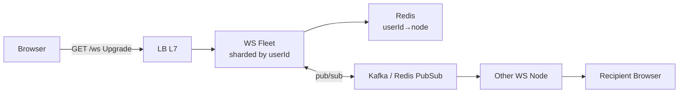

# WebSocket

> Ek hi TCP pe dono taraf jab chahe bhejo — HTTP request-response nahi, persistent pipe.

> HTTP ek chitthi jaisa — har baar naya lifafa. WebSocket ek phone call — ek baar connect, fir jab tak kaato nahi dono bol-sun sakte. Chat, live comments, docs cursor ke liye yahi.

HTTP me client puche tabhi server bole. Live me server ko push karna hai (`typing...`, new message) — tab WS.

## HTTP vs Polling vs WS

- **Short polling:** har 2 sec `GET /messages` — simple par 30 req/min waste, latency 2 sec.
- **Long polling:** `GET` ko server 20 sec hold kare, naya aaya to jawab — better par har message pe naya connection.
- **SSE (Server-Sent Events):** ek HTTP se server → client stream, text/event-stream. One-way (server to client), auto reconnect. Notification feed ke liye kaafi.
- **WebSocket:** `ws://` 101 Upgrade ke baad dono taraf binary/text bhejo, 1 connection. 2-way — chat, docs, game.

**Pick:** chat/docs/game → WS, feed/notifications → SSE bhi chalega, polling sirf fallback.

## How it connects

1. **Handshake:** `GET /ws` + `Upgrade: websocket` + `Sec-WebSocket-Key` → `101 Switching Protocols`
2. **Frame:** har message frame me — `FIN, opcode, payload`. Ping/Pong heartbeat har 25 sec.
3. **Close:** `Close 1000` + client reconnect with backoff + `lastMsgId` se catch-up.

## Scaling the fleet

- **Sharding:** `hash(userId) % nodes` ya consistent hash — same user hamesha same node? Actually mobile roam karega, isliye **Redis map** `userId→nodeId` + pub/sub: sender node `PUBLISH node:{recipientNode} msg`, recipient node push.
- **50M sockets:** 1 node 50k → 1000 nodes, LB least-connections, kernel tuning `ulimit, tcp_keepalive`.
- **Presence:** `SET presence:{userId} online EX 30` heartbeat 15 sec, TTL se offline detect.

## Failure modes to mention

1. **Reconnect storm:** 1k nodes restart pe 50M clients ek saath → jitter + exponential backoff (`1s,2s,4s+rand`), last cursor se `GET /messages?since=` catch-up.
2. **Message loss:** WS at-most-once — **ACK + retry**: client `clientMsgId`, server `IF NOT EXISTS` persist, fir `ack`. Missed pe history `GET`.
3. **Idle timeout:** LB 60 sec me WS kaat dega — `ping` har 25 sec + `X-Accel-Buffering: no` for SSE.
4. **Auth:** WS upgrade pe `?token=JWT` validate, short-lived (5 min), phir heartbeat me refresh.

**🔴 Galti:** "Har user pe naya thread" — 50k threads marega. Event-loop (Node/Netty) use karo.
**✅ Sahi:** "WS fleet sharded, Redis presence + pub/sub, ACK + history fallback, ping + backoff."

**Phrase:** "WebSocket phone call jaisa — 101 upgrade, ek TCP pe 2-way, heartbeat + Redis presence, miss pe history se catch-up."

**Yaad rakho (Revision):** Polling waste, SSE 1-way, WS 2-way, 101 upgrade, ping 25s, Redis user→node + pub/sub, ACK + `since` catch-up, backoff.

**See also:** [whatsapp](/hld/whatsapp), [google-docs](/hld/google-docs), [fb-live-comments](/hld/fb-live-comments).
