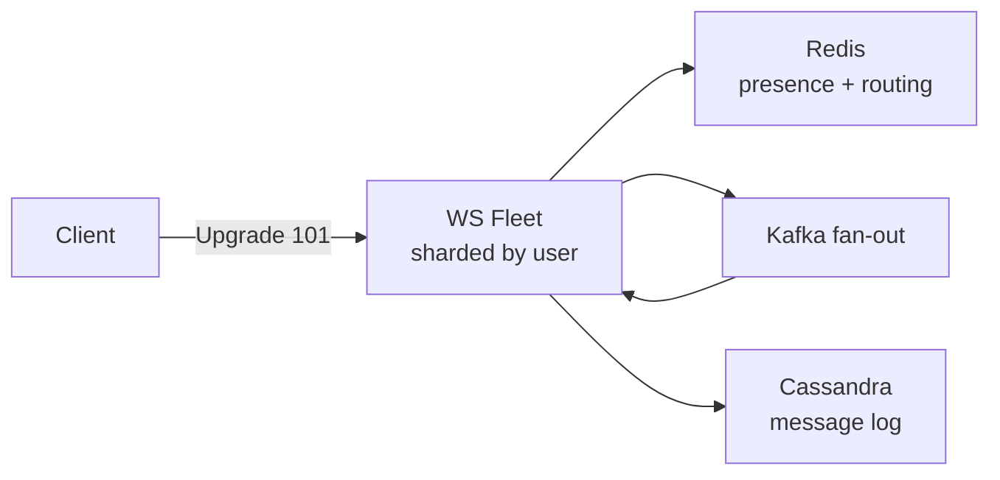

# WebSocket

> Persistent two-way pipe — handshake, fleet sharding, and catch-up on reconnect.

> HTTP is a letter — new envelope every time. WebSocket is a phone call — connect once, both sides talk until hangup. Chat, live comments, and collaborative cursors live here. The fleet behind it needs sharding (user to server mapping), heartbeats (dead connection detection), and catch-up (missed messages on reconnect).

## When to pick it

1. True two-way realtime (chat, multiplayer, collaborative editing)
2. High-frequency server pushes (live scores, trading ticks)
3. Long-lived sessions where handshake cost matters

**Don't use for:** one-way feeds (SSE suffices), request-response APIs, or rare updates (long polling is simpler).

## How it works

Client sends an HTTP Upgrade request; server answers 101 and the TCP connection becomes a message pipe (text or binary frames). Servers shard by user hash; Redis maps `userId → server` plus presence with TTL heartbeats. Disconnects trigger client backoff reconnects plus history catch-up from the message log.

## Failure modes to mention

1. **Connection storms** — deploys or outages reconnect everyone at once; stagger reconnects with jittered backoff.
2. **Sticky routing loss** — server death orphans mappings; Redis remap plus client reconnect covers it.
3. **Idle timeouts** — LB and NAT kill silent sockets; heartbeat every ~15-30s.
4. **Missed messages** — gaps between disconnect and catch-up; sequence IDs plus log replay close them.

**Mistake:** "WebSocket for everything realtime."
**Correct:** "Two-way needs WebSocket; one-way feeds fit SSE; rare updates fit long polling."

**Phrase:** "WebSocket is the phone call — upgrade once, shard the fleet, heartbeat presence, replay history on reconnect."

**Remember (Revision):** 101 upgrade, user-hash sharding, Redis presence with TTL, jittered backoff reconnects, sequence IDs plus log catch-up.

**See also:** [whatsapp](/hld/whatsapp), [fb live comments](/hld/fb-live-comments), [api design](/hld/api-design).
