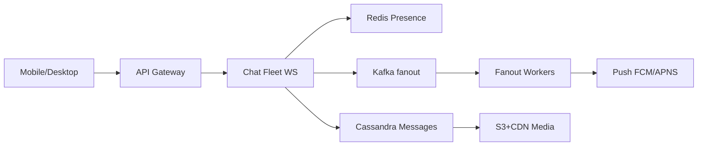

# WhatsApp

> Mobile messaging. Online path is **WebSockets**. Offline path is **push + stored messages**. Groups and media are the usual extras.

> **TL;DR Hinglish:** Persist pehle Cassandra me, phir deliver — online ko WebSocket, offline ko push. Group fan-out Kafka se async, media S3.

## Kya poochte hain? (What they ask) — Hinglish me samjho

Design WhatsApp / Telegram: 1:1 chat, groups (~100–256 members), send text and photos, ticks for **sent / delivered / read**, typing indicators, last-seen/online, and history sync across devices. Focus on low latency for online users and durability when offline — not on building Signal from scratch.

What the interviewer tests:

- Do you separate the **hot connection path** (WebSocket) from the **durable log** ([Cassandra](/system-design/cassandra)) and the **offline push** path (FCM/APNS)?
- Can you handle **fan-out for groups** without blocking `send()` on 100 pushes?
- Do you have a story for **ordering, presence, and multi-device** sync?
- Can you keep **media** out of the chat nodes (pre-signed S3 + CDN)?

A strong answer: *persist first, then deliver — WebSocket if online, push if offline, group fan-out async via Kafka*.

## Requirements — Kya chahiye? (Functional / Non-functional)

| Category | Details |
|---|---|
| **Functional** | 1:1 send/receive (text, media, location), group create/add/remove (≤256), message history with pagination, delivered/read receipts, typing indicator, presence (online/last-seen), multi-device (phone + desktop), media upload/download |
| **Non-functional** | Online p95 < 100ms, durable messages (no loss), ordering per chat, 99.9% availability, storage for billions of messages/day, E2E encryption mentioned but often out of scope for 45 min |
| **Clarify** | Max group size? Message size limit? Retention (store forever vs TTL)? E2E required or server sees plaintext? Ask — most interviews skip full Signal protocol and accept "server stores ciphertext" |
| **Out of scope v1** | Voice/video calls (WebRTC), Stories/Status, broadcast channels at 1M scale (different fan-out), full Signal double-ratchet implementation |

## Scale ka andaaza — Kitna load? (Math jo design badle)

Assume 500M DAU, avg 30 messages/user/day, 20% groups.

| Metric | Math | Result |
|---|---|---|
| Message QPS | 500M × 30 / 86400 ≈ **173K msgs/s** avg, peak 2–3× | ~350K/s peak |
| Storage (text) | 173K × 300 bytes ≈ **52 MB/s** → 4.5 TB/day | 1.6 PB/year — needs [Cassandra](/system-design/cassandra)/Dynamo, not Postgres single node |
| Storage (media) | 10% msgs with photo 1 MB → 1.7K/s × 1 MB = **1.7 GB/s** → 147 TB/day | Goes to [S3](/system-design/s3) + CDN, not DB |
| Connections | 500M DAU, 10% concurrent WS | **50M concurrent sockets** → fleets sharded by consistent hash |
| Bandwidth | 173K × 500 bytes (with overhead) ≈ 86 MB/s messages + media CDN | CDN-served media avoids origin melt |

Key insight: message **count** is high but each is tiny — optimize for **write throughput + fan-out**, not large payloads. Media dominates bytes but is offloaded to object storage.

## API Design — Endpoints kya honge?

```http
POST /v1/auth/login  { "phone":"+9198...", "code":"123456" } → { "userId":"u_1","accessToken":"...","wsUrl":"wss://chat.example/ws" }
POST /v1/auth/refresh → { "accessToken":"..." }

WS wss://chat.example/ws?token=...
  Client → Server: { "type":"send", "chatId":"c_9f3", "clientMsgId":"cm_1", "body":"hello", "mediaKey": null }
  Server → Client: { "type":"ack", "clientMsgId":"cm_1", "msgId":"m_abc", "ts": 1714000000, "status":"sent" }
  Server → Recipient: { "type":"message", "chatId":"c_9f3", "msgId":"m_abc", "from":"u_1","body":"hello","ts":1714000000 }
  Client → Server: { "type":"delivered", "msgId":"m_abc" } / { "type":"read", "chatId":"c_9f3","upToMsgId":"m_abc" }
  Client → Server: { "type":"typing", "chatId":"c_9f3", "isTyping": true }

GET /v1/chats/{chatId}/messages?cursor=m_abc&limit=50
→ 200 { "messages":[{ "msgId":"...", "from":"u_1","body":"...","ts":..., "status":"read" }], "nextCursor":"m_xyz" }

POST /v1/media/presign { "contentType":"image/jpeg","size": 2048000 } → { "mediaId":"med_1","uploadUrl":"https://s3.example/...","cdnUrl":"https://cdn.example/med_1.jpg" }
POST /v1/groups { "name":"family","memberIds":["u_2","u_3"] } → { "chatId":"c_grp1" }
POST /v1/groups/{chatId}/members { "add":["u_4"],"remove":["u_5"] }
```

Headers: `Idempotency-Key: clientMsgId` for dedup. History is cursor-paginated by `(chatId, ts/msgId)`. Media message body is `{ mediaId, cdnUrl, size, thumb }` — never inline bytes.

## High-Level Design (HLD) — Boxes kaise judenge? (Hinglish)

```
[ Mobile / Desktop ] --HTTPS--> [ API Gateway (auth, rate-limit) ]
        |  \
        |   `---WS/TLS---> [ Chat Fleet (WS servers, sharded) ] --pub/sub--> [ Redis (presence, conn map) ]
        |                       |    |  \
        |                       |    |   `--> [ Kafka: chat.events ] --> [ Fanout Workers ] --> push to recipient fleets
        |                       |    |
        |                       |    `--------> [ Cassandra (messages) ]  PK=chatId, SK=ts
        |                       |
        v                       v
   [ S3 + CDN (media) ]   [ Push Gateway → FCM/APNS ]  ([Notification System](/system-design/notification-system))
                                |
                           [ Elasticsearch (optional search) — async ]
```



**Components:**

- **Chat Fleet (WS servers):** Holds `userId → { nodeId, conn }` in [Redis](/system-design/redis) (hash + TTL heartbeat). Stateless — any node can serve any user via consistent hash or Redis lookup. Routes incoming `send` to `persist → ack → deliver`.
- **[Cassandra](/system-design/cassandra) / Dynamo:** Message log `PK=chatId, clustering=timestamp/msgId`. Append-only, TTL optional. Provides history pages and catch-up. Hot cache of recent 100 msgs in Redis optional.
- **[Kafka](/system-design/kafka):** Decouples deliver fan-out for groups: chat node writes to log, publishes `message.created`; fanout workers push to 99 recipient nodes in parallel so `send()` returns after one durable write.
- **Redis:** Presence (`user:{id}:online` with 30s TTL), typing, `userId→node` map, per-chat sequence counter.
- **S3 + CDN:** Media upload via pre-signed URL, download via CDN signed URL. Chat nodes never proxy bytes.
- **Push Gateway:** For offline users — enqueues FCM/APNS via [Notification System](/system-design/notification-system) after persist.

**Write flow (online):** Sender WS `send` → Chat node validates, assigns server `msgId/ts` (Snowflake per chat), **persist to Cassandra** → `ack sent` to sender → lookup recipient `nodeId` in Redis → if online: publish to that WS node → recipient gets `message`, replies `delivered` → forwarded to sender as `delivered`. If offline: enqueue push notification.

**Read flow (history / reconnect):** `GET /messages?cursor=` → Cassandra range scan `WHERE chatId=? AND ts < cursor LIMIT 50`. On app open, client fetches missed messages since `lastSeenMsgId`, then attaches WS for live.

## Low-Level Design (LLD) — DB + Classes (Hinglish notes)

### DB schema

```sql
-- Cassandra CQL
CREATE TABLE messages (
  chat_id     UUID,
  ts          BIGINT, -- snowflake ms + seq, server-assigned, clustering
  msg_id      UUID,
  sender_id   UUID,
  body        TEXT,       -- ciphertext if E2E, else plaintext
  media_id    UUID,       -- nullable
  client_msg_id TEXT,     -- for dedup
  PRIMARY KEY (chat_id, ts, msg_id)
) WITH CLUSTERING ORDER BY (ts DESC);
CREATE INDEX ON messages(sender_id); -- secondary, or separate table by user

CREATE TABLE chats (
  chat_id     UUID PRIMARY KEY,
  type        TEXT, -- 'dm' | 'group'
  name        TEXT, -- group name
  created_by  UUID,
  created_at  BIGINT
);

CREATE TABLE chat_members (
  chat_id     UUID,
  user_id     UUID,
  role        TEXT, -- admin/member
  joined_at   BIGINT,
  PRIMARY KEY (chat_id, user_id)
);
-- To list user's chats: materialized view or second table
CREATE TABLE user_chats (
  user_id     UUID,
  chat_id     UUID,
  last_read_msg_id UUID,
  muted       BOOLEAN,
  PRIMARY KEY (user_id, chat_id)
);

-- Receipts (per message, per recipient)
CREATE TABLE receipts (
  msg_id      UUID,
  user_id     UUID,
  delivered_at BIGINT,
  read_at     BIGINT,
  PRIMARY KEY (msg_id, user_id)
);

-- Postgres for users/auth (small, relational)
-- users(user_id PK, phone UNIQUE, name, public_key)
-- media(media_id PK, owner_id FK, s3_key, size, content_type, created_at)
-- indexes: chats by user_id, messages already partitioned by chat_id
```

### Key classes / responsibilities

```java
class ConnectionManager {
  void onConnect(userId, nodeId) // HSET user:node userId nodeId, SET presence online TTL 30s
  void onHeartbeat(userId)        // EXPIRE presence
  void onDisconnect(userId)       // DEL mapping, set lastSeen
  String routeToNode(userId)      // HGET user:node
}
class MessageService {
  Message send(chatId, senderId, clientMsgId, body) // dedup by (sender,clientMsgId), assign ts/msgId, persist to Cassandra, publish Kafka
  List<Message> history(chatId, cursor, limit) // CQL range query
  void markDelivered(msgId, userId) // upsert receipts, notify sender via WS/push
}
class GroupService {
  void addMembers(chatId, userIds) // TX on chat_members + user_chats fan-out
  List<UUID> members(chatId)       // cached in Redis SET chat:{id}:members
}
class FanoutWorker { // Kafka consumer
  void onMessageCreated(event) // for each member != sender: if online push WS, else enqueue FCM/APNS
}
class MediaService {
  PresignedUrl presign(userId, contentType, size) // S3 presign, store media row
}
```

### Concurrency & algorithms

- **Idempotency:** `clientMsgId` unique per sender — `INSERT ... IF NOT EXISTS` or check `(senderId, clientMsgId)` in Redis/Cassandra before persist. Retries from mobile never duplicate.
- **Ordering:** Per-chat monotonic `ts` (server Snowflake + per-chat seq in Redis `INCR chat:{id}:seq`). Clients render by `ts`, reordering if clock skew. No global order needed.
- **Presence:** Heartbeat every 15s, TTL 30s in Redis. `online` = key exists. `lastSeen` stored in Postgres on disconnect.
- **E2E encryption (if asked):** Server stores ciphertext only; key exchange via Signal outside critical path — mention as box.

### Patterns used

Publish-Subscribe (Kafka fan-out), Presence with TTL, Cache-Aside (member sets), CQRS (write to Cassandra, read history), Outbox pattern (persist then publish), Idempotent Receiver.

## Deep Dive — Gehrai se (Interview yahi puchega) — groups and fan-out

A group of 100 cannot wait for 99 sequential WS pushes inside `send()`. The chat node does exactly one durable write, acks the sender, then publishes to [Kafka](/system-design/kafka) topic `chat.events` (partitioned by `chatId` for order). A pool of **Fanout Workers** consumes and for each member looks up `userId→node` in Redis: if online, `PUBLISH node:{id} {message}` (Redis PubSub / NATS) so the recipient's WS node pushes; if offline, batch enqueue to [Notification System](/system-design/notification-system) (FCM/APNS). For huge broadcast channels (1M), switch to **pull model** — write once, clients poll `GET /messages` — not 1:1 push per member.

## Deep Dive — Gehrai se (Interview yahi puchega) — receipts, ordering, and exactly-once delivery

Receipts are two client ACKs: receiver's SDK sends `delivered` on receipt, `read` when the thread is opened. Both upsert `receipts` and are forwarded to sender's WS (if sender offline, stored and delivered on reconnect). Ordering: server-assigned `ts` wins; client `clientMsgId` is only for dedup. At-least-once publish from Kafka is safe because `msgId` dedup on client (already seen → drop). Failed fan-out retries with backoff; poison → DLQ.

## Deep Dive — Gehrai se (Interview yahi puchega) — multi-device and offline catch-up

Each device is a separate WS connection (`userId:deviceId → node`). A message is marked `delivered` per device, `read` is per user but synced — when one device sends `read upToMsgId`, server fans `read` to sender **and** to the user's other devices so badges clear. Offline catch-up: on connect, server sends `missed = SELECT * FROM messages WHERE chatId IN userChats AND ts > lastAckTs LIMIT 200` plus a `sync` of `last_read_msg_id` per chat. Deleted devices get full history page via `GET /messages`.

## Hinglish Tip — Galti vs Sahi

**🔴 Galti:** Hot path pe DB direct without cache/queue.
**✅ Sahi:** Cache/queue beech me, DB source of truth.

## Failures & Scale — Kya tootega aur kaise bachenge? (Hinglish)

- **WS node crash:** Connections re-establish (client retries with backoff) and re-register in Redis; undelivered messages remain in Cassandra and are fetched on reconnect — no loss.
- **Cassandra hotspot (viral group):** Partition by `chatId` spreads load; large groups still one partition — add write-behind Redis buffer and use `TWCS` compaction for time-series.
- **Kafka lag:** `send()` already acked after Cassandra write, so lag only delays delivery (acceptable) — not durability.
- **Push failure (FCM/APNS down):** Queue with retry and collapse key per chat (only latest push per offline user).
- **Media overload:** Pre-signed S3 upload never traverses chat nodes; CDN cache + signed URL expiry limits hotlinking; thumbnail service async.
- **50M sockets:** Shard WS fleet by consistent hash on `userId`, autoscale on connections/node (target ~50K/node), use kernel tuning + LB with least-connections.

## Aur kya puch sakte hain? (Extra probes — Hinglish)

1. **Multi-device sync:** Each device is a consumer; `read` must sync across devices — use a per-user `device_sync` topic or versioned `user_chats.last_read`.
2. **Presence & last-seen:** Heartbeat in Redis with TTL; last-seen from Postgres `users.last_seen_at` updated on disconnect. Privacy toggle is a policy check before returning presence.
3. **Shard chats by `chatId`:** All message, member, and receipt tables are co-partitioned by `chatId` for locality; user inbox is a secondary view.
4. **Search:** Async [Elasticsearch](/system-design/elasticsearch) indexer over Kafka — not inline.
5. **Rate limit & abuse:** Per-user [Rate Limiter](/system-design/rate-limiter) on `send`, plus spam ML async.

**Yaad rakho (Revision):** 1) Persist pehle Cassandra me 2) Group fan-out Kafka async 3) Online WS, offline push 4) Media S3, presence Redis TTL.

**Phrase:** Persist first, then deliver. WebSocket if online, push if not. Media is S3. Groups fan out asynchronously so send() returns after the log write.

