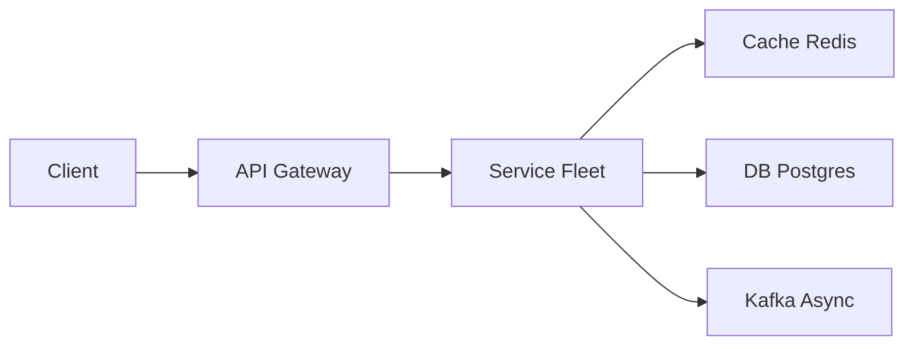

# Yelp

> Local business search. Combine **text + geo + rating** without scanning the planet. Photos and reviews are the heavy extras.

> **TL;DR Hinglish:** ES geo_point + text + rating, distance decay ranking, autocomplete separate index, hot cities cache.

## Kya poochte hain? (What they ask) — Hinglish me samjho

"Design Yelp / Google Maps local search." Interviewer says: "Pizza near me, open now, 4+ stars." They expect a map with pins + a list. Clicking a pin opens a business detail page with hours, photos, and reviews.

What they really test: can you marry **full-text search** ("pizza", "vegan sushi") with **geo filtering** (lat/lng + radius or map viewport bounding box) and layered filters (rating, price `$$`, category, `openNow`, attributes like `outdoor seating`) while staying inside ~200 ms p95? And can you explain ranking — not just filtering? Bonus traps: suggest-as-you-type, hot cities like "coffee in downtown SF" getting hammered, stale reviews vs fresh search index, and photo storage.

Example scale to anchor: 30M businesses worldwide, 200M reviews, 50M photos. US read-heavy: ~80k search QPS globally (peak-hour burst ~200k), ~10k review writes/day per large city. Assume 5% of searches include `openNow`.

## Requirements — Kya chahiye? (Functional / Non-functional)

**Functional:**
- Search businesses by text query + location: `q` (free text on name, categories, attributes), `lat/lng` + `radius` or `bounds` (map viewport), pagination with `cursor` or `offset`.
- Filters: `minRating` (e.g. 4.0+), `price` ($-$$$$), `category`, `openNow`, `attributes` (delivery, outdoor, parking).
- Sort: relevance (text score × rating × popularity) blended with distance decay; also sort-by-distance and sort-by-rating modes.
- Business detail page: name, address, hours (weekly), photos, aggregate rating, review list paginated, menu/attributes.
- Write reviews: `POST /reviews` with rating (1-5), text, photos; edit/delete own review.
- Upload business photos (owner or user), moderation queue.
- Autocomplete / suggest-as-you-type for business names and categories.

**Non-functional:**
- Search p95 < 200 ms globally; business page p95 < 100 ms (cached).
- Strong consistency for business metadata and reviews in Postgres; **eventual** consistency (seconds) OK for search index.
- Results must be geo-biased — a pizza in SF should not outrank a mediocre one 200 m away for "pizza near me".
- Highly available reads (target 99.95%); writes can tolerate brief async indexing lag.
- Photo delivery via CDN, durable object storage.
- Noisy / spam reviews must not poison ranking.

**Clarify — questions to ask interviewer:**
- Is `openNow` a hard filter or a ranking boost? (Answer: usually hard filter for the interview.)
- Do we need to support map-move search (viewport bbox) vs only radius? Assume both.
- Do reviews affect ranking / rating in search in real time? (Say: aggregate rating updated async, search ranking refreshed every minute.)
- Multi-language search? Say: English first, analyzer per language later.
- Do we need to rank ads / sponsored results? Defer to v2 but name the hook.

**Out of scope (v1):**
- Reservations, ordering, payments, messaging the business.
- Real-time collaborative editing of business info (owner dashboard deferred).
- Full social graph / follow feed.
- ML personalization beyond simple popularity + distance.

## Scale ka andaaza — Kitna load? (Math jo design badle)

| Quantity | Assumption | Math | Result |
|---|---|---|---|
| Businesses | 30M globally, avg row 2 KB (incl. hours JSON) | 30M × 2 KB | ~60 GB in Postgres |
| Reviews | 200M reviews, avg 500 bytes text + 200 bytes metadata | 200M × 0.7 KB | ~140 GB; grows ~20 GB/yr |
| Photos | 50M photos, avg 2 MB stored (orig + 2 thumbs) | 50M × 2 MB | ~100 TB in S3 |
| Search QPS | 80k avg, 200k peak; 90% of traffic in top 20 metros | 200k × 0.5 KB resp | ~100 MB/s egress peak |
| Business page QPS | ~40k avg (0.5× search, click-through) | cached 80% | ~8k DB QPS after cache |
| Write QPS | ~150 reviews/sec peak (US evening) + photo uploads | tiny vs reads | DB easily handles |
| Index size (ES) | Per doc: name + categories + geo_point + denorm fields ~1.5 KB | 30M × 1.5 KB × 1.3 overhead | ~60 GB index, 3 shards × 2 replicas |
| Cache | Hot search tiles `geohash(5)+q+filters` Top 100k keys, 4 KB each | — | ~400 MB in [Redis](/system-design/redis) |
| Bandwidth - search | 200k × 0.5 KB | — | ~100 MB/s |
| Bandwidth - photos | 50k photo views/s × 80 KB thumb | — | ~4 GB/s via CDN (origin tiny) |

Reasoning: search is list+light metadata only, so responses stay small. Photos dominate bandwidth but are CDN-cacheable. Postgres size is modest for 30M rows; the hard part is the geo+text index, not the OLTP store.

## API Design — Endpoints kya honge?

**Search businesses**
```http
GET /v1/search?q=pizza&lat=37.7749&lng=-122.4194&radius=3000&minRating=4&price=1,2&openNow=true&sort=relevance&cursor=eyJ...
Authorization: Bearer <token>   // optional for personalization later

200 OK
{
  "results": [
    { "id": "b_9f2a", "name": "Tony's Pizza", "rating": 4.6, "reviewCount": 1832,
      "price": 2, "distanceM": 420, "categories": ["Pizza","Italian"],
      "photoUrl": "https://cdn.yelp.com/b_9f2a/thumb.jpg", "isOpen": true },
    ...
  ],
  "nextCursor": "eyJ...",
  "totalApprox": 842
}
```

**Viewport search (map move — debounced on client)**
```http
GET /v1/search/bounds?neLat=37.81&neLng=-122.40&swLat=37.76&swLng=-122.45&q=coffee&minRating=4
```

**Business detail**
```http
GET /v1/businesses/{businessId}
200 { "id":"b_9f2a", "name":"Tony's", "address":{...}, "hours":{ "mon":[["11:00","22:00"]], ...},
       "rating":4.6, "reviewCount":1832, "price":2, "categories":[...],
       "photoUrls":["https://cdn.../feed.jpg"], "isOpenNow": true }

GET /v1/businesses/{id}/reviews?cursor=&limit=20&sort=newest
GET /v1/businesses/{id}/photos?cursor=
```

**Writes**
```http
POST /v1/businesses/{id}/reviews
{ "rating": 5, "text": "Best slice...", "photoIds": ["ph_..."], "idempotencyKey": "uuid" }
201 { "reviewId": "r_..." }

DELETE /v1/businesses/{id}/reviews/{reviewId}
POST /v1/businesses/{id}/photos/presign  -> { "uploadUrl": "https://s3...", "photoId":"ph_..." }
GET  /v1/suggest?q=piz  -> { "suggestions": ["pizza","pizza near me","Pizzeria Delfina"] }
```

Errors: `400` bad filter, `404` business not found, `409` duplicate idempotency key, `429` rate-limited (spam).

## High-Level Design (HLD) — Boxes kaise judenge? (Hinglish)

```
[ Mobile / Web ] 
      |
     CDN (Fastly/CloudFront) — photos, suggest, cached search tiles
      |
  [ API Gateway ] — auth, rate-limit, geo validation, WAF
      |
  +---+---+---+
  |       |       |
Search  Business  Review/Photo  (stateless services, autoscaled)
Service  Service   Service
  |       |       |
  +---+---+---+---+
      |       |
  [Elasticsearch]  [ Postgres (primary + read replicas) ]  [ S3 (photos) ]
  geo_point+text   Business, Review, Photo, Hours            thumbs + orig
      ^              |  (CDC via Debezium / app event)        ^
      |              +--------> [Kafka] --indexer--> ES ------+
      |                                                       
  [Redis]  hot tile cache (q+geohash+filters) + business page cache
      |
  [Kafka] — review-written, photo-uploaded, rating-recomputed events
```



**Component roles:**
- **CDN:** serves photo variants and caches hot suggest + search tile responses (short TTL 30-60s). Absorbs photo bandwidth.
- **API Gateway:** validates `lat/lng`, normalizes query, enforces rate limits per IP/user, routes to services.
- **Search Service:** builds ES query, checks Redis tile cache first, falls back to ES, blends distance decay, applies post-filter for `openNow` edge cases, paginates.
- **Business Service:** serves detail page from Redis (key `biz:{id}`) else Postgres read replica; hydrates aggregate rating.
- **Review/Photo Service:** writes to Postgres transactionally, emits `ReviewCreated` to [Kafka](/system-design/kafka), triggers async ES reindex + rating recompute.
- **Indexer workers:** consume CDC/Kafka, bulk-index into [Elasticsearch](/system-design/elasticsearch) with retry + DLQ.
- **Postgres:** source of truth. Partition reviews by `business_id` hash if 200M+ grows.
- **S3:** photo originals + derived sizes via async worker (thumb 200px, feed 800px).

**Write path (review):** Client → API Gateway → Review Service → Postgres (insert review, update business `review_count`/`rating_sum` in same txn) → emit Kafka event → ack 201 (search still stale for ~1-2s) → indexer updates ES, cache invalidation deletes `biz:{id}` key.

**Read path (search):** Client → CDN → API Gateway → Search Service → Redis tile lookup (key = `search:{geohash5}:{q_norm}:{filters_hash}:{sort}`) → hit returns immediately; miss → ES `bool` query (geo filter + text `match` + range on rating/price + decay) → write back to Redis with 45s TTL → return.

**Read path (business page):** CDN (photo) + Redis `biz:{id}` → Postgres replica on miss. Reviews paginated separately to keep page cache small.

## Low-Level Design (LLD) — DB + Classes (Hinglish notes)

**Database schema (Postgres):**
```sql
CREATE TABLE business (
  id              TEXT PRIMARY KEY,          -- b_xxxx
  name            TEXT NOT NULL,
  slug            TEXT UNIQUE,
  address_json    JSONB NOT NULL,            -- street, city, state, zip, lat, lng
  lat             DOUBLE PRECISION NOT NULL,
  lng             DOUBLE PRECISION NOT NULL,
  geohash5        TEXT NOT NULL,             -- for tile cache + coarse grouping
  categories      TEXT[] NOT NULL,           -- denormalised array for index
  price           SMALLINT CHECK (price BETWEEN 1 AND 4),
  attributes      JSONB,                     -- {delivery:true, outdoor:true}
  hours_json      JSONB NOT NULL,            -- {mon:[["11:00","22:00"]], ...} in local tz + UTC offset
  rating_avg      NUMERIC(3,2) NOT NULL DEFAULT 0,  -- maintained async or in txn
  review_count    INT NOT NULL DEFAULT 0,
  photo_count     INT NOT NULL DEFAULT 0,
  owner_id        TEXT REFERENCES users(id),
  created_at      TIMESTAMPTZ NOT NULL DEFAULT now(),
  updated_at      TIMESTAMPTZ NOT NULL DEFAULT now()
);
CREATE INDEX ON business USING GIN (categories);
CREATE INDEX ON business (geohash5);
CREATE INDEX ON business (rating_avg DESC, review_count DESC);

CREATE TABLE review (
  id              TEXT PRIMARY KEY,
  business_id     TEXT NOT NULL REFERENCES business(id) ON DELETE CASCADE,
  user_id         TEXT NOT NULL REFERENCES users(id),
  rating          SMALLINT NOT NULL CHECK (rating BETWEEN 1 AND 5),
  text            TEXT,
  created_at      TIMESTAMPTZ NOT NULL DEFAULT now(),
  updated_at      TIMESTAMPTZ,
  helpful_count   INT NOT NULL DEFAULT 0,
  status          TEXT NOT NULL DEFAULT 'visible', -- visible | hidden | flagged
  idempotency_key TEXT UNIQUE,               -- dedup client retries
  CONSTRAINT uniq_user_biz_time UNIQUE (business_id, user_id, created_at) -- soft dupe guard
);
CREATE INDEX ON review (business_id, created_at DESC);
CREATE INDEX ON review (business_id, rating DESC);
CREATE INDEX ON review (user_id, created_at DESC);

CREATE TABLE photo (
  id              TEXT PRIMARY KEY,
  business_id     TEXT NOT NULL REFERENCES business(id) ON DELETE CASCADE,
  review_id       TEXT REFERENCES review(id) ON DELETE SET NULL,
  uploader_id     TEXT NOT NULL REFERENCES users(id),
  s3_key_orig     TEXT NOT NULL,
  s3_key_thumb    TEXT, s3_key_feed TEXT,
  status          TEXT NOT NULL DEFAULT 'pending', -- pending | ready | rejected
  created_at      TIMESTAMPTZ NOT NULL DEFAULT now()
);
CREATE INDEX ON photo (business_id, created_at DESC);

CREATE TABLE business_hours_override (
  business_id TEXT REFERENCES business(id) ON DELETE CASCADE,
  date        DATE NOT NULL,
  hours_json  JSONB, -- null = closed that day
  PRIMARY KEY (business_id, date)
);
```

**Key classes (Search Service, Java-ish pseudocode):**
```java
class SearchService {
  ResultPage search(Query q) {
    String tileKey = TileKey.of(q.q, q.geohash5(), q.filtersHash(), q.sort);
    return cache.getOrLoad(tileKey, 45, SECONDS, () -> esClient.search(buildESQuery(q)));
  }
  ESQuery buildESQuery(Query q) {
    // bool: must(match(q)) + filter(geo_distance/bounding_box) + filter(rating, price)
    // + should(distance_decay) + sort by _score or distance
  }
}
class BusinessService {
  Business load(String id) { return cache.get("biz:"+id, () -> repo.findById(id)); }
  void onReviewCreated(ReviewCreated e) { cache.del("biz:"+e.businessId); indexer.enqueue(e); }
}
class ReviewService {
  @Transactional Review create(CreateReview cmd) {
    // idempotency check on idempotency_key, insert review, update business rating_sum/count
  }
}
```

**Important algorithms / concurrency:**
- **Distance decay ranking:** `score = text_score * (rating/5)^0.5 * exp(-distance / 1500m)`. Cheap to explain and monotonic. Alternative: ES `gauss` decay on `geo_point`.
- **Idempotent review write:** client sends `idempotencyKey`; `INSERT ... ON CONFLICT (idempotency_key) DO NOTHING RETURNING id`.
- **Cache invalidation:** delete `biz:{id}` on review write; tile cache is TTL-only (stale 45s is acceptable for search).
- **Pagination:** `search_after` with ES tie-breaker `(_score, _id)` rather than deep `from/size`.

**Design patterns:** Cache-Aside (Redis), CQRS-lite (Postgres write → ES read), Outbox/CDC for indexing, Idempotency-Key, Decorator for photo variants.

## Deep Dive — Gehrai se (Interview yahi puchega) — geo + text together

**Problem:** pure geo filter in SQL is fast but forgets text ranking; pure text ranks a famous "Pizza Hut" 2000 km away above the shop next door. You need both.

**Solution:** filter geo first (cheap, high selectivity), then rank by text inside the viewport. In ES this is a single `bool` query with a `geo_bounding_box` or `geo_distance` **filter** clause (not scored) plus a `must: multi_match` on `name^3`, `categories^2`, `attributes`. A `gauss` decay function on `location` multiplies the text score: close matches get a boost without excluding slightly farther excellent results. For the interview, sketch:

```json
{ "query": { "bool": {
  "must":   { "multi_match": { "query":"pizza", "fields":["name^3","categories^2"] } },
  "filter": [
    { "geo_bounding_box": { "location": { "top_left":{...}, "bottom_right":{...} } } },
    { "range": { "rating_avg": { "gte": 4 } } }
  ],
  "should": { "gauss": { "location": { "origin":"37.77,-122.41", "scale":"1.5km", "decay":0.5 } } }
}}}
```

Say: "Filter the map viewport (≤5km box), then rank. That keeps latency bounded."

## Deep Dive — Gehrai se (Interview yahi puchega) — open-now and hours

Hours are awkward in ES because `mon 22:00 - tue 02:00` spans midnight and timezones. Two practical options: (1) denormalize **today's open intervals in UTC for the next 48h** into the index at index time and filter with a `range` on `open_intervals`; (2) fetch a slightly larger candidate set (e.g. top 100) and post-filter `isOpenNow()` in the service using `hours_json` + business timezone — simpler to explain, slightly less efficient. Recommend (1) for production, (2) for interview brevity. Mention both and pick one. Also note holiday overrides via `business_hours_override`.

## Deep Dive — Gehrai se (Interview yahi puchega) — hot tiles, autocomplete, and spam

**Hot tiles:** "coffee" in downtown SF with the same bbox hits thousands of times per second. Cache `q+geohash+filters` in Redis with 30-60s TTL + singleflight on miss so only one request fans out to ES. Use a `geohash5` (~5 km cell) so nearby but not identical viewports share the cache via rounding.

**Autocomplete:** separate ES index with `completion` suggester on business names + category lexicon; query on each keystroke with debounce on client; Redis caches prefix results ("piz" → ["pizza","pizzeria..."]).

**Spam reviews:** rate-limit `POST /reviews` per user/IP, require `idempotencyKey`, async moderation queue (text classifier + manual review), shadow-hide flagged reviews from ES/search but keep them visible to the author until resolved.

## Hinglish Tip — Galti vs Sahi

**🔴 Galti:** Hot path pe DB direct without cache/queue.
**✅ Sahi:** Cache/queue beech me, DB source of truth.

## Failures & Scale — Kya tootega aur kaise bachenge? (Hinglish)

- **ES down:** degrade to Postgres geo query (`ST_DWithin` via PostGIS) for a narrow radius + simple `ILIKE` on name/category, with a banner "results may be incomplete". Don't fail search entirely.
- **Postgres primary down:** promote replica; review writes queue in Kafka for replay. Search stays up via ES + Redis.
- **Sharding:** business table by `geohash prefix` or hash on `id`; ES by geo shard (city/region) so a query touches 1-2 shards. Reviews partitioned by `business_id`.
- **Replication:** Postgres streaming replica per AZ; ES 1 primary + 2 replicas per shard; S3 cross-region replication for photos.
- **Caching layers:** CDN (edge) → Redis tile cache → business page cache → ES page cache. All with TTL + explicit delete on write for page cache.
- **Probing / SLOs:** p95 search latency alert >250 ms, ES JVM heap >80%, indexer lag (Kafka consumer lag) >10s, photo moderation queue depth.
- **Failure modes:** double-review deduped by idempotency key; indexer DLQ + replay; clock skew handled by using server time for `openNow`.

## Aur kya puch sakte hain? (Extra probes) / Interview follow-ups

1. **Sponsored ranking:** blend a separate `sponsored` slot with `isAd:true` label; score = `bid * relevance`; never mix into organic ranking — say "ads are a second list merged at the top".
2. **Price / attribute facets:** ES aggregations (`terms` on categories, `range` on price) for the left filter panel; compute from the same ES query.
3. **Pagination deep pages:** cursor (`search_after`) beats `OFFSET`; explain why deep offset is expensive.
4. **Personalization:** re-rank top 50 by user history (past cuisines) — fetch history from [Redis](/system-design/redis) and multiply score lightly; defer to v2.
5. **Moderation + photos:** async NSFW scan (Rekognition-style) before marking `photo.status=ready`; S3 lifecycle to delete rejected originals.
6. **Analytics:** `search_logged` events to [Kafka](/system-design/kafka) → warehouse for CTR / conversion of ranking tweaks.

**Yaad rakho (Revision):** Write durable, read cache, async Kafka/Flink, failure me degrade gracefully.

**Phrase:** "Postgres owns the business. ES is geo + text. I filter the map viewport, then rank with distance decay. Popular tiles sit in Redis. Reviews can lag in search."
