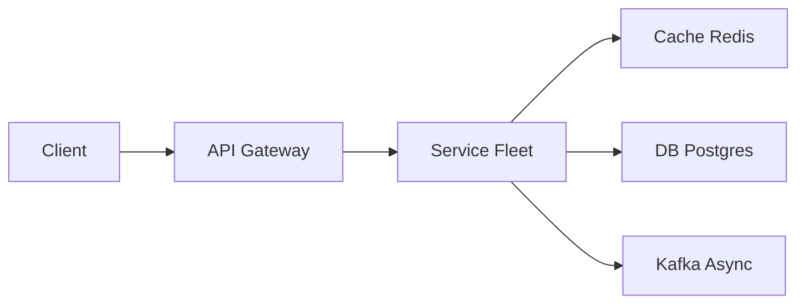

# YouTube Top K

> Trending videos. The interview is **counting at scale** and keeping a **cheap Top-K**, not training YouTube's real recommender.

> **TL;DR Hinglish:** Views ko Flink window me count karo, Top-K heap per window, cache me rakho. Late events watermark se handle.

## Kya poochte hain? (What they ask) — Hinglish me samjho

Interviewer: "Design YouTube Trending — Top 100 videos in last 24h globally and per country. Views arrive as a firehose; dashboard must load in <100ms. How would you do it?" You have 45 minutes to converge on a pipeline that never does `SELECT ... ORDER BY views DESC LIMIT 100` on the OLTP.

**What they really test:** (1) Do you treat views as **events in a log** vs row updates? (2) Can you pick windowing semantics (tumbling vs sliding, event-time vs processing-time)? (3) How you bound cost — you cannot sort 2B videos per request. (4) Trade-off: freshness vs accuracy vs cost. (5) Hot-key handling when one MrBeast video gets 50M views/hour on one shard.

**Scale anchor:** YouTube: ~2.5B MAU, ~500 hours uploaded/min, ~5B video plays/day. Trending QPS: watch page 50k RPS but `GET /trending` itself is ~5-10k RPS globally (cacheable). Ingest: ~60k view events/sec average, bursts to ~500k/sec during viral events. 24h window holds ~5B events. Storing raw events 7 days matters; serving Top-K is just 100 IDs per region.

## Requirements — Kya chahiye? (Functional / Non-functional)

**Functional:**
- Ingest `view` event `{ videoId, userId?, region, categoryId, ts }` from player (batched, at-least-once, possibly late/out-of-order by seconds to minutes).
- Query `GET /trending?window=1h|24h|7d&region=GLOBAL|IN|US&category=&k=50..200` — return ranked list with title, channel, thumbnail, view count, rank delta.
- Per-video counts per window available for hydration; de-duplicate repeated plays by same user within e.g. 10 min (debounce) if required.
- Support per-country and per-category variants without re-architecting (add dimension to key).
- Historical windows (last 24h sliding) not just calendar day.

**Non-functional:**
- Read latency p95 < 80ms (served from [Redis](/system-design/redis) / CDN); ingest not on critical path — async pipeline.
- Eventual consistency OK: trending can lag 10-30 seconds, never miss billing-grade accuracy here but avoid wild rank flips.
- No thundering read on DB: Top-K recompute is O(K log K + distinct) not O(N log N) over video catalog.
- Fault-tolerant: lost Flink state rebuilds from [Kafka](/system-design/kafka); serving layer survives AZ loss.
- Cost-aware: do not keep 24h of raw events in memory on one box; sketch or incremental aggregation.

**Clarify:**
- What counts as a view? 3 sec? 30 sec? Auto-play counts? Interviewer often says "any play event we send" — don't overfit.
- Is `k` fixed 100 or client-supplied? Max k?
- Do we need strong fraud filtering or just basic bot dedupe?
- Sliding vs tumbling window? Slide every minute vs every second?
- Per-user personalization or global only? (Answer: v1 global + region, no personalization.)

**Out of scope (v1):**
- Personalized recommendations / ML ranking — trending is count-based + small recency boost.
- Full-text search over titles.
- Real-time comment/like counts in ranking (deferred to v2 weighted score).
- Exact-once billing semantics — trending allows ~1% error.

## Scale ka andaaza — Kitna load? (Math jo design badle)

| Dimension | Assumption | Math | Result |
|-----------|-----------|------|--------|
| View events | 5B/day global | 5B / 86400 | ~58k events/sec avg, ~300-500k peak |
| Trending reads | 10k RPS | 10k * 86400 | 864M reads/day |
| Serving payload | 100 IDs * ~200B + metadata ~50KB/list | 10k * 50KB | 500 MB/s egress (cacheable → ~50 MB/s to origin) |
| Raw event store | 5B * 200B JSON + overhead | 1 TB/day | 7 TB/week in Kafka/S3 (retention 7d) |
| Aggregates | 50M distinct videos/day * 16B counter | ~800 MB per 24h window shards | Fits in Flink state + Cassandra |
| Memory for heap | K=100 per region * 200 regions * 24 windows | negligible | <10 MB in Redis |

Bandwidth is dominated by hydration (thumbnails via CDN, not trending service). Compute heavy part is aggregation, not serving.

## API Design — Endpoints kya honge?

```http
// Ingest — called by player edge / collector (internal, batched)
POST /v1/views:batch
Content-Type: application/json
{
  "events": [
    { "videoId": "dQw4w9WgXcQ", "region": "IN", "categoryId": 10, "ts": 1714000000, "eventId": "uuid-1", "userId": "u123" }
  ]
}
=> 202 Accepted { "accepted": 1 }

// Alternative pixel GET for web legacy
GET /v1/views/pixel?videoId=abc&region=IN&ts=1714000000&eventId=uuid-1 => 204 No Content

// Query trending
GET /v1/trending?window=24h&region=IN&category=music&k=100&cursor=0
=> 200 OK
{
  "window": "24h",
  "region": "IN",
  "updatedAt": 1714000123,
  "items": [
    { "rank": 1, "videoId": "abc", "views": 4820123, "title": "...", "channel": "...", "thumbnail": "https://cdn/...", "delta": +2 },
    { "rank": 2, "videoId": "xyz", "views": 4100234, "...": "..." }
  ],
  "nextCursor": null
}
```

Internal: `GET /internal/counts?videoIds=abc,xyz&window=24h` for hydration. All writes idempotent by `eventId`.

## High-Level Design (HLD) — Boxes kaise judenge? (Hinglish)

```
Client (player) -> CDN/Edge Collector -> [Kafka] views (partitioned by videoId%N or round-robin)
                                              |
                                   [Flink] Aggregator (event-time sliding window)
                                              |  state: keyed counts + min-heap TopK
                                              v
                                     Serving Store ([Redis] trending:{region}:{window} + [Cassandra] counts)
                                              ^
API Gateway -> Trending Service -> Redis (read) -> Hydration Cache ([Redis]/[Memcached]) -> Video Metadata DB
                                              -> CDN for response
```



**Components:**
- **Edge Collector / API Gateway:** Lightweight Go/Netty service that validates, batches (100 events / 50ms), returns 202, produces to [Kafka](/system-design/kafka). Never blocks on DB. Rate-limits per IP for bot mitigation.
- **[Kafka](/system-design/kafka):** Durable log, 3x replication, 100+ partitions. Retention 7 days. Topic `views.raw` (raw), `views.deduped` (after dedupe processor).
- **[Flink](/system-design/flink) / Kafka Streams:** Keyed aggregations. Two-stage: (a) dedupe by `eventId` (RocksDB state TTL 1h), (b) windowed count per `(videoId, region, category)`. Sliding window 24h sliding every 1 minute (or 30s). Maintains min-heap Top-K per region in state and emits diffs every 15-30s to [Redis](/system-design/redis). Handles late events via watermark + allowed lateness 5 min.
- **Serving Store:** [Redis](/system-design/redis) Cluster holds precomputed lists `trending:IN:24h` (sorted set or JSON list) + per-video counts hash `counts:{videoId}` TTL 2x window. [Cassandra](/system-design/cassandra) for durable windowed counts if you need point queries and backfill.
- **Trending Service:** Stateless, reads Redis, hydrates titles from video metadata cache (Caffeine L1 + Redis L2) and returns ranking. Hydration misses bulk-load from primary DB via read replica.
- **Batch Reconciler (optional):** Hourly Spark job over S3 raw logs corrects Flink counts and publishes adjustment if drift > threshold — keeps Flink's approximation honest.

**Write path:** player batch -> edge -> Kafka -> Flink dedupe+count -> Redis/Cassandra.
**Read path:** `GET /trending` -> Trending Service -> `GET trending:IN:24h` from Redis (p95 <10ms) -> mget metadata from cache -> assemble response -> CDN cache 15s.

## Low-Level Design (LLD) — DB + Classes (Hinglish notes)

**DB schema — serving + metadata**

```sql
-- Durable windowed counts (Cassandra-style, shown as SQL for clarity)
CREATE TABLE video_window_counts (
  video_id       VARCHAR(32) NOT NULL,
  region         VARCHAR(8)  NOT NULL,
  window_start   TIMESTAMPTZ NOT NULL,
  window_end     TIMESTAMPTZ NOT NULL,
  category_id    INT,
  view_count     BIGINT NOT NULL DEFAULT 0,
  updated_at     TIMESTAMPTZ NOT NULL,
  PRIMARY KEY (region, window_end, video_id)
) PARTITION BY RANGE (window_end);
CREATE INDEX ON video_window_counts (video_id, window_end);

-- Trending snapshot (Redis is primary, but RDBMS backup for cold start)
CREATE TABLE trending_snapshots (
  region       VARCHAR(8) NOT NULL,
  window_type  VARCHAR(8) NOT NULL, -- '1h','24h','7d'
  k            INT NOT NULL,
  snapshot_at  TIMESTAMPTZ NOT NULL,
  items        JSONB NOT NULL, -- [{video_id, views, rank}]
  PRIMARY KEY (region, window_type, snapshot_at)
);

-- Dedup table / state (TTL = 1h)
CREATE TABLE view_events_dedup (
  event_id   UUID PRIMARY KEY,
  video_id   VARCHAR(32) NOT NULL,
  ts         TIMESTAMPTZ NOT NULL,
  expires_at TIMESTAMPTZ NOT NULL
) WITH (ttl = '1 hour');
```

**Key classes & responsibilities**

```java
class ViewEvent { String eventId, videoId, region; int categoryId; Instant ts; String userId; }
interface ViewCollector { void acceptBatch(List<ViewEvent> batch); } // -> KafkaProducer
class DedupeProcessor { boolean isDuplicate(eventId); } // RocksDB + BloomFilter
class WindowCounter { void add(ViewEvent e); Map<VideoId, Long> windowCounts(SlidingWindow w); }
class TopKHeap { // min-heap size K per region
  void offer(VideoId id, long count); List<ScoredVideo> topK();
}
class TrendingPublisher { void publish(String region, String window, List<ScoredVideo> topK); }
class TrendingService {
  TrendingResponse getTrending(String region, String window, int k);
  // reads Redis, hydrates via VideoMetadataCache
}
```

**Concurrency handling / algorithms:**
- **Event-time watermarks:** Flink watermark = max event ts - 30s. Windows fire on watermark, not wall clock, so late events still correctly counted if within allowed lateness.
- **Hot-key mitigation:** Salted keys: `key = videoId + "#" + random(0..N-1)` for first-stage aggregation, second stage merges N salts. Prevents one viral video hashing to single subtask and OOMing it.
- **Min-heap Top-K:** O(N log K) not O(N log N). Per region, keep heap of 100; each count update does heap adjust in O(log K). Emit only when top-K diff > threshold or every 15s to reduce Redis churn.
- **Count-Min Sketch (optional):** If interviewer pushes "billions distinct", mention CMS + heap for heavy hitters as approx alternative at ~1% error with 10x less memory.
- **Idempotency:** `eventId` dedup before counting; Flink checkpointing + transactional sink gives effective exactly-once for counts within allowed lateness.

**Design patterns:**
- **Event Sourcing + CQRS:** Kafka log is source of truth; serving store is derived read model.
- **Materialized View:** Trending list is a continuously maintained view.
- **Cache-Aside:** Trending Service caches lists with short TTL and stale-while-revalidate.
- **Strangler / Lambda hybrid:** Streaming path for freshness + batch reconciler for accuracy.

## Deep Dive — Gehrai se (Interview yahi puchega) — Sliding windows, watermarks and late events

A 24h **sliding** window every 1 minute naively keeps 1440 overlapping windows. Flink optimizes with **slicing**: keep per-minute buckets and sum 1440 buckets on query. Watermark handles out-of-order: player batching + mobile offline causes events 2-5 min late. Set watermark delay 30-60s and allowed lateness 5 min; late events beyond that go to a side output `late_views` and increment an `adjustments` counter applied at next publish, not rewriting the closed window. For read path, never recompute window from scratch on every event — incremental aggregation (`ReduceFunction` + `WindowFunction`) keeps per-bucket sum in RocksDB and updates heap incrementally. If you need per-second freshness, shrink slide to 10s but publish diff only if top 20 changes to avoid flapping.

## Deep Dive — Gehrai se (Interview yahi puchega) — Hot keys, heavy hitters and approximate Top-K

One video hitting 1M views/sec would saturate a single keyed subtask if keyed by `videoId`. Fix with **key salting + two-phase aggregation**: first stage counts per `(videoId, salt)` in parallel, second stage sums salts to real videoId. Also cap per-user dedupe in edge to drop bot bursts before Kafka. For Top-K at massive cardinality (100M videos/day), exact counting in Flink state is heavy (RocksDB spill). Alternative discussed in interviews: **Count-Min Sketch** to estimate frequency + **SpaceSaving** or min-heap to track heavy hitters — gives ~1-2% error but constant memory. Whichever path, publish path must be rate-limited: even if counts update 100k times/sec, publish to Redis at most once per 15s per region, coalescing updates. Mention **probabilistic early emission** if top rank changes by > threshold.

## Hinglish Tip — Galti vs Sahi

**🔴 Galti:** Hot path pe DB direct without cache/queue.
**✅ Sahi:** Cache/queue beech me, DB source of truth.

## Failures & Scale — Kya tootega aur kaise bachenge? (Hinglish)

- **Kafka down:** Edge collector spills to local disk buffer (bounded 10 min) + returns 202 anyway; clients retry batch. Backpressure via `429` when buffer full.
- **Flink subtask fails:** Checkpoint every 30s to S3; on restore replays from last offset. Exactly-once via checkpoint + idempotent Redis `SET` + Cassandra `upsert` (last-write-wins on count). No double counting after dedupe window.
- **Redis hot shard:** Replicate `trending:IN:24h` to 3 replicas via read replicas; Trending Service reads from replica, writes to primary. Hot key replication + L1 Caffeine 5s in service mitigates.
- **Cassandra compaction lag:** Counts table TTL auto-expires old windows; add time-bucketed partitions to avoid tombstone storm.
- **Region failover:** Multi-AZ Kafka + Flink; Trending Service stateless behind [Load Balancer](/system-design/load-balancer). Stale snapshot served with `Age` header if writer stalls — never 500.
- **Scale knobs:** Add Kafka partitions + Flink parallelism linearly; sharding by region for heaps (each region heap independent). CDN caches `GET /trending` 15-30s, absorbing 90%+ reads.

## Aur kya puch sakte hain? (Extra probes)

- Why not update MySQL `views` counter? — Row-level lock contention at 60k QPS, impossible to keep sliding window; kills primary.
- Per-category trending — add `categoryId` to Flink key; heap per `(region, category)`; cardinality * categories still bounded because heap per combo is just K=100.
- Decaying trending score — `score = view_count * exp(-age/half_life)` or weight last hour 3x — same pipeline, just weighted sum in Flink.
- Fraud/bot filtering — separate processor checks `userId` rate, data-center ASN, headless fingerprint; taints event with `is_valid` flag before counting.
- Cold start / new video boost — separate "Rising" list ranked by velocity (`views last 10 min / views last hour`).
- Compare pipeline choice: [Kafka](/system-design/kafka) + [Flink](/system-design/flink) vs Kinesis + Spark Structured Streaming — same idea, Flink wins on low latency.

**Yaad rakho (Revision):** Write durable, read cache, async Kafka/Flink, failure me degrade gracefully.

**Phrase:** Views are events. Flink counts in a sliding window and publishes a Redis list of 100 ids. The website never sorts the whole catalog.
