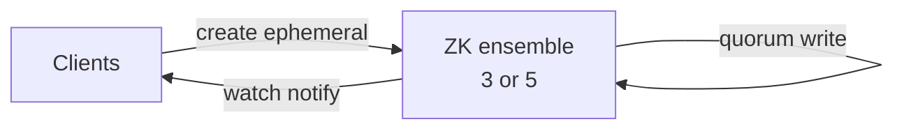

# ZooKeeper

> Coordination: leader election, distributed locks, and config. Kafka used to need it; the patterns still matter.

> ZooKeeper is a tiny strongly-consistent store (znodes in a tree) that systems use to agree: who leads, who holds the lock, what the config says. Watches notify clients of changes. CP by design — minorities fail during partitions rather than split brains.

## When to pick it

1. Leader election (one active writer among replicas)
2. Distributed locks with fencing and leases
3. Service configuration and membership (who is alive)
4. Coordination primitives behind Kafka (classic), Hadoop, and friends

**Don't use for:** general storage, queues, or high-throughput reads — **etcd** / Consul often fill the same role in Kubernetes-native stacks. Same interview ideas apply.

## How it works

Clients create **ephemeral** znodes (vanish on session loss) and set **watches**. The ensemble (odd-sized, usually 3 or 5) orders writes through a leader with **Zab** consensus. Reads can be local and fast; writes need a **quorum**. Recipes (locks, elections, barriers) compose from sequential ephemeral nodes + watches.

**Fencing:** a lock without a monotonic token is dangerous — delayed holders must be rejected by storage after a new leader wins.

## Consistency story (say this)

- ZooKeeper is **CP**: under partition, the minority **stops serving** rather than risk two leaders.
- Use it for **tiny coordination metadata**, not application payloads.
- Session timeout must exceed worst GC pause or ephemeral nodes vanish and elections flap.

## Failure modes to mention

1. **Herd effect** — every client watching one node thunders on change; use hierarchical / curated watches.
2. **Session expiry** — long GC kills sessions and drops ephemeral nodes; tune timeouts to pause times.
3. **Write bottleneck** — all writes funnel through the leader; keep data tiny.
4. **Split brain avoided by design** — plan capacity so a majority stays up in one region (or accept region loss).

**Mistake:** "Store application data in ZooKeeper."
**Correct:** "Coordination only — tiny znodes, ephemeral membership, watches for change."

**Phrase:** "ZooKeeper is the agreement box — leaders elected, locks fenced, config watched, all strongly consistent."

**Remember (Revision):** Ephemeral znodes + watches; odd ensembles; quorum writes; coordination only; herd effect guarded; CP under partition.

**See also:** [distributed systems](/hld/distributed-systems), [kafka](/hld/kafka), [job scheduler](/hld/job-scheduler).
