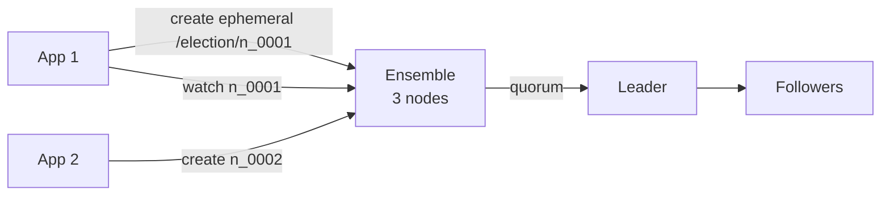

# ZooKeeper

> Coordination — leader election, distributed locks, aur config. Kafka pehle ispe tha, ab bhi samajhna zaruri.

> **TL;DR Hinglish:** ZooKeeper ek chhota par pakka register hai jahan saare servers likh ke decide karte hain leader kaun, lock kis ka. Har write quorum pe, read fast. Etcd/Consul iske naye bhai, par concept same.

Data nahi, **coordination** ke liye. 3-5 nodes ka ensemble, `2F+1` me se `F+1` quorum pe write. Strong consistent (CP).

## Kaise kaam — Hinglish me

**ZNode:** file jaisa, path `/election/candidate-0001`. Types:
- **Persistent** — permanent
- **Ephemeral** — session khatam to auto delete (presence)
- **Sequential** — naam me `0001, 0002` auto — lock/election me order

**Watch:** koi key badli to notify — config change.

**Herd effect:** 100 clients ek znode watch kare, ek change pe sab jage → thunder. Fix: watch per client ya sequential.

## 3 use-cases interview me bolo

1. **Leader election:** ` /election` me sequential ephemeral banao, sabse chhota leader. Dead to next.
2. **Lock:** `/locks/my-lock` me `lock-0001` banao, smallest hold kare, baaki watch.
3. **Config/service discovery:** `/config/featureFlag` watch, change pe reload.

**Ensemble:** 3 nodes → 1 fail ok, 5 → 2 fail ok. 4 se fayda nahi (quorum 3 hi). Latency quorum pe.

**Modern:** Kafka ne KRaft (Raft) se ZK hataya, aur systems Etcd/Consul (Raft) use karte hain — concept same, API alag.

**🔴 Galti:** "ZK me bada data" — ZK chhota (1MB), data S3/DB me.
**✅ Sahi:** "Chhota coordination data, watch + ephemeral, 3/5 nodes quorum."

**Phrase:** "ZooKeeper CP coordination — ephemeral+sequential zNodes se election/lock, quorum write, watch for config."

**Yaad rakho:** Ephemeral = session, sequential = order, quorum = F+1, 3/5 nodes, bada data mat dalo.

**See also:** [kafka](/system-design/kafka), [job-scheduler](/system-design/job-scheduler), [distributed-cache](/system-design/distributed-cache).
